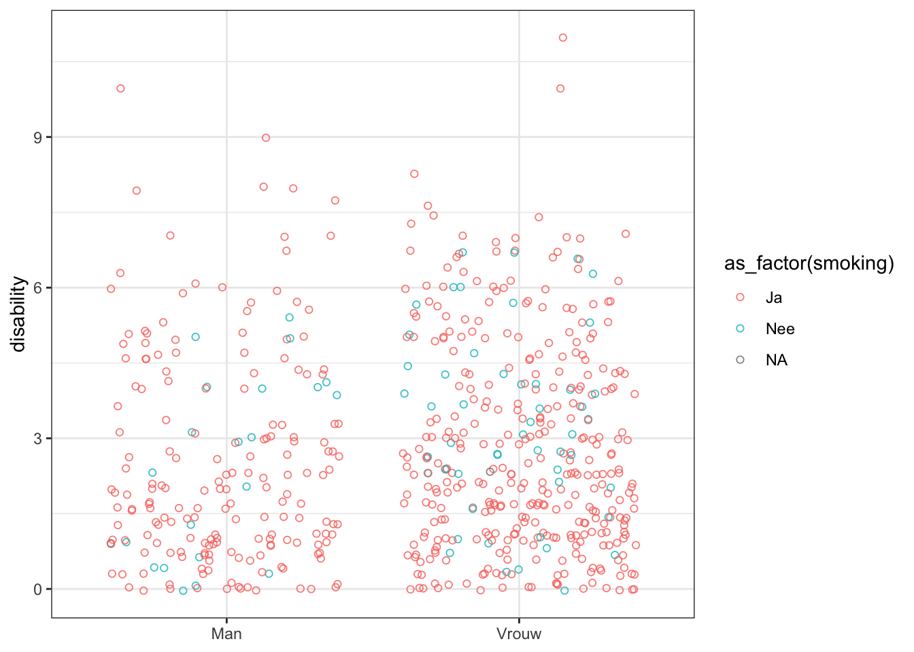
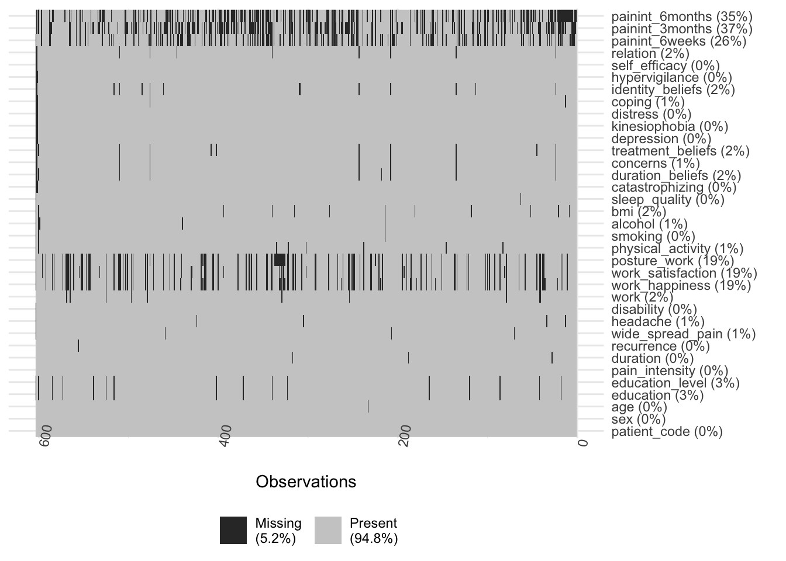
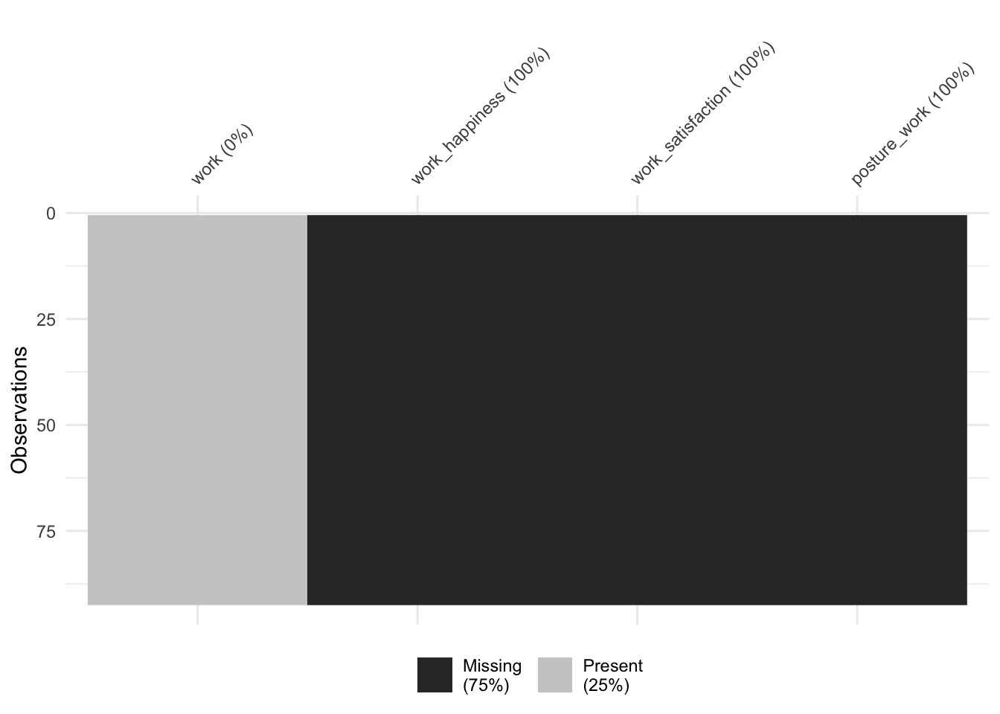
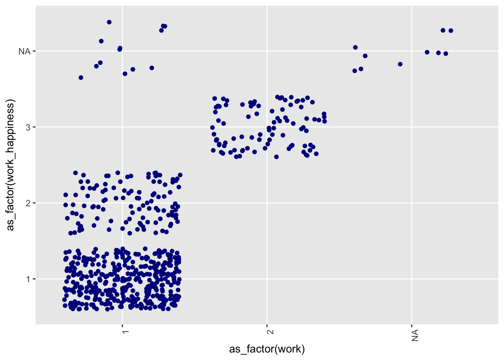
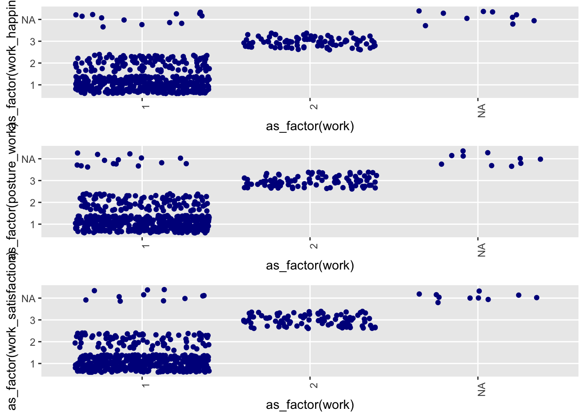

# Exploratory Data Analysis - Raw Data


## Suggested improvements of the code

- Spend time learning the R basics: [this is a very good resource - R for Data Science by Grolemund and Wickham](https://r4ds.hadley.nz/). When you would like to learn more on stastistics go here [Modern Dive](https://moderndive.com/) or here [Discovering statistics using R- by Andy Field](https://www.discovr.rocks/)

-   Avoid repetition, this is where the power of R is greatest; write or use functions and iterations to avoid duplication in the code. I will show an example

-   Avoid 'Dutch' language in code and comments; If you would like to share your code (e.g. for asking help or as annex to a publication - yes, you should do that for reproducibility reasons - then having Dutch language scattered in the code will need a translation)

-   Use `.qmd` (RStudio Quatro - Markdown) for writing out an analysis. `.R` are for function definitions, or scripts that handle a single job (e.g. the cleaning of a dataset and writing out the results). Using a `literate programming` format (`.qmd`) enables the mix between code, its output and contextual narratives and text. It also takes formatting into account. You can e.g. use `LaTeX` formulas such as $y=ax+b$ (the linear) or $y=ax+bx^2+c$ (the quadratic). You can use HTML markup such as `{=html}     <mark>This is a Highlight</mark>` . You can even write your thesis in this platform. See [this Github page](#0) for an example and more info. Learning Markdown is not so difficult and the syntax is easy to remember. See [for a cheatsheet](https://res.cloudinary.com/dyd911kmh/image/upload/v1676540721/Marketing/Blog/Quarto_Cheat_Sheet.pdf) 

 - I recommend spending a bit more time on exploration of the data before diving into the formal statistics. Exploratory Data Analysis is important because it will reveal patterns in the data you were unaware of. It usually also indicated errors in the data (for example coding or data entry errors, or data types that are incorrect upon parsing the dataset into R). For a good resource: [see chapter 7](https://r4ds.had.co.nz/exploratory-data-analysis.html) of 'R For Data Science' by Garret Grolemund & Hadley Wickham.
 
 - For a general workflow on how to inspect and glimpse missingness in the data, see [this blogpost](https://towardsdatascience.com/smart-handling-of-missing-data-in-r-6425f8a559f2)
 
 - For large mutations on the data: check the outcome for errors and inconsistencies. Generating visulaizations can help spotting weird things in the data. For instance if you create a histogram of data that has one large outlier it will look like this:

```r
library(tidyverse)
df_demo <- tibble::tibble(x = c(rnorm(999, mean = 10, sd = 4), 200))
df_demo |>
  ggplot2::ggplot(aes(x = x)) + ggplot2::geom_histogram(bins = 100)
```


Can you spot the outlier? 
 
 - spend time to inspect and correct data types of variables. This is particularly important when you want to do any kind of modelling

## Packages


```r
library(tidymodels)
library(tidyverse)
library(psfmi)
library(miceadds)
library(micemd)
library(mitools)
library(mice)
library(naniar)
library(tidymodels)
library(skimr)
#library(norm)
## warning
## This package has some major limitations
#(for example, it does not work reliably when
#  the number of variables exceeds 30),
#and has been superseded by the norm2 package.
#detach("package:VIM", unload = TRUE)
# I recommend against using the attach() or detach() functions in any form in R
# I replaced the norm for norm2 package because of the above warning.
#library(norm2)
library(VIM)
library(finalfit)
library(haven)
```

## Load data

```r
df_raw <-
  read_sav(
    here::here(
      "data-raw",
      "D010",
      "SPSS basis File results.sav"
      )
    ) |> 
  janitor::clean_names()
```

## First glimpse at missingness

```r
naniar::vis_miss(df_raw)
```


```r
## that is unexpected: patient code has a missing value!! -> fixed in new dataset
## filter the data
## add index
df_raw <- df_raw |>
  mutate(index = 1:nrow(df_raw))

#ind <- is.na(df_raw$patient_code)
#df_raw[ind,]$index
```

**NO LONGER AN ISSUE**
So row 410 is the one with the NA in the patient code. This missing value might give us problems in tracebility. I am going to remove that observation, using the `ind` logical vector.


```r
#df_raw <- df_raw[!ind,]
```

## Select relevant variables


```r
df_select <- df_raw |>
   dplyr::select(-c(
    # patient_code,
     attitude,
     pt_code,
     coping_active,
     coping_passive,
     percentage_active_coping,
     percentage_passive_coping,
     pain_6weeks,
     pain_categorized_6weeks,
     pain_3months,
     pain_catagorized_3months,
     pain_6months,
     pain_categorized_6months,
     index)
     ) |>
  rename(sex = seks)

df_select
```

```
## # A tibble: 603 × 35
##    patient_code sex        age education education_level pain_intensity duration
##           <dbl> <dbl+lb> <dbl> <dbl+lbl> <dbl+lbl>                <dbl>    <dbl>
##  1          498 2 [Vrou…    64 2 [mavo]  0 [Low eductio…              8        4
##  2          766 2 [Vrou…    32 4 [havo]  0 [Low eductio…              7        2
##  3          402 1 [Man]     51 1 [Basis] 0 [Low eductio…              7        5
##  4          669 1 [Man]     29 7 [hbo]   1 [High educti…              5       10
##  5          764 1 [Man]     35 7 [hbo]   1 [High educti…              4        5
##  6          762 2 [Vrou…    46 8 [wo]    1 [High educti…              5        4
##  7          401 1 [Man]     50 7 [hbo]   1 [High educti…              2       10
##  8          763 2 [Vrou…    49 3 [vbo]   0 [Low eductio…              6        4
##  9          497 1 [Man]     46 5 [vwo]   0 [Low eductio…              3        2
## 10          496 1 [Man]     60 7 [hbo]   1 [High educti…             10        4
## # ℹ 593 more rows
## # ℹ 28 more variables: recurrence <dbl+lbl>, wide_spread_pain <dbl+lbl>,
## #   headache <dbl+lbl>, disability <dbl>, work <dbl+lbl>,
## #   work_happiness <dbl+lbl>, work_satisfaction <dbl+lbl>,
## #   posture_work <dbl+lbl>, physical_activity <dbl+lbl>, smoking <dbl+lbl>,
## #   alcohol <dbl+lbl>, bmi <dbl>, sleep_quality <dbl+lbl>,
## #   catastrophizing <dbl>, duration_beliefs <dbl>, concerns <dbl>, …
```

```r
names(df_select)
```

```
##  [1] "patient_code"      "sex"               "age"              
##  [4] "education"         "education_level"   "pain_intensity"   
##  [7] "duration"          "recurrence"        "wide_spread_pain" 
## [10] "headache"          "disability"        "work"             
## [13] "work_happiness"    "work_satisfaction" "posture_work"     
## [16] "physical_activity" "smoking"           "alcohol"          
## [19] "bmi"               "sleep_quality"     "catastrophizing"  
## [22] "duration_beliefs"  "concerns"          "treatment_beliefs"
## [25] "depression"        "kinesiophobia"     "distress"         
## [28] "coping"            "identity_beliefs"  "hypervigilance"   
## [31] "self_efficacy"     "relation"          "painint_6weeks"   
## [34] "painint_3months"   "painint_6months"
```

```r
#DT::datatable(df_select)
```

## Exploratory Data Analysis

### Some exploratory plots
Different flavors of graph types

```r
## males / females
df_select |>
  group_by(sex) |>
  tally() |>
  ggplot(aes(x = as_factor(sex), y = n)) +
  geom_col(show.legend = FALSE)
```


```r
## age
df_select |>
  group_by(sex) |>
  summarise(mean_age = mean(age, na.rm = TRUE)) |>
  ggplot(aes(x = as_factor(sex), y = mean_age)) +
  geom_col(show.legend = FALSE)
```


```r
## boxplot  
df_select |>
  group_by(sex) |>
  ggplot(aes(x = as_factor(sex), y = age)) +
  geom_boxplot(show.legend = FALSE)
```


```r
## age distribution
df_select |>
  group_by(sex) |>
  ggplot(aes(x = age)) +
  geom_density(aes(colour = as_factor(sex))) +
  theme_bw()
```


```r
## pain intensity
df_select |>
  group_by(sex) |>
  ggplot(aes(x = pain_intensity)) +
  geom_density(aes(colour = as_factor(sex)), size = 1) +
  theme_bw()
```


```r
## dotplots
df_select |>
  group_by(sex, smoking) |>
  ggplot(aes(x = as_factor(sex), y = disability)) +
  geom_point(
    aes(colour = as_factor(smoking)), 
    position = "jitter", 
    shape = 1, 
    alpha = 0.8) +
  theme_bw() +
  xlab(NULL)
```



```r
## work
df_select |>
  group_by(work) |>
  tally()
```

```
## # A tibble: 3 × 2
##   work          n
##   <dbl+lbl> <int>
## 1  1 [Ja]     501
## 2  2 [Nee]     92
## 3 NA           10
```

### Missing values
Some overall missingness inspections

```r
# Are there missing values in the dataset?
any_na(df_select)
```

```
## [1] TRUE
```

```r
# How many?
n_miss(df_select)
```

```
## [1] 1098
```

```r
prop_miss(df_select)
```

```
## [1] 0.05202559
```

```r
# Which variables are affected?
df_select %>% 
  is.na() %>% 
  colSums() |> 
  enframe() |> 
  ggplot(aes(x = reorder(as_factor(name), value), y = value)) +
    geom_point() +
    coord_flip() +
  xlab("variable in data") +
  ylab("Total number of NA")
```


### Get number of missings per variable (n and %)

```r
miss_var_summary(df_select)
```

```
## # A tibble: 35 × 3
##    variable          n_miss pct_miss
##    <chr>              <int>    <dbl>
##  1 painint_3months      224    37.1 
##  2 painint_6months      212    35.2 
##  3 painint_6weeks       154    25.5 
##  4 posture_work         117    19.4 
##  5 work_happiness       115    19.1 
##  6 work_satisfaction    113    18.7 
##  7 education             16     2.65
##  8 education_level       16     2.65
##  9 identity_beliefs      14     2.32
## 10 bmi                   12     1.99
## # ℹ 25 more rows
```

```r
miss_var_table(df_select)
```

```
## # A tibble: 17 × 3
##    n_miss_in_var n_vars pct_vars
##            <int>  <int>    <dbl>
##  1             0      3     8.57
##  2             1      3     8.57
##  3             2      2     5.71
##  4             3      7    20   
##  5             4      1     2.86
##  6             5      3     8.57
##  7             8      2     5.71
##  8            10      3     8.57
##  9            12      2     5.71
## 10            14      1     2.86
## 11            16      2     5.71
## 12           113      1     2.86
## 13           115      1     2.86
## 14           117      1     2.86
## 15           154      1     2.86
## 16           212      1     2.86
## 17           224      1     2.86
```

```r
# Get number of missings per observation (n and %)
miss_case_summary(df_select)
```

```
## # A tibble: 603 × 3
##     case n_miss pct_miss
##    <int>  <int>    <dbl>
##  1   603     26     74.3
##  2   602     14     40  
##  3   600     10     28.6
##  4    42      9     25.7
##  5   340      9     25.7
##  6    24      8     22.9
##  7   208      8     22.9
##  8   510      8     22.9
##  9   476      7     20  
## 10    18      6     17.1
## # ℹ 593 more rows
```

```r
miss_case_table(df_select)
```

```
## # A tibble: 13 × 3
##    n_miss_in_case n_cases pct_cases
##             <int>   <int>     <dbl>
##  1              0     199    33.0  
##  2              1     111    18.4  
##  3              2      87    14.4  
##  4              3     129    21.4  
##  5              4      32     5.31 
##  6              5      17     2.82 
##  7              6      19     3.15 
##  8              7       1     0.166
##  9              8       3     0.498
## 10              9       2     0.332
## 11             10       1     0.166
## 12             14       1     0.166
## 13             26       1     0.166
```

### Some more visuals on missingness

```r
gg_miss_var(df_select)
```


### Is missness, mcar (missing cases at random)

```r
naniar::vis_miss(df_select) + 
  theme(axis.text.x = element_text(angle=80)) +
  coord_flip()
```



Is the presence of missing values related with missings in other variables?

```r
gg_miss_upset(df_select)
```


From this plot we see that much of the missingness is not accross many variables. There are howver quite a number of cases (88) where missing cases are accross the vars `painint_3months_NA`, `painint_6months_NA` and `painint_6 weeks_NA`. This suggests some missingness not at randomm accross these variables and warrants a closer inspection. 

From the [blog](https://towardsdatascience.com/smart-handling-of-missing-data-in-r-6425f8a559f2)

If you had concrete hypothesis about the impact of the presence of missing values in a certain variable on a target variable, you can test it like this:


```r
# add a variable to the dataset that indicates the missingness of paininit_6weeks per observation
df_select_test <- df_select %>%
  mutate(missing_6weekspainit = is.na(painint_6weeks))
  
# get missing paininit_6weeks info for participants that have a therapist with "Biopsychosocial (value 2)" attitude
missing_paininit_6weeks_male <- df_select_test %>%
  filter(sex == 1) %>%
  pull(missing_6weekspainit)
  
# get missing paininit_6weeks info for participants that have a therapist with "Biomedical (value 1)" attitude
missing_paininit_6weeks_female <- df_select_test %>%
  filter(sex == 2) %>%
  pull(missing_6weekspainit)
  
#check whether the percentage of missings in missing_paininit_6weeks differ per level of sex.
t.test(
  missing_paininit_6weeks_male, 
  missing_paininit_6weeks_female
  )
```

```
## 
## 	Welch Two Sample t-test
## 
## data:  missing_paininit_6weeks_male and missing_paininit_6weeks_female
## t = 0.46638, df = 406.65, p-value = 0.6412
## alternative hypothesis: true difference in means is not equal to 0
## 95 percent confidence interval:
##  -0.05664914  0.09188917
## sample estimates:
## mean of x mean of y 
## 0.2669903 0.2493703
```
There is no reason to assume (from this analysis) that the sex of a patient is correlated to having missing values for paininit_6weeks. Note that this is a hypothetical case, that might not make sense in this particular case, when you bring context into play.

## Write table with all labels

```r
data_label <- t(as.data.frame(labelled::var_label(df_select))) 
data_label
```

```
##                   [,1]                                                           
## patient_code      "Physiotherapist code"                                         
## sex               "Seks"                                                         
## age               "Age in years"                                                 
## education         "Hoogstgenoten opleiding"                                      
## education_level   "Education level"                                              
## pain_intensity    "Pijnintensiteit"                                              
## duration          "Duur klachten"                                                
## recurrence        "Recifief > 3 maanden geleden"                                 
## wide_spread_pain  "Pijn in andere plekken van het lichaam"                       
## headache          "Ervaart u sinds u nekpijn heeft hoofdpijn"                    
## disability        "Somscore PDI"                                                 
## work              "Werkt u?"                                                     
## work_happiness    "Gelukkig werk"                                                
## work_satisfaction "Voldoening werk"                                              
## posture_work      "Wisselen houding"                                             
## physical_activity "Nederlandse Norm Gezond Bewegen"                              
## smoking           "Roken"                                                        
## alcohol           "Alchol"                                                       
## bmi               "BMI"                                                          
## sleep_quality     "Ervaren slaapproblemen"                                       
## catastrophizing   "SOM PCS Catastrophing"                                        
## duration_beliefs  "Hoe lang denkt u dat uw nekpijn zal duren?"                   
## concerns          "Hoe bezorgd bent u over uw nekpijn?"                          
## treatment_beliefs "Hoeveel denkt u dat uw behandeling kan helpen bij uw nekpijn?"
## depression        "SOM score Depressie"                                          
## kinesiophobia     "SOM score Tampa"                                              
## distress          "SOM score Distress"                                           
## coping            "Actief / passieve coping"                                     
## identity_beliefs  "In welke mate vindt u dat u uw nekpijn begrijpt?"             
## hypervigilance    "SOM score PVAQ"                                               
## self_efficacy     "SOM score PSEQ"                                               
## relation          "Hoeveel vertrouwen heeft u in uw zogverlener/fysiotherapeut?" 
## painint_6weeks    "Pijnintensiteit"                                              
## painint_3months   "Pijnintensiteit"                                              
## painint_6months   "Pijnintensiteit"
```

```r
df = df_select
ind = 2
## get labels and coding
get_spss_coding <- function(ind, df){
  
  at <- attributes(df[[ind]])$labels |> enframe()
  at <- map_df(
    .x = at,
    .f = as.character
  )
  ## get column name
  col <- names(df[ind])
  at$var_name <- col |> as.character()
  
  ## return df
  return(at)
  
  }

map_df(
  .x = 1:ncol(df_select),
  .f = get_spss_coding,
  df = df_select
) -> labelling
labelling
```

```
## # A tibble: 47 × 3
##    name  value var_name 
##    <chr> <chr> <chr>    
##  1 Man   1     sex      
##  2 Vrouw 2     sex      
##  3 Basis 1     education
##  4 mavo  2     education
##  5 vbo   3     education
##  6 havo  4     education
##  7 vwo   5     education
##  8 mwo   6     education
##  9 hbo   7     education
## 10 wo    8     education
## # ℹ 37 more rows
```

```r
DT::datatable(labelling)
```

```{=html}
<div class="datatables html-widget html-fill-item" id="htmlwidget-f4f662693ad229e2c94f" style="width:100%;height:auto;"></div>
<script type="application/json" data-for="htmlwidget-f4f662693ad229e2c94f">{"x":{"filter":"none","vertical":false,"data":[["1","2","3","4","5","6","7","8","9","10","11","12","13","14","15","16","17","18","19","20","21","22","23","24","25","26","27","28","29","30","31","32","33","34","35","36","37","38","39","40","41","42","43","44","45","46","47"],["Man","Vrouw","Basis","mavo","vbo","havo","vwo","mwo","hbo","wo","Low eduction","High eduction","Nee","Ja","Ja","Nee","Nee","Ja","Ik had voorheen ook hoofdpijn","Ja","Nee","Totaal ongelukkig","Niet gelukkig","Neutraal","Gelukkig","Totaal gelukkig","Totaal geen voldoening","Geen voldoening","Neutraal","Voldoening","Heel veel voldoening","Volledig onmogelijk","Onmogelijk","Neutraal","Mogelijk","Volledig mogelijk","Ik beweeg geen enkele dag per week 30 minuten matig intensief","Ik ben 5 dagen of vaker actief per week","Ik zit hier precies tussen in","Ja","Nee","Ja","Nee","Geen slaapproblemen","Ervaren slaapproblemen","Passive Coping","Active Coping"],["1","2","1","2","3","4","5","6","7","8","0","1","1","2","1","2","1","2","3","1","2","1","2","3","4","5","1","2","3","4","5","1","2","3","4","5","1","2","3","1","2","1","2","0","1","0","1"],["sex","sex","education","education","education","education","education","education","education","education","education_level","education_level","recurrence","recurrence","wide_spread_pain","wide_spread_pain","headache","headache","headache","work","work","work_happiness","work_happiness","work_happiness","work_happiness","work_happiness","work_satisfaction","work_satisfaction","work_satisfaction","work_satisfaction","work_satisfaction","posture_work","posture_work","posture_work","posture_work","posture_work","physical_activity","physical_activity","physical_activity","smoking","smoking","alcohol","alcohol","sleep_quality","sleep_quality","coping","coping"]],"container":"<table class=\"display\">\n  <thead>\n    <tr>\n      <th> <\/th>\n      <th>name<\/th>\n      <th>value<\/th>\n      <th>var_name<\/th>\n    <\/tr>\n  <\/thead>\n<\/table>","options":{"columnDefs":[{"orderable":false,"targets":0},{"name":" ","targets":0},{"name":"name","targets":1},{"name":"value","targets":2},{"name":"var_name","targets":3}],"order":[],"autoWidth":false,"orderClasses":false}},"evals":[],"jsHooks":[]}</script>
```

```r
## remove sps-labels
df_select <- df_select |>
  sjlabelled::remove_all_labels()
```


## Deal with 'work' variables

"
1.	Work and work-related questions 
Work 1 = yes / 2 = no
Wanneer variable “work” 2 is  dan worden “work_happiness”, “work_satisfaction” en “posture_work” = 3
"


```r
df_select |>
  dplyr::select(
    work,
    work_happiness,
    work_satisfaction,
    posture_work
  ) -> df_work

map_df(
  .x = df_work,
  unique
)
```

```
## # A tibble: 3 × 4
##    work work_happiness work_satisfaction posture_work
##   <dbl>          <dbl>             <dbl>        <dbl>
## 1     1              1                 1            1
## 2     2              2                 2            2
## 3    NA             NA                NA           NA
```

```r
df_work |>
  dplyr::filter(work == 2) |> naniar::vis_miss()
```



```r
df_select$work |> unique()
```

```
## [1]  1  2 NA
```

```r
df_select$work_happiness |> unique()
```

```
## [1]  1  2 NA
```

```r
df_select$work_satisfaction |> unique()
```

```
## [1]  1  2 NA
```

```r
df_select$posture_work |> unique()
```

```
## [1]  1  2 NA
```

```r
df_select <- df_select |>
  mutate(
    work_happiness = ifelse(
      work == 2, 3, work_happiness 
    )
  )

df_select <- df_select |>
  mutate(
    work_satisfaction = ifelse(
      work == 2, 3, work_satisfaction
    )
  )

df_select <- df_select |>
  mutate(
    posture_work = ifelse(
      work == 2, 3, posture_work 
    )
  )

## Check if NA's are replaced for "NOT-APPLICABLE
df_work |>
  dplyr::filter(work == 2) |> naniar::vis_miss()
```


```r
df_select |>
  ggplot(
    aes(
      x = as_factor(work),
      y = as_factor(work_happiness)
    )
  ) +
  geom_point(position = "jitter", colour = "darkblue") +
  toolboxr::rotate_axis_labels("x", angle = 90) -> work_plot_happy

work_plot_happy
```



```r
df_select |>
  ggplot(
    aes(
      x = as_factor(work),
      y = as_factor(work_satisfaction)
    )
  ) +
  geom_point(position = "jitter", colour = "darkblue") +
  toolboxr::rotate_axis_labels("x", angle = 90) -> work_plot_satisfaction
work_plot_satisfaction
```


```r
df_select |>
  ggplot(
    aes(
      x = as_factor(work),
      y = as_factor(posture_work)
    )
  ) +
  geom_point(position = "jitter", colour = "darkblue") +
  toolboxr::rotate_axis_labels("x", angle = 90) -> work_plot_posture
work_plot_posture
```


```r
cowplot::plot_grid(
  work_plot_happy,
  work_plot_posture,
  work_plot_satisfaction,
  ncol = 1
)
```



## Recode `physical_activity`

2.	Physical activity aanpassen in basis file 
1 = ik beweeg geen enkele dag per week
2 = Ik ben 5 dagen of vaker actief per week
3 = Ik zit hier precies tussen in 
Waarbij dan de 1 en 3 == 1  (Not achieving the Dutch Healthy Exercise Norm)
En 2 = 0  (Achieving the Dutch Healthy Exercise Norm )


```r
df_select$physical_activity |> unique()
```

```
## [1]  2  3  1 NA
```

```r
df_select <- df_select |>
  mutate(
    physical_activity_recoded = 
      ifelse(
        (physical_activity == 1 | physical_activity == 3),
        1, 
        physical_activity),
    physical_activity_recoded = 
      ifelse(
        physical_activity == 2, 
        0, 
        physical_activity_recoded
      
    ) 
  )


df_select |>
  ggplot(
    aes(
      x = as_factor(physical_activity),
      y = as_factor(physical_activity_recoded)
    )
  ) +
  geom_point(position = "jitter", colour = "darkblue") +
  toolboxr::rotate_axis_labels("x", angle = 20)
```


```r
#levels(df_select$physical_activity |> as_factor())
#df_select$physical_activity |> unique()
#levels(df_select$physical_activity |> as_factor())
#df_select$physical_activity_recoded |> unique()

df_select$physical_activity <- df_select$physical_activity_recoded
df_select <- df_select |>
  dplyr::select(-physical_activity_recoded)
#df_select$physical_activity <- droplevels(as_factor( df_select$physical_activity))
```

## Write subsetted data to disk

```r
write_rds(
  df_select,
  here::here(
    "data",
    "df_non_imp_select.rds"
  )
)

## and the labelling
write_csv(
  labelling,
  here::here(
    "data",
    "labelling_and_coding_vars.csv"
  )
)
```

