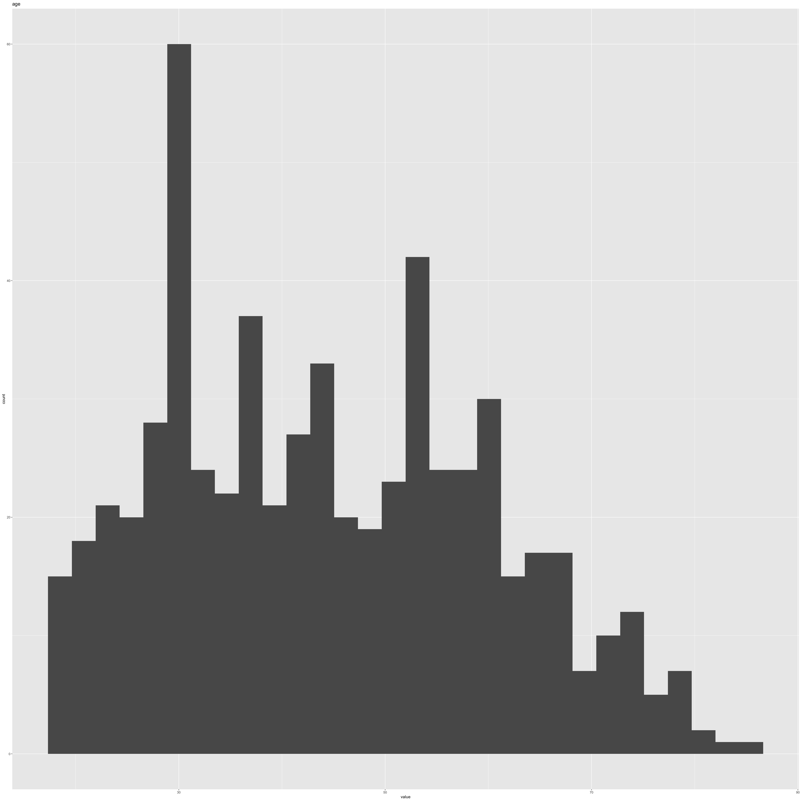
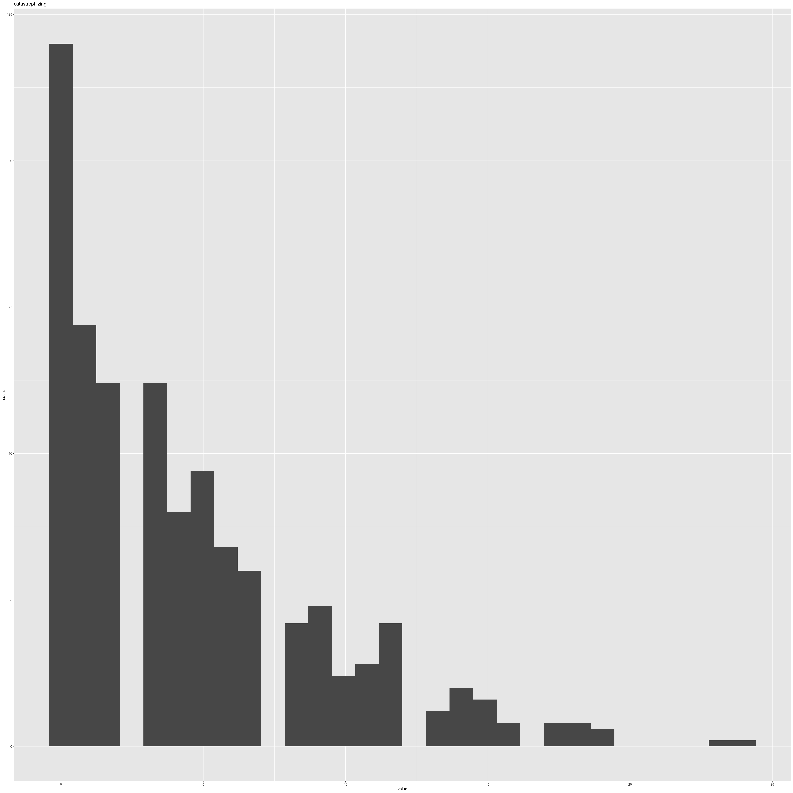
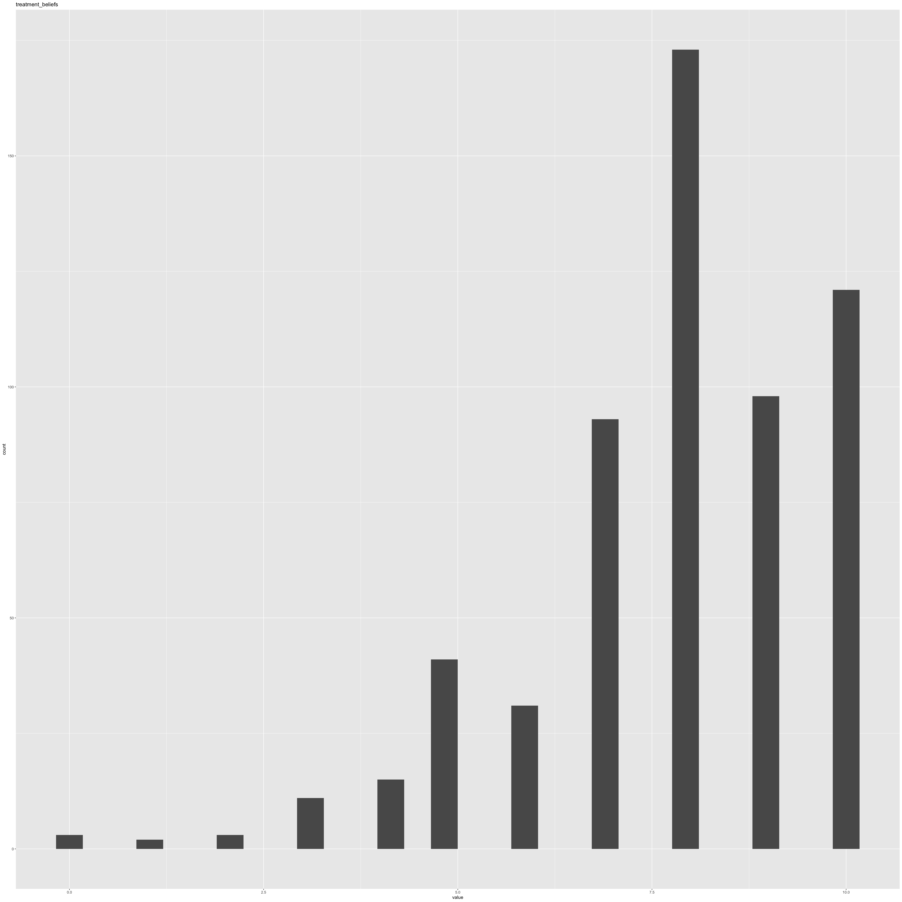
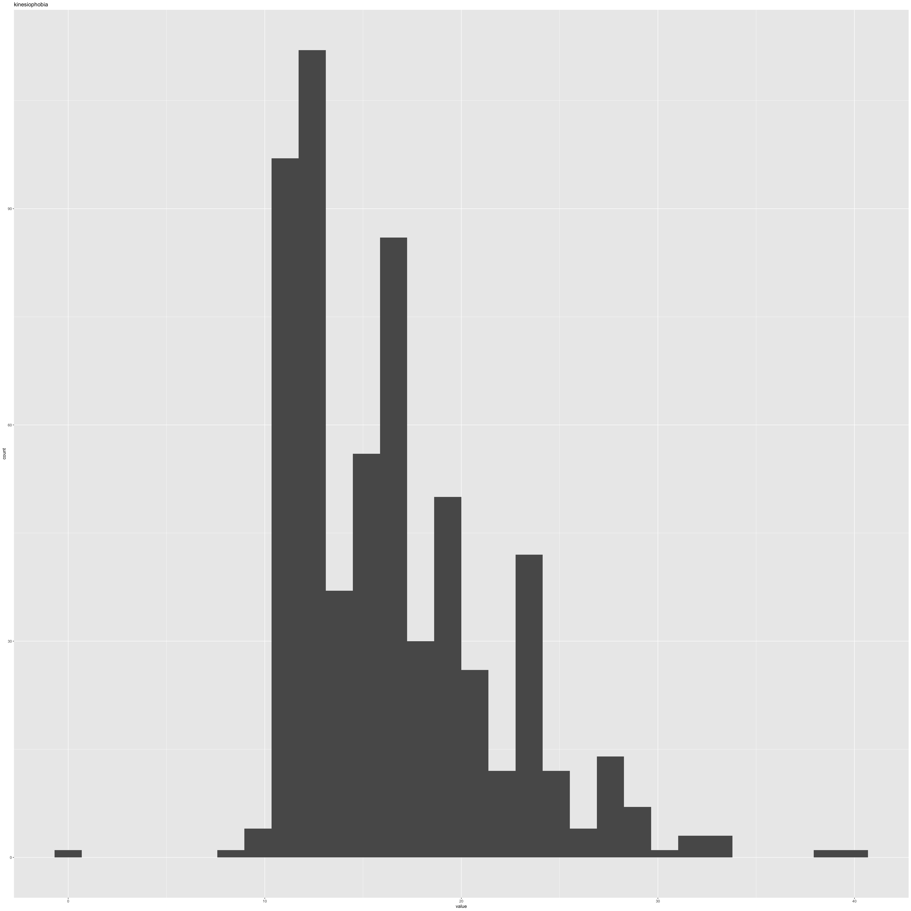
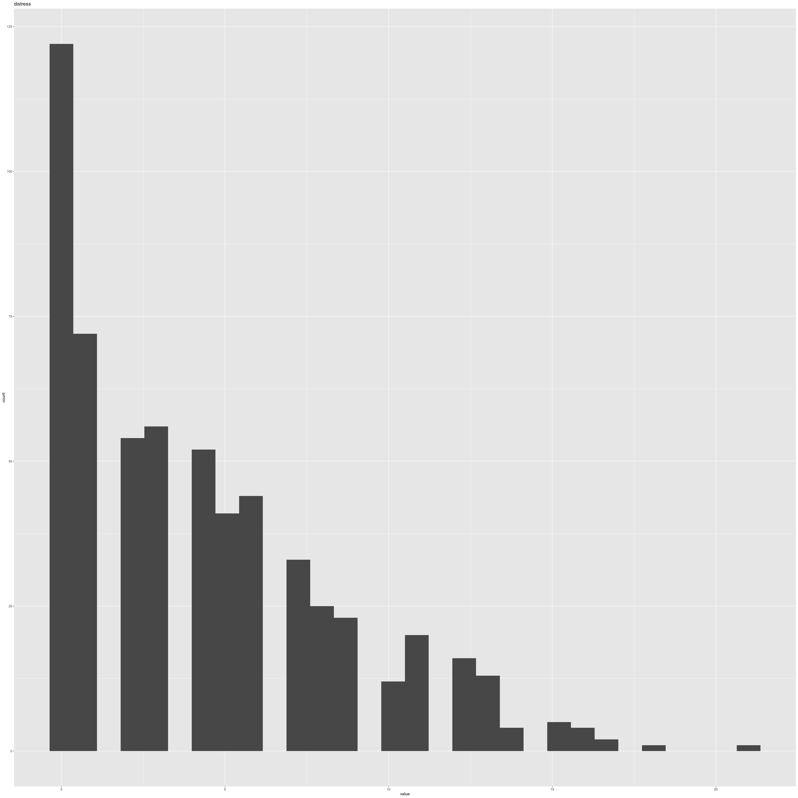
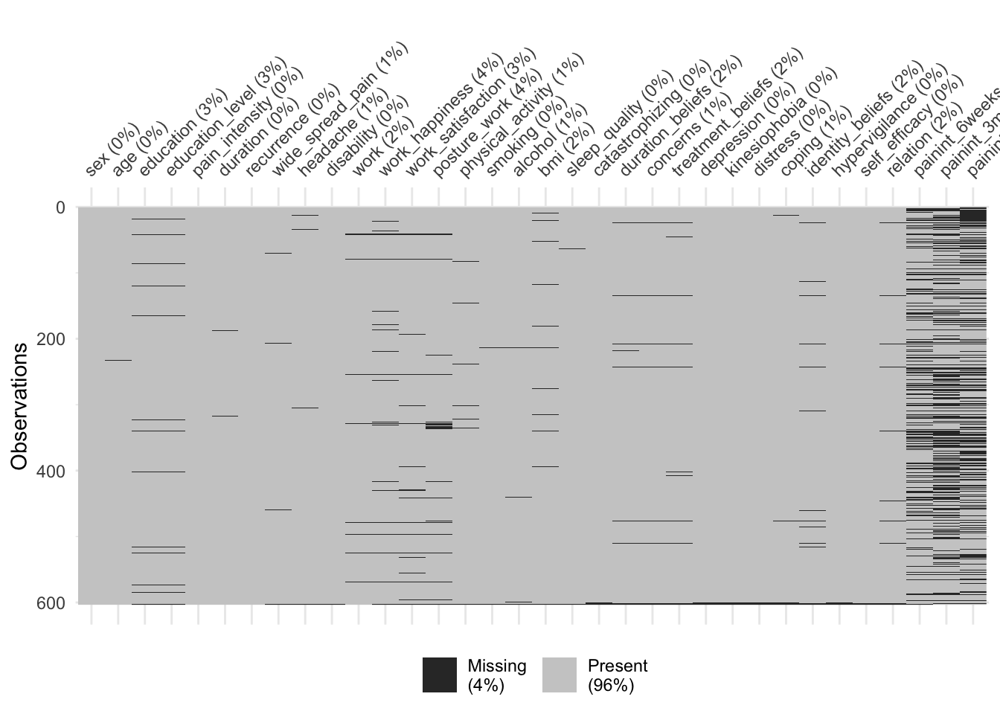
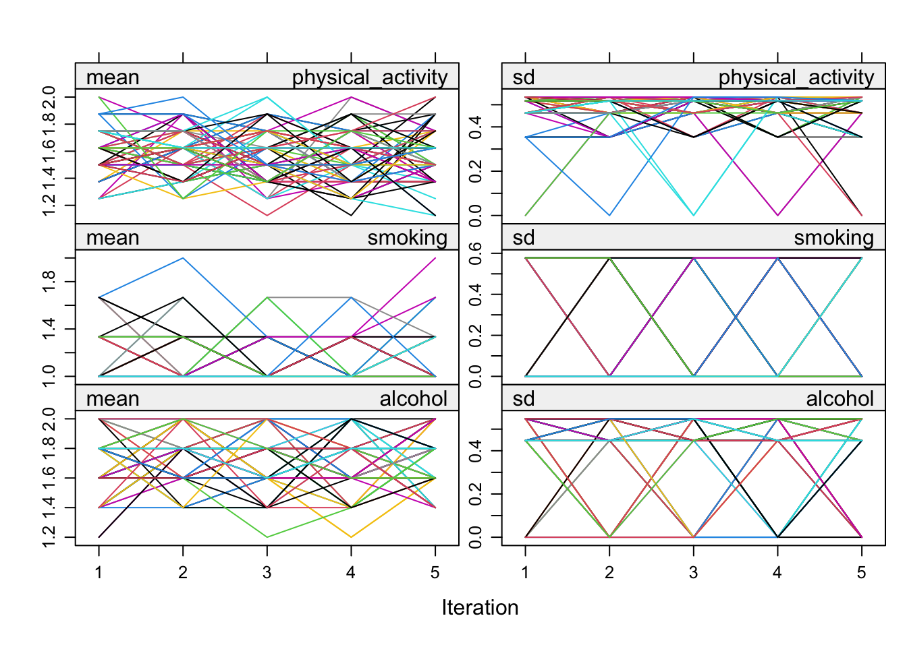
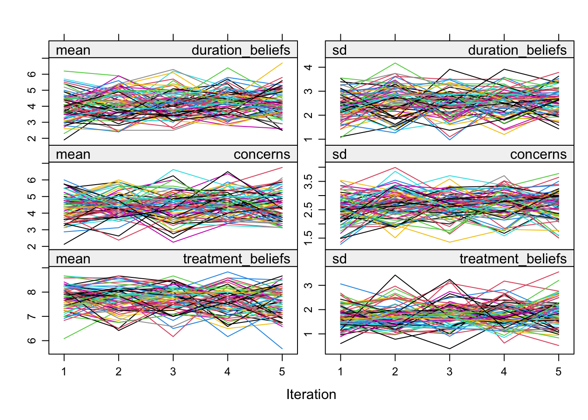
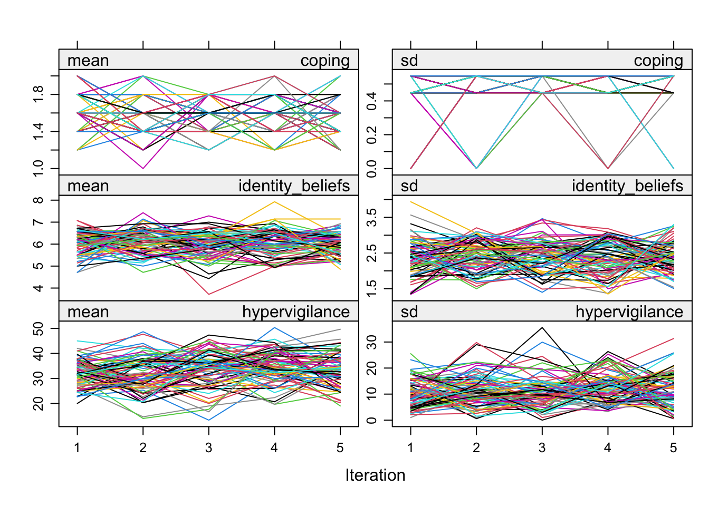
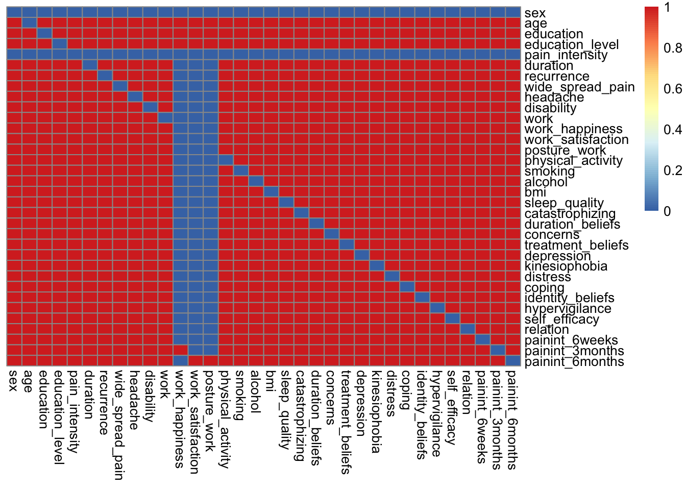

# Imputation of missing values

This section describes in detail how we dealt with imputation of missing values in the data. The overal method of imputation that was chosen is the multiple imputation methods, available in the `{mice}` R package.


## Packages

```r
library(tidyverse)
```

```
## ── Attaching core tidyverse packages ──────────────────────── tidyverse 2.0.0 ──
## ✔ dplyr     1.1.4     ✔ readr     2.1.5
## ✔ forcats   1.0.0     ✔ stringr   1.5.1
## ✔ ggplot2   3.5.0     ✔ tibble    3.2.1
## ✔ lubridate 1.9.3     ✔ tidyr     1.3.1
## ✔ purrr     1.0.2     
## ── Conflicts ────────────────────────────────────────── tidyverse_conflicts() ──
## ✖ dplyr::filter() masks stats::filter()
## ✖ dplyr::lag()    masks stats::lag()
## ℹ Use the conflicted package (<http://conflicted.r-lib.org/>) to force all conflicts to become errors
```

```r
library(mice)
```

```
## 
## Attaching package: 'mice'
## 
## The following object is masked from 'package:stats':
## 
##     filter
## 
## The following objects are masked from 'package:base':
## 
##     cbind, rbind
```

## Data
Because we need to work with multiple versions of the dataset, I decided to change the data structure into a list. This makes it more traceable and more easy to inspect different datasets and keep track of changes. At the end of this analysis a single list object will have all the different versions of the datasets collected together and written to disk.


```r
## raw data
df_raw <- haven::read_sav(
  here::here(
    "data-raw",
    "D010",
    "SPSS basis File results.sav"
  )
)

## non-imputed - subset
df_non_imp_select <- readr::read_rds(
  here::here(
    "data",
    "df_non_imp_select.rds"
  )) |> as_tibble()

names(df_non_imp_select)
```

```
##  [1] "patient_code"      "sex"               "age"              
##  [4] "education"         "education_level"   "pain_intensity"   
##  [7] "duration"          "recurrence"        "wide_spread_pain" 
## [10] "headache"          "disability"        "work"             
## [13] "work_happiness"    "work_satisfaction" "posture_work"     
## [16] "physical_activity" "smoking"           "alcohol"          
## [19] "bmi"               "sleep_quality"     "catastrophizing"  
## [22] "duration_beliefs"  "concerns"          "treatment_beliefs"
## [25] "depression"        "kinesiophobia"     "distress"         
## [28] "coping"            "identity_beliefs"  "hypervigilance"   
## [31] "self_efficacy"     "relation"          "painint_6weeks"   
## [34] "painint_3months"   "painint_6months"
```

```r
data <- list(
  data_raw = df_raw,
  data_subset = df_non_imp_select
)

rm(df_raw, df_non_imp_select)

## add metadata
attr(data$data_subset, "meta") <- "Data variable subset from raw data [file: './data-raw/D010/SPSS basis File results.sav']. Dataframe stored on disk as [file: './data/df_non_imp_select.rds']"  

attr(data$data_raw, "meta") <- "Raw unprocessed data as recieved from supplier [file: './data-raw/D010/SPSS basis File results.sav']" 

## get attributes
attributes(data$data_raw)
```

```
## $class
## [1] "tbl_df"     "tbl"        "data.frame"
## 
## $row.names
##   [1]   1   2   3   4   5   6   7   8   9  10  11  12  13  14  15  16  17  18
##  [19]  19  20  21  22  23  24  25  26  27  28  29  30  31  32  33  34  35  36
##  [37]  37  38  39  40  41  42  43  44  45  46  47  48  49  50  51  52  53  54
##  [55]  55  56  57  58  59  60  61  62  63  64  65  66  67  68  69  70  71  72
##  [73]  73  74  75  76  77  78  79  80  81  82  83  84  85  86  87  88  89  90
##  [91]  91  92  93  94  95  96  97  98  99 100 101 102 103 104 105 106 107 108
## [109] 109 110 111 112 113 114 115 116 117 118 119 120 121 122 123 124 125 126
## [127] 127 128 129 130 131 132 133 134 135 136 137 138 139 140 141 142 143 144
## [145] 145 146 147 148 149 150 151 152 153 154 155 156 157 158 159 160 161 162
## [163] 163 164 165 166 167 168 169 170 171 172 173 174 175 176 177 178 179 180
## [181] 181 182 183 184 185 186 187 188 189 190 191 192 193 194 195 196 197 198
## [199] 199 200 201 202 203 204 205 206 207 208 209 210 211 212 213 214 215 216
## [217] 217 218 219 220 221 222 223 224 225 226 227 228 229 230 231 232 233 234
## [235] 235 236 237 238 239 240 241 242 243 244 245 246 247 248 249 250 251 252
## [253] 253 254 255 256 257 258 259 260 261 262 263 264 265 266 267 268 269 270
## [271] 271 272 273 274 275 276 277 278 279 280 281 282 283 284 285 286 287 288
## [289] 289 290 291 292 293 294 295 296 297 298 299 300 301 302 303 304 305 306
## [307] 307 308 309 310 311 312 313 314 315 316 317 318 319 320 321 322 323 324
## [325] 325 326 327 328 329 330 331 332 333 334 335 336 337 338 339 340 341 342
## [343] 343 344 345 346 347 348 349 350 351 352 353 354 355 356 357 358 359 360
## [361] 361 362 363 364 365 366 367 368 369 370 371 372 373 374 375 376 377 378
## [379] 379 380 381 382 383 384 385 386 387 388 389 390 391 392 393 394 395 396
## [397] 397 398 399 400 401 402 403 404 405 406 407 408 409 410 411 412 413 414
## [415] 415 416 417 418 419 420 421 422 423 424 425 426 427 428 429 430 431 432
## [433] 433 434 435 436 437 438 439 440 441 442 443 444 445 446 447 448 449 450
## [451] 451 452 453 454 455 456 457 458 459 460 461 462 463 464 465 466 467 468
## [469] 469 470 471 472 473 474 475 476 477 478 479 480 481 482 483 484 485 486
## [487] 487 488 489 490 491 492 493 494 495 496 497 498 499 500 501 502 503 504
## [505] 505 506 507 508 509 510 511 512 513 514 515 516 517 518 519 520 521 522
## [523] 523 524 525 526 527 528 529 530 531 532 533 534 535 536 537 538 539 540
## [541] 541 542 543 544 545 546 547 548 549 550 551 552 553 554 555 556 557 558
## [559] 559 560 561 562 563 564 565 566 567 568 569 570 571 572 573 574 575 576
## [577] 577 578 579 580 581 582 583 584 585 586 587 588 589 590 591 592 593 594
## [595] 595 596 597 598 599 600 601 602 603
## 
## $names
##  [1] "Patient_code"              "PT_code"                  
##  [3] "Seks"                      "Age"                      
##  [5] "Education"                 "Education_level"          
##  [7] "Pain_intensity"            "Duration"                 
##  [9] "Recurrence"                "WideSpreadPain"           
## [11] "Headache"                  "Disability"               
## [13] "Work"                      "Work_happiness"           
## [15] "Work_Satisfaction"         "Posture_work"             
## [17] "Physical_activity"         "Smoking"                  
## [19] "Alcohol"                   "BMI"                      
## [21] "Sleep_quality"             "Catastrophizing"          
## [23] "Duration_beliefs"          "Concerns"                 
## [25] "Treatment_beliefs"         "Depression"               
## [27] "Kinesiophobia"             "Distress"                 
## [29] "Coping"                    "Percentage_active_coping" 
## [31] "Coping_active"             "Percentage_passive_coping"
## [33] "Coping_passive"            "Identity_beliefs"         
## [35] "Hypervigilance"            "Self_efficacy"            
## [37] "Attitude"                  "Relation"                 
## [39] "Pain_6weeks"               "Painint_6weeks"           
## [41] "Pain_categorized_6weeks"   "Pain_3months"             
## [43] "Painint_3months"           "Pain_catagorized_3months" 
## [45] "Pain_6months"              "Painint_6months"          
## [47] "Pain_categorized_6months" 
## 
## $meta
## [1] "Raw unprocessed data as recieved from supplier [file: './data-raw/D010/SPSS basis File results.sav']"
```

## Prepare datset for imputing
To prepare the data for imputation we need to carefully consider which variables to keep in the data and which variables we will use to get imputed values for missing values. In order to have a dataset that we can staert preparing, we copy the dataset so that we can keep the original data for comparison.


```r
## copy datasets
data$data_to_impute <- data$data_subset
names(data)
```

```
## [1] "data_raw"       "data_subset"    "data_to_impute"
```

```r
data_to_impute <- data$data_to_impute
names(data_to_impute)
```

```
##  [1] "patient_code"      "sex"               "age"              
##  [4] "education"         "education_level"   "pain_intensity"   
##  [7] "duration"          "recurrence"        "wide_spread_pain" 
## [10] "headache"          "disability"        "work"             
## [13] "work_happiness"    "work_satisfaction" "posture_work"     
## [16] "physical_activity" "smoking"           "alcohol"          
## [19] "bmi"               "sleep_quality"     "catastrophizing"  
## [22] "duration_beliefs"  "concerns"          "treatment_beliefs"
## [25] "depression"        "kinesiophobia"     "distress"         
## [28] "coping"            "identity_beliefs"  "hypervigilance"   
## [31] "self_efficacy"     "relation"          "painint_6weeks"   
## [34] "painint_3months"   "painint_6months"
```

The id column 'pation_code' is a zero variance variable and does not serve any pupose in the imputation process, so here we delete it.

```r
## remove ID var 'patient_code'
data$data_to_impute <- data$data_to_impute |>
  select(-patient_code)
```

## Convert all categorical vars to factors
For the imputation process we need the discrete variables to be factors.

```r
## which are factors and which are continuous vars?
should_be_factors <- c(
  "coping",
  "sleep_quality",
  "alcohol",
  "smoking",
  "physical_activity",
  "posture_work",
  "work_satisfaction",
  "work_happiness",
  "work",
  "headache",
  "wide_spread_pain",
  "recurrence",
  "education_level",
  "education",
  "sex"
)

## copy dataset
data$data_preprocessed <- data$data_to_impute

## convert the categoricals to factors
data$data_preprocessed <- data$data_preprocessed %>%
  mutate(across(should_be_factors, as_factor))
```

```
## Warning: There was 1 warning in `mutate()`.
## ℹ In argument: `across(should_be_factors, as_factor)`.
## Caused by warning:
## ! Using an external vector in selections was deprecated in tidyselect 1.1.0.
## ℹ Please use `all_of()` or `any_of()` instead.
##   # Was:
##   data %>% select(should_be_factors)
## 
##   # Now:
##   data %>% select(all_of(should_be_factors))
## 
## See <https://tidyselect.r-lib.org/reference/faq-external-vector.html>.
```

```r
## check datatypes
map_df(
  .x = data$data_preprocessed,
  .f = class
  ) |> 
  t() |>
  enframe(name = "var_name", value = "var_type") -> var_types
```

## Panel with all distributions
In a panel plot we can show all the distibutions which provide an idea on which variables are discrete and which are continuous. The panels can also be viewed as images in the `./img` folder.

```r
##  function to plot a vectors histogram
source(
  here::here(
    "R",
    "plot_distro.R"
  )
)

ind_num <- map_lgl(
  .x = data$data_preprocessed,
  .f = is.numeric
)

num_vars <- names(data$data_preprocessed)[ind_num]

## create histogram to establish var type / data distribution
list_histograms <- map2(
  .x = data$data_preprocessed[ ,ind_num],
  .y = num_vars,
  .f = plot_distro
)

list_histograms
```

```
## $age
```

```
## `stat_bin()` using `bins = 30`. Pick better value with `binwidth`.
```

```
## Warning: Removed 1 row containing non-finite outside the scale range
## (`stat_bin()`).
```



```
## 
## $pain_intensity
```

```
## `stat_bin()` using `bins = 30`. Pick better value with `binwidth`.
```


```
## 
## $duration
```

```
## `stat_bin()` using `bins = 30`. Pick better value with `binwidth`.
```

```
## Warning: Removed 3 rows containing non-finite outside the scale range
## (`stat_bin()`).
```


```
## 
## $disability
```

```
## `stat_bin()` using `bins = 30`. Pick better value with `binwidth`.
```

```
## Warning: Removed 1 row containing non-finite outside the scale range
## (`stat_bin()`).
```


```
## 
## $bmi
```

```
## `stat_bin()` using `bins = 30`. Pick better value with `binwidth`.
```

```
## Warning: Removed 12 rows containing non-finite outside the scale range
## (`stat_bin()`).
```


```
## 
## $catastrophizing
```

```
## `stat_bin()` using `bins = 30`. Pick better value with `binwidth`.
```

```
## Warning: Removed 3 rows containing non-finite outside the scale range
## (`stat_bin()`).
```



```
## 
## $duration_beliefs
```

```
## `stat_bin()` using `bins = 30`. Pick better value with `binwidth`.
```

```
## Warning: Removed 10 rows containing non-finite outside the scale range
## (`stat_bin()`).
```


```
## 
## $concerns
```

```
## `stat_bin()` using `bins = 30`. Pick better value with `binwidth`.
```

```
## Warning: Removed 8 rows containing non-finite outside the scale range
## (`stat_bin()`).
```


```
## 
## $treatment_beliefs
```

```
## `stat_bin()` using `bins = 30`. Pick better value with `binwidth`.
```

```
## Warning: Removed 12 rows containing non-finite outside the scale range
## (`stat_bin()`).
```



```
## 
## $depression
```

```
## `stat_bin()` using `bins = 30`. Pick better value with `binwidth`.
```

```
## Warning: Removed 3 rows containing non-finite outside the scale range
## (`stat_bin()`).
```


```
## 
## $kinesiophobia
```

```
## `stat_bin()` using `bins = 30`. Pick better value with `binwidth`.
```

```
## Warning: Removed 3 rows containing non-finite outside the scale range
## (`stat_bin()`).
```



```
## 
## $distress
```

```
## `stat_bin()` using `bins = 30`. Pick better value with `binwidth`.
```

```
## Warning: Removed 3 rows containing non-finite outside the scale range
## (`stat_bin()`).
```



```
## 
## $identity_beliefs
```

```
## `stat_bin()` using `bins = 30`. Pick better value with `binwidth`.
```

```
## Warning: Removed 14 rows containing non-finite outside the scale range
## (`stat_bin()`).
```


```
## 
## $hypervigilance
```

```
## `stat_bin()` using `bins = 30`. Pick better value with `binwidth`.
```

```
## Warning: Removed 3 rows containing non-finite outside the scale range
## (`stat_bin()`).
```


```
## 
## $self_efficacy
```

```
## `stat_bin()` using `bins = 30`. Pick better value with `binwidth`.
```

```
## Warning: Removed 2 rows containing non-finite outside the scale range
## (`stat_bin()`).
```


```
## 
## $relation
```

```
## `stat_bin()` using `bins = 30`. Pick better value with `binwidth`.
```

```
## Warning: Removed 10 rows containing non-finite outside the scale range
## (`stat_bin()`).
```


```
## 
## $painint_6weeks
```

```
## `stat_bin()` using `bins = 30`. Pick better value with `binwidth`.
```

```
## Warning: Removed 154 rows containing non-finite outside the scale range
## (`stat_bin()`).
```


```
## 
## $painint_3months
```

```
## `stat_bin()` using `bins = 30`. Pick better value with `binwidth`.
```

```
## Warning: Removed 224 rows containing non-finite outside the scale range
## (`stat_bin()`).
```


```
## 
## $painint_6months
```

```
## `stat_bin()` using `bins = 30`. Pick better value with `binwidth`.
```

```
## Warning: Removed 212 rows containing non-finite outside the scale range
## (`stat_bin()`).
```


```r
cowplot::plot_grid(plotlist = list_histograms)
```

```
## `stat_bin()` using `bins = 30`. Pick better value with `binwidth`.
```

```
## Warning: Removed 1 row containing non-finite outside the scale range
## (`stat_bin()`).
```

```
## `stat_bin()` using `bins = 30`. Pick better value with `binwidth`.
## `stat_bin()` using `bins = 30`. Pick better value with `binwidth`.
```

```
## Warning: Removed 3 rows containing non-finite outside the scale range
## (`stat_bin()`).
```

```
## `stat_bin()` using `bins = 30`. Pick better value with `binwidth`.
```

```
## Warning: Removed 1 row containing non-finite outside the scale range
## (`stat_bin()`).
```

```
## `stat_bin()` using `bins = 30`. Pick better value with `binwidth`.
```

```
## Warning: Removed 12 rows containing non-finite outside the scale range
## (`stat_bin()`).
```

```
## `stat_bin()` using `bins = 30`. Pick better value with `binwidth`.
```

```
## Warning: Removed 3 rows containing non-finite outside the scale range
## (`stat_bin()`).
```

```
## `stat_bin()` using `bins = 30`. Pick better value with `binwidth`.
```

```
## Warning: Removed 10 rows containing non-finite outside the scale range
## (`stat_bin()`).
```

```
## `stat_bin()` using `bins = 30`. Pick better value with `binwidth`.
```

```
## Warning: Removed 8 rows containing non-finite outside the scale range
## (`stat_bin()`).
```

```
## `stat_bin()` using `bins = 30`. Pick better value with `binwidth`.
```

```
## Warning: Removed 12 rows containing non-finite outside the scale range
## (`stat_bin()`).
```

```
## `stat_bin()` using `bins = 30`. Pick better value with `binwidth`.
```

```
## Warning: Removed 3 rows containing non-finite outside the scale range
## (`stat_bin()`).
```

```
## `stat_bin()` using `bins = 30`. Pick better value with `binwidth`.
```

```
## Warning: Removed 3 rows containing non-finite outside the scale range
## (`stat_bin()`).
```

```
## `stat_bin()` using `bins = 30`. Pick better value with `binwidth`.
```

```
## Warning: Removed 3 rows containing non-finite outside the scale range
## (`stat_bin()`).
```

```
## `stat_bin()` using `bins = 30`. Pick better value with `binwidth`.
```

```
## Warning: Removed 14 rows containing non-finite outside the scale range
## (`stat_bin()`).
```

```
## `stat_bin()` using `bins = 30`. Pick better value with `binwidth`.
```

```
## Warning: Removed 3 rows containing non-finite outside the scale range
## (`stat_bin()`).
```

```
## `stat_bin()` using `bins = 30`. Pick better value with `binwidth`.
```

```
## Warning: Removed 2 rows containing non-finite outside the scale range
## (`stat_bin()`).
```

```
## `stat_bin()` using `bins = 30`. Pick better value with `binwidth`.
```

```
## Warning: Removed 10 rows containing non-finite outside the scale range
## (`stat_bin()`).
```

```
## `stat_bin()` using `bins = 30`. Pick better value with `binwidth`.
```

```
## Warning: Removed 154 rows containing non-finite outside the scale range
## (`stat_bin()`).
```

```
## `stat_bin()` using `bins = 30`. Pick better value with `binwidth`.
```

```
## Warning: Removed 224 rows containing non-finite outside the scale range
## (`stat_bin()`).
```

```
## `stat_bin()` using `bins = 30`. Pick better value with `binwidth`.
```

```
## Warning: Removed 212 rows containing non-finite outside the scale range
## (`stat_bin()`).
```


```r
ggsave(here::here("img", "distros.png"), height = 40, width = 40, dpi = 300)
ggsave(here::here("img", "distros.svg"), height = 40, width = 40, dpi = 300)
```

# Imputation of missing values

## Checking Missing Completely at Random (MCAR)
https://bookdown.org/mwheymans/bookmi/missing-data-evaluation.html#missing-data-evaluation-in-r

From the analysis above we can conclude that some of the variables:
are on a continuous or discrete scale. We need to select those to assess MCAR.

### Missingness pattern

```r
md.pattern(data$data_preprocessed) ## figure does not scale properly, TODO: needs a fix
```

## Define predictors to include in the imputations

```r
## select continuous and discrete
var_selection <- c(
  # "patient_code", 
  "sex",
  "age",
  "education",
  "education_level",
  "pain_intensity",
  "duration",
  "recurrence",
  "wide_spread_pain",
  "headache",
  "disability",
  "work",
# "work_happiness",
# "work_satisfaction",
# "posture_work",
  "physical_activity",
  "smoking",
  "alcohol",
  "bmi",
  "sleep_quality",
  "catastrophizing",
  "duration_beliefs",
  "concerns",
  "treatment_beliefs",
  "depression",
  "kinesiophobia",
  "distress",
  "coping",
  "identity_beliefs",
  "hypervigilance",
  "self_efficacy",
  "relation",
  "painint_6weeks",
  "painint_3months",
  "painint_6months"
  )

intersect(names(data$data_preprocessed), var_selection)
```

```
##  [1] "sex"               "age"               "education"        
##  [4] "education_level"   "pain_intensity"    "duration"         
##  [7] "recurrence"        "wide_spread_pain"  "headache"         
## [10] "disability"        "work"              "physical_activity"
## [13] "smoking"           "alcohol"           "bmi"              
## [16] "sleep_quality"     "catastrophizing"   "duration_beliefs" 
## [19] "concerns"          "treatment_beliefs" "depression"       
## [22] "kinesiophobia"     "distress"          "coping"           
## [25] "identity_beliefs"  "hypervigilance"    "self_efficacy"    
## [28] "relation"          "painint_6weeks"    "painint_3months"  
## [31] "painint_6months"
```

```r
library(naniar)
mcar_test(data = data$data_preprocessed[, var_selection])
```

```
## # A tibble: 1 × 4
##   statistic    df p.value missing.patterns
##       <dbl> <dbl>   <dbl>            <int>
## 1     1681.  1578  0.0356               58
```

From `?mcar_test`:
Use Little's (1988) test statistic to assess if data is missing completely at random (MCAR). The null hypothesis in this test is that the data is MCAR, and the test statistic is a chi-squared value. 

Based on the fact the p-value here is not < 0.05, we can conclude that we cannot reject the NULL hypothesis, thus concluding that the missingness in the data is MCAR.

## Inspect the unique values of some of the variables

```r
df_select_compare <- data$data_preprocessed |>
  dplyr::select(
    age,
    depression,
    duration,
    pain_intensity
  )

map(
  .x = df_select_compare, 
  .f = unique
  )


df_select_compare_fct <- df_select_compare |>
  mutate(
    age = as_factor(age),
    depression = as_factor(depression),
    duration = as_factor(duration)
  )
  
  
map(
  .x = df_select_compare_fct, 
  .f = levels
  )

map(
  .x = df_select_compare_fct, 
  .f = unique
  )

rm(df_select_compare, df_select_compare_fct)
```

## Using the MICE package for imputation of missing values
Before we proceed with MICE, we need to remove the SPSS labels from the dataframe (see: https://stackoverflow.com/questions/62395629/error-t-haven-labelled-not-supported-while-attempting-mice-package-in-r)

## Create predictorMatrix for MICE

When we want to create a predictionMatrix automatically with a threshold for low correlating variables


```r
names(data$data_preprocessed)
```

```
##  [1] "sex"               "age"               "education"        
##  [4] "education_level"   "pain_intensity"    "duration"         
##  [7] "recurrence"        "wide_spread_pain"  "headache"         
## [10] "disability"        "work"              "work_happiness"   
## [13] "work_satisfaction" "posture_work"      "physical_activity"
## [16] "smoking"           "alcohol"           "bmi"              
## [19] "sleep_quality"     "catastrophizing"   "duration_beliefs" 
## [22] "concerns"          "treatment_beliefs" "depression"       
## [25] "kinesiophobia"     "distress"          "coping"           
## [28] "identity_beliefs"  "hypervigilance"    "self_efficacy"    
## [31] "relation"          "painint_6weeks"    "painint_3months"  
## [34] "painint_6months"
```

```r
pred <- quickpred(data$data_preprocessed, minpuc = 0.5, include = var_selection)

rownames(pred) <- colnames(pred)
pred <- pred |> as.matrix()
pheatmap::pheatmap(pred, cluster_rows = FALSE, cluster_cols = FALSE)
```


## Calculate percentage missing data and cases
When we want to have all variables in the dataset available for imputation

One of the hyperperameters for the 'mice' function is `m`, the number of imputations: this should be at least the percentage of missing cases in the data.

Let's calulate


```r
## manual calculation
n_na <- sum(is.na(data$data_preprocessed))
n_obs <- nrow(data$data_preprocessed) * ncol(data$data_preprocessed)

perc_mssing <- 100 * (n_na/n_obs)
perc_mssing |> round(1)
```

```
## [1] 4
```

```r
## using naniar package / visual confirmation is always good
vis_miss(data$data_preprocessed)
```



```r
## missing cases
pct_missing_cases <- naniar::prop_miss_case(data$data_preprocessed) * 100
```

So 4.0093649% of the total data is missing. But 59.7014925% of the cases has at least one missing value. We set the `m` parameter to 75   

## Running the imputations
In order to allow for running imputations over multiple cores of the computer, we use the `{future}` package.


```r
df_inspect <- data$data_preprocessed

## get data types
map_df(
  df_inspect,
  class
) |> 
  t() |>
  as_tibble() -> datatypes
```

```
## Warning: The `x` argument of `as_tibble.matrix()` must have unique column names if
## `.name_repair` is omitted as of tibble 2.0.0.
## ℹ Using compatibility `.name_repair`.
## This warning is displayed once every 8 hours.
## Call `lifecycle::last_lifecycle_warnings()` to see where this warning was
## generated.
```

```r
levels(df_inspect$physical_activity)
```

```
## [1] "0" "1"
```

```r
df_inspect$physical_activity |> unique()
```

```
## [1] 0    1    <NA>
## Levels: 0 1
```

```r
levels(df_inspect$work)
```

```
## [1] "1" "2"
```

```r
df_inspect$work |> unique()
```

```
## [1] 1    2    <NA>
## Levels: 1 2
```

```r
levels(df_inspect$work_happiness)
```

```
## [1] "1" "2" "3"
```

```r
df_inspect$work_happiness |> unique()
```

```
## [1] 1    2    3    <NA>
## Levels: 1 2 3
```

```r
levels(df_inspect$posture_work)
```

```
## [1] "1" "2" "3"
```

```r
df_inspect$posture_work |> unique()
```

```
## [1] 1    2    3    <NA>
## Levels: 1 2 3
```

```r
future::plan("multisession", workers = pmin(2L, future::availableCores()))
data$mult_imp <- futuremice(
  data$data_preprocessed, 
  m = 75,
  maxiter = 10,
  parallelseed = 123,
  predictorMatrix = pred
  )
```

```
## Warning: Number of logged events: 339
```

```
## Warning: Number of logged events: 464
```

```
## Warning: Number of logged events: 398
```

```
## Warning: Number of logged events: 367
```

```
## Warning: Number of logged events: 358
```

```
## Warning: Number of logged events: 382
```

```
## Warning: Number of logged events: 338
```

## Inspect the imputations
We can look at the imputed dataframe as an item in the 'data' list object.

```r
data$mult_imp
```

```
## Class: mids
## Number of multiple imputations:  75 
## Imputation methods:
##               sex               age         education   education_level 
##                ""             "pmm"         "polyreg"          "logreg" 
##    pain_intensity          duration        recurrence  wide_spread_pain 
##                ""             "pmm"          "logreg"          "logreg" 
##          headache        disability              work    work_happiness 
##         "polyreg"             "pmm"          "logreg"         "polyreg" 
## work_satisfaction      posture_work physical_activity           smoking 
##         "polyreg"         "polyreg"          "logreg"          "logreg" 
##           alcohol               bmi     sleep_quality   catastrophizing 
##          "logreg"             "pmm"          "logreg"             "pmm" 
##  duration_beliefs          concerns treatment_beliefs        depression 
##             "pmm"             "pmm"             "pmm"             "pmm" 
##     kinesiophobia          distress            coping  identity_beliefs 
##             "pmm"             "pmm"          "logreg"             "pmm" 
##    hypervigilance     self_efficacy          relation    painint_6weeks 
##             "pmm"             "pmm"             "pmm"             "pmm" 
##   painint_3months   painint_6months 
##             "pmm"             "pmm" 
## PredictorMatrix:
##                 sex age education education_level pain_intensity duration
## sex               0   0         0               0              0        0
## age               1   0         1               1              1        1
## education         1   1         0               1              1        1
## education_level   1   1         1               0              1        1
## pain_intensity    0   0         0               0              0        0
## duration          1   1         1               1              1        0
##                 recurrence wide_spread_pain headache disability work
## sex                      0                0        0          0    0
## age                      1                1        1          1    1
## education                1                1        1          1    1
## education_level          1                1        1          1    1
## pain_intensity           0                0        0          0    0
## duration                 1                1        1          1    1
##                 work_happiness work_satisfaction posture_work physical_activity
## sex                          0                 0            0                 0
## age                          1                 1            1                 1
## education                    1                 1            1                 1
## education_level              1                 1            1                 1
## pain_intensity               0                 0            0                 0
## duration                     0                 0            0                 1
##                 smoking alcohol bmi sleep_quality catastrophizing
## sex                   0       0   0             0               0
## age                   1       1   1             1               1
## education             1       1   1             1               1
## education_level       1       1   1             1               1
## pain_intensity        0       0   0             0               0
## duration              1       1   1             1               1
##                 duration_beliefs concerns treatment_beliefs depression
## sex                            0        0                 0          0
## age                            1        1                 1          1
## education                      1        1                 1          1
## education_level                1        1                 1          1
## pain_intensity                 0        0                 0          0
## duration                       1        1                 1          1
##                 kinesiophobia distress coping identity_beliefs hypervigilance
## sex                         0        0      0                0              0
## age                         1        1      1                1              1
## education                   1        1      1                1              1
## education_level             1        1      1                1              1
## pain_intensity              0        0      0                0              0
## duration                    1        1      1                1              1
##                 self_efficacy relation painint_6weeks painint_3months
## sex                         0        0              0               0
## age                         1        1              1               1
## education                   1        1              1               1
## education_level             1        1              1               1
## pain_intensity              0        0              0               0
## duration                    1        1              1               1
##                 painint_6months
## sex                           0
## age                           1
## education                     1
## education_level               1
## pain_intensity                0
## duration                      1
## Number of logged events:  339 
##   it im             dep meth
## 1  1  1 painint_3months  pmm
## 2  1  1 painint_6months  pmm
## 3  1  2 painint_3months  pmm
## 4  1  2 painint_6months  pmm
## 5  1  2 painint_6months  pmm
## 6  1  3 painint_3months  pmm
##                                                                                                                                                                                                                                                        out
## 1                                                                                                                                                                                                                                                    work2
## 2                                                                                                                                                                                                                                     work2, posture_work3
## 3                                                                                                                                                                                                                                                    work2
## 4                                                                                                                                                                                                                                     work2, posture_work2
## 5 mice detected that your data are (nearly) multi-collinear.\nIt applied a ridge penalty to continue calculations, but the results can be unstable.\nDoes your dataset contain duplicates, linear transformation, or factors with unique respondent names?
## 6                                                                                                                                                                                                                                          work_happiness3
```

Printing the `mult_imp` object to the console will give you the used methods for each variable:

**It is suggested to let the MICE function decide the method and not change it.**
see also: https://stats.stackexchange.com/questions/204313/how-to-choose-which-imputation-to-use-to-replace-missing-values

## Check convergence

```r
plot(data$mult_imp)
```



From these plots we see that there is no evident trend in the estimation of the means over iterations, for any of the imputed variables. Therefore we can conclude that convergence was achieved and that the max. iteration of 10 is a valid setting for this imputation run.

## Check for plausible values of imputation

```r
svg(filename = here::here("img", "stripplot.svg"))
stripplot(data$mult_imp)
dev.off()
```

```
## quartz_off_screen 
##                 2
```

## Checking the used predictor matrix

```r
future::plan("sequential")
## inspect the predictorMatrix
pm_df <- data$mult_imp$predictorMatrix |>
  as.data.frame()
  
rownames(pm_df) <- colnames(pm_df)

library(pheatmap)
pheatmap(pm_df, cluster_rows = FALSE, cluster_cols = FALSE)
```




## Running multiple regressions


```r
reg_multimp <- with(data = data$mult_imp, lm(pain_intensity ~ sex * age))

summary(reg_multimp$analyses[[1]])
plot(reg_multimp$analyses[[1]])

#pool
reg_pooled <- pool(reg_multimp)
#analyse pooled results - does the confidence interval include both directions? 
summary(reg_pooled, conf.int = TRUE, conf.level = 0.95) |> 
  as_tibble() |>
  janitor::clean_names() |>
  dplyr::filter(term != "(Intercept)") |>
  ggplot(
    aes(x = term,
        y = estimate)
  ) +
  geom_point(colour = "red", size = 2) +
  geom_errorbar(aes(ymin=estimate-x2_5_percent, ymax=estimate+x97_5_percent), width=.2,
                 position=position_dodge(.9)) +
  ylim(c(-0.5, 0.5)) +
  theme_bw()
```

## Complete the dataset with this imputation

```r
#create imputed data to work with
data$data_imputed <- complete(data$mult_imp, 1) |>
  as_tibble()
  
naniar::vis_miss(data$data_imputed)
```


```r
## add atttributes to imputed dataframe
attr(data$data_imputed, "meta") <- "Imputed data. Input data is data variable subset from data [file: './data/df_non_imp_select.rds']. Dataframe stored on disk as [file: './data/df_imp_select.rds']"  

## remove clutter
rm(df_imp, df_multimp, reg_multimp, reg_pooled, pm_df, pred, var_selection, list_histograms)
```

```
## Warning in rm(df_imp, df_multimp, reg_multimp, reg_pooled, pm_df, pred, :
## object 'df_imp' not found
```

```
## Warning in rm(df_imp, df_multimp, reg_multimp, reg_pooled, pm_df, pred, :
## object 'df_multimp' not found
```

```
## Warning in rm(df_imp, df_multimp, reg_multimp, reg_pooled, pm_df, pred, :
## object 'reg_multimp' not found
```

```
## Warning in rm(df_imp, df_multimp, reg_multimp, reg_pooled, pm_df, pred, :
## object 'reg_pooled' not found
```

## Visualize the imputations

```r
# Load the necessary libraries
library(ggplot2)

# Assuming 'data_with_missing' is your dataset with missing values
# and 'data_with_imputed' is your dataset with imputed values

## dummies
data_missing = data$data_preprocessed
data_imputed = data$data_imputed
#variable_name = names(data$data_preprocessed)[33]


## raw data plot
# Plot for dataset with imputed values
plot_missingness_points <- function(df, var){
  df |>
    ggplot(aes(x = var, y = value)) +
    geom_point(aes(colour = is_missing), position = "jitter", shape = 1) +
    ggtitle(var)
}

#df = joined - distro function
plot_missingness_distro <- function(df, var){
  df |>
    ggplot(aes(x = value)) +
    geom_density(aes(colour = var)) +
    ggtitle(var) +
    facet_wrap(~var)
}

#plot_missingness_distro(df = df)

compare_datasets <- function(
    variable_name,
    data_missing, 
    data_imputed, 
    plot_function) {
  # Create a bar plot to compare the distribution of the specified variable
  
  # Plot for dataset with missing values
  joined <- tibble(
    missing = data_missing[[variable_name]],
    imputed = data_imputed[[variable_name]]
    
  ) |>
    mutate(
      is_missing = is.na(missing)
    ) |>
    pivot_longer(
      c(missing, imputed), names_to = "var", values_to = "value")
    
  plot_missingness <- plot_function(joined, var = variable_name)
    
  return(plot_missingness)
  
}

var_names_preprocessed <- names(data$data_preprocessed) 
var_names_imputed <- names(data$data_imputed)
var_names_iteration <- var_names_preprocessed

map(
  .x = var_names_iteration,
  .f = compare_datasets,
  data_missing = data$data_preprocessed,
  data_imputed = data$data_imputed,
  plot_function = plot_missingness_points
) -> plot_points_missingness_list


names(plot_points_missingness_list) <- var_names_iteration
plot_points_missingness_list

map(
  .x = var_names_iteration,
  .f = compare_datasets,
  data_missing = data$data_preprocessed,
  data_imputed = data$data_imputed,
  plot_function = plot_missingness_distro
) -> plot_distros_missingness_list


names(plot_distros_missingness_list) <- var_names_iteration
plot_distros_missingness_list
```

## Skimming the data

```r
data$data_imputed %>% 
  skimr::skim(
    pain_intensity, 
    sex, 
    age, 
    painint_6weeks, 
    alcohol,
    painint_3months, 
    painint_6months
    ) 
```


Table: (\#tab:skimr)Data summary

|                         |           |
|:------------------------|:----------|
|Name                     |Piped data |
|Number of rows           |603        |
|Number of columns        |34         |
|_______________________  |           |
|Column type frequency:   |           |
|factor                   |2          |
|numeric                  |5          |
|________________________ |           |
|Group variables          |None       |


**Variable type: factor**

|skim_variable | n_missing| complete_rate|ordered | n_unique|top_counts     |
|:-------------|---------:|-------------:|:-------|--------:|:--------------|
|sex           |         0|             1|FALSE   |        2|2: 397, 1: 206 |
|alcohol       |         0|             1|FALSE   |        2|2: 474, 1: 129 |


**Variable type: numeric**

|skim_variable   | n_missing| complete_rate|  mean|    sd| p0| p25| p50| p75| p100|hist  |
|:---------------|---------:|-------------:|-----:|-----:|--:|---:|---:|---:|----:|:-----|
|pain_intensity  |         0|             1|  5.93|  1.86|  1|   5|   6|   7|   10|▁▃▆▇▁ |
|age             |         0|             1| 44.51| 15.64| 18|  31|  44|  56|   85|▇▇▇▅▂ |
|painint_6weeks  |         0|             1|  2.54|  2.61|  0|   0|   2|   5|   10|▇▃▂▂▁ |
|painint_3months |         0|             1|  2.05|  2.65|  0|   0|   0|   4|    9|▇▂▂▂▁ |
|painint_6months |         0|             1|  1.25|  2.35|  0|   0|   0|   1|   10|▇▁▁▁▁ |


## Add `attitude`
We decided that the 'attitude' variable could not be imputed, so we romved that variable from the data and now we put it back. It is the only variable in the data that has missingness now.

```r
data$data_imputed$attitude <- data$data_raw$Attitude
# TODO: create merge based on patient code
data$data_imputed <- data$data_imputed |> sjlabelled::remove_all_labels()
data_final <- data$data_imputed

naniar::vis_miss(data$data_imputed)
```


## Save to disk

```r
data |>
  write_rds(here::here("data", "data-list.rds"))

write_rds(data$data_imputed, here::here("data", "df_imputed.rds"))
```
