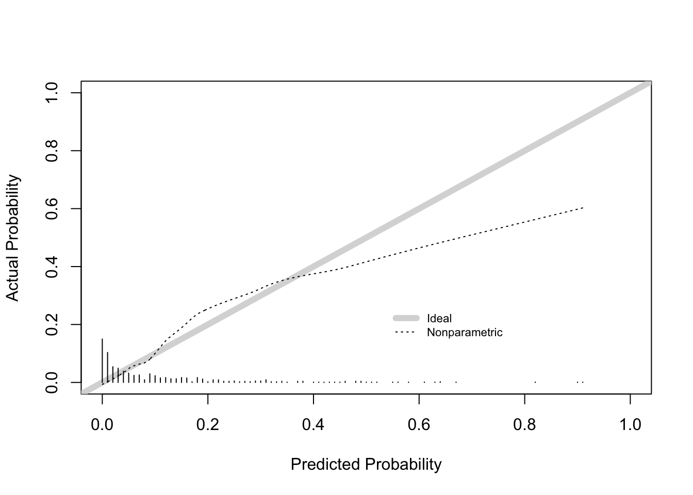

# Prognostic model


## Packages

```r
library(rms)
library(foreign)
library(dplyr)
library(haven)
library(car)
library(fpc)
library(lmtest)
library(pROC)
library(tidyverse)
library(haven)
library(corrr)
library(car)
library(stats)
library(base)
library(broom)
library(MASS)
library(pROC)
library(ResourceSelection)
library(xfun)
library(skimr)
library(DataExplorer)
```

## Data load
We load the dataset that contains imputed missing values. To see the details on imputation method this package contains a vignette called 'imputation'. To see this and other vignettes and code run:

```r
browseVignettes(package = "painr")
```

The dataset is loaded from folder `./data` as an .rds R binary file.

```r
imputed_with_attitude_and_chronic <- read_rds(
  here::here(
    "data",
    "imputed_with_attitude_and_chronic.rds"
  )
)
```

## Clean data and rename vars
We rename the variable `wide_spread_pain` to `pidbr` (pain in different body regions) 

```r
imputed_with_attitude_and_chronic <- imputed_with_attitude_and_chronic |>
  rename(pidbr = wide_spread_pain)
```

## Exploratory Data Analysis
With `summary()` we can get an overview of the different variables

```r
summary(imputed_with_attitude_and_chronic)
#>  sex          age          education   education_level pain_intensity  
#>  1:206   Min.   :18.00   7      :208   0:321           Min.   : 1.000  
#>  2:397   1st Qu.:31.00   6      :204   1:282           1st Qu.: 5.000  
#>          Median :44.00   8      : 74                   Median : 6.000  
#>          Mean   :44.51   2      : 42                   Mean   : 5.929  
#>          3rd Qu.:56.00   4      : 30                   3rd Qu.: 7.000  
#>          Max.   :85.00   3      : 20                   Max.   :10.000  
#>                          (Other): 25                                   
#>     duration      recurrence pidbr   headache   disability     work   
#>  Min.   : 1.000   1:198      1:211   1:249    Min.   : 0.000   1:508  
#>  1st Qu.: 2.000   2:405      2:392   2:284    1st Qu.: 1.000   2: 95  
#>  Median : 4.000                      3: 70    Median : 2.300          
#>  Mean   : 4.522                               Mean   : 2.726          
#>  3rd Qu.: 6.000                               3rd Qu.: 4.100          
#>  Max.   :11.000                               Max.   :11.000          
#>                                                                       
#>  work_happiness work_satisfaction posture_work physical_activity smoking
#>  1:392          1:417             1:388        0:220             1:531  
#>  2:116          2: 91             2:120        1:383             2: 72  
#>  3: 95          3: 95             3: 95                                 
#>                                                                         
#>                                                                         
#>                                                                         
#>                                                                         
#>  alcohol      bmi        sleep_quality catastrophizing  duration_beliefs
#>  1:129   Min.   :10.73   0:130         Min.   : 0.000   Min.   : 0.000  
#>  2:474   1st Qu.:22.51   1:473         1st Qu.: 1.000   1st Qu.: 2.000  
#>          Median :24.66                 Median : 3.000   Median : 3.000  
#>          Mean   :25.35                 Mean   : 4.587   Mean   : 4.121  
#>          3rd Qu.:27.66                 3rd Qu.: 7.000   3rd Qu.: 6.000  
#>          Max.   :51.06                 Max.   :24.000   Max.   :10.000  
#>                                                                         
#>     concerns      treatment_beliefs   depression     kinesiophobia  
#>  Min.   : 0.000   Min.   : 0.000    Min.   : 0.000   Min.   : 0.00  
#>  1st Qu.: 2.000   1st Qu.: 7.000    1st Qu.: 0.000   1st Qu.:12.00  
#>  Median : 4.000   Median : 8.000    Median : 1.000   Median :15.00  
#>  Mean   : 3.954   Mean   : 7.813    Mean   : 2.471   Mean   :16.55  
#>  3rd Qu.: 6.000   3rd Qu.: 9.000    3rd Qu.: 4.000   3rd Qu.:20.00  
#>  Max.   :10.000   Max.   :10.000    Max.   :20.000   Max.   :40.00  
#>                                                                     
#>     distress      coping  identity_beliefs hypervigilance self_efficacy  
#>  Min.   : 0.000   0:122   Min.   : 0.000   Min.   : 0     Min.   : 0.00  
#>  1st Qu.: 1.000   1:481   1st Qu.: 5.000   1st Qu.:23     1st Qu.:10.00  
#>  Median : 3.000           Median : 6.000   Median :31     Median :11.00  
#>  Mean   : 4.386           Mean   : 6.111   Mean   :31     Mean   :10.31  
#>  3rd Qu.: 7.000           3rd Qu.: 8.000   3rd Qu.:38     3rd Qu.:12.00  
#>  Max.   :21.000           Max.   :10.000   Max.   :76     Max.   :12.00  
#>                                                                          
#>     relation      painint_6weeks   painint_3months painint_6months 
#>  Min.   : 0.000   Min.   : 0.000   Min.   :0.000   Min.   : 0.000  
#>  1st Qu.: 8.000   1st Qu.: 0.000   1st Qu.:0.000   1st Qu.: 0.000  
#>  Median : 9.000   Median : 2.000   Median :0.000   Median : 0.000  
#>  Mean   : 8.799   Mean   : 2.541   Mean   :2.048   Mean   : 1.247  
#>  3rd Qu.:10.000   3rd Qu.: 5.000   3rd Qu.:4.000   3rd Qu.: 1.000  
#>  Max.   :10.000   Max.   :10.000   Max.   :9.000   Max.   :10.000  
#>                                                                    
#>     attitude      patient_code   painint_6weeks_high painint_3months_high
#>  Min.   :1.000   Min.   :100.0   Mode :logical       Mode :logical       
#>  1st Qu.:2.000   1st Qu.:330.5   FALSE:331           FALSE:391           
#>  Median :2.000   Median :594.0   TRUE :272           TRUE :212           
#>  Mean   :1.758   Mean   :570.2                                           
#>  3rd Qu.:2.000   3rd Qu.:811.5                                           
#>  Max.   :2.000   Max.   :999.0                                           
#>  NA's   :49                                                              
#>  painint_6months_high  painint_high   painint_total_score is_painint_chronic
#>  Mode :logical        Min.   :0.000   Min.   : 0.000      Mode :logical     
#>  FALSE:476            1st Qu.:0.000   1st Qu.: 0.000      FALSE:541         
#>  TRUE :127            Median :1.000   Median : 5.000      TRUE :62          
#>                       Mean   :1.013   Mean   : 5.836                        
#>                       3rd Qu.:2.000   3rd Qu.: 9.000                        
#>                       Max.   :3.000   Max.   :28.000                        
#> 
```

Using a more sophisticated workflow to do exploratory analysis can be done using the `{skimr}` package and the `{DataExplorer}` package. To get an automated report for this dataset, run the following code. The file can be found in the `./inst` folder of this repo.

```r
imputed_with_attitude_and_chronic |>
    create_report(
        output_file  = "eda_DataExplorer_imputed_with_attitude_and_chronic",
        output_dir   = "inst",
        y            = "painint_total_score",
        report_title = "EDA painint_total_score"
    )
```

## Variabel analysis - Independent Predictive Capacity 
Identifying the independent predictive capacity of the candidate prognostic variables at baseline and the existence or non-existence of chronic pain by univariate logistic regression analysis.
Univariate logistic regression for continous variables
Univariate analyses, model per variable with 95 confidence interval and OR
Fitting the univariate logistic regression model
Retrieving the coefficient and standard error for "Variable"
Calculating the 95% confidence interval for "Variable"


```r
continuous_variables <-
  c(
    "depression",
    "concerns",
    "age",
    "pain_intensity",
    "duration",
    "disability",
    "bmi",
    "catastrophizing",
    "duration_beliefs",
    "treatment_beliefs",
    "kinesiophobia",
    "distress",
    "identity_beliefs",
    "hypervigilance",
    "relation",
    "self_efficacy"
  )

# Univariate analyses of the continuous variables
univariate_analysis_continuous <- function(variable, data) {
  formula <- as.formula(paste("is_painint_chronic ~", variable))
  model <- glm(formula, data = data, family = binomial)
  summary_model <- summary(model)
  coef_variable <- summary_model$coefficients[variable, "Estimate"]
  std_error <- summary_model$coefficients[variable, "Std. Error"]
  OR <- exp(coef_variable)
  lower_limit <- exp(coef_variable - 1.96 * std_error)
  upper_limit <- exp(coef_variable + 1.96 * std_error)
  cat("Variable:", variable, "\n")
  cat("Odds Ratio (OR):", OR, "\n")
  cat("95% Betrouwbaarheidsinterval:",
      lower_limit,
      "-",
      upper_limit,
      "\n\n")
}

# Univariate analyses for all continuous variables
for (variable in continuous_variables) {
  univariate_analysis_continuous(variable, imputed_with_attitude_and_chronic)
}
#> Variable: depression 
#> Odds Ratio (OR): 1.119845 
#> 95% Betrouwbaarheidsinterval: 1.0508 - 1.193426 
#> 
#> Variable: concerns 
#> Odds Ratio (OR): 1.233207 
#> 95% Betrouwbaarheidsinterval: 1.110387 - 1.369613 
#> 
#> Variable: age 
#> Odds Ratio (OR): 1.013596 
#> 95% Betrouwbaarheidsinterval: 0.9969062 - 1.030565 
#> 
#> Variable: pain_intensity 
#> Odds Ratio (OR): 1.360536 
#> 95% Betrouwbaarheidsinterval: 1.151988 - 1.60684 
#> 
#> Variable: duration 
#> Odds Ratio (OR): 1.113063 
#> 95% Betrouwbaarheidsinterval: 1.022841 - 1.211244 
#> 
#> Variable: disability 
#> Odds Ratio (OR): 1.173679 
#> 95% Betrouwbaarheidsinterval: 1.042149 - 1.321808 
#> 
#> Variable: bmi 
#> Odds Ratio (OR): 1.011411 
#> 95% Betrouwbaarheidsinterval: 0.953955 - 1.072327 
#> 
#> Variable: catastrophizing 
#> Odds Ratio (OR): 1.055757 
#> 95% Betrouwbaarheidsinterval: 1.001937 - 1.112468 
#> 
#> Variable: duration_beliefs 
#> Odds Ratio (OR): 1.333599 
#> 95% Betrouwbaarheidsinterval: 1.206493 - 1.474095 
#> 
#> Variable: treatment_beliefs 
#> Odds Ratio (OR): 0.842013 
#> 95% Betrouwbaarheidsinterval: 0.7434092 - 0.9536954 
#> 
#> Variable: kinesiophobia 
#> Odds Ratio (OR): 1.038989 
#> 95% Betrouwbaarheidsinterval: 0.9911072 - 1.089184 
#> 
#> Variable: distress 
#> Odds Ratio (OR): 1.122442 
#> 95% Betrouwbaarheidsinterval: 1.059899 - 1.188674 
#> 
#> Variable: identity_beliefs 
#> Odds Ratio (OR): 0.9137298 
#> 95% Betrouwbaarheidsinterval: 0.8203274 - 1.017767 
#> 
#> Variable: hypervigilance 
#> Odds Ratio (OR): 1.014424 
#> 95% Betrouwbaarheidsinterval: 0.9914855 - 1.037892 
#> 
#> Variable: relation 
#> Odds Ratio (OR): 0.8736736 
#> 95% Betrouwbaarheidsinterval: 0.744835 - 1.024798 
#> 
#> Variable: self_efficacy 
#> Odds Ratio (OR): 0.9228016 
#> 95% Betrouwbaarheidsinterval: 0.8348215 - 1.020054
```

## Relevel dichotomous variables

```r
# Univariate logistic regression for categorized and dichotomous variables.
# Set the "1" or "0" of the variable as a reference category.
# Fitting the univariate logistic regression.
# Calculating the OR and CI of this model.

# Variable "work"
imputed_with_attitude_and_chronic$work <-
  relevel(imputed_with_attitude_and_chronic$work, ref = "1")
model1 <-
  glm(is_painint_chronic ~ work, data = imputed_with_attitude_and_chronic, family = binomial)
OR_work <- exp(coef(model1))
CI_work <- exp(confint(model1))
print(OR_work)
#> (Intercept)       work2 
#>  0.09012876  2.95873016
print(CI_work)
#>                  2.5 %    97.5 %
#> (Intercept) 0.06476482 0.1219859
#> work2       1.62175793 5.2614647

# Variable "Education_level"
imputed_with_attitude_and_chronic$education_level <-
  relevel(imputed_with_attitude_and_chronic$education_level, ref = "1")
model2 <-
  glm(is_painint_chronic ~ education_level,
      data = imputed_with_attitude_and_chronic,
      family = binomial)
OR_education_level <- exp(coef(model2))
CI_education_level <- exp(confint(model2))
print(OR_education_level)
#>      (Intercept) education_level0 
#>        0.1058824        1.1557886
print(CI_education_level)
#>                       2.5 %    97.5 %
#> (Intercept)      0.06960165 0.1543606
#> education_level0 0.68231415 1.9770643

# Variable "recurrence"
imputed_with_attitude_and_chronic$recurrence <-
  relevel(imputed_with_attitude_and_chronic$recurrence, ref = "1")
model3 <-
  glm(is_painint_chronic ~ recurrence,
      data = imputed_with_attitude_and_chronic,
      family = binomial)
OR_recurrence <- exp(coef(model3))
CI_recurrence <- exp(confint(model3))
print(OR_recurrence)
#> (Intercept) recurrence2 
#>   0.1061453   1.1190753
print(CI_recurrence)
#>                  2.5 %    97.5 %
#> (Intercept) 0.06400102 0.1656877
#> recurrence2 0.64242847 2.0165613

# Variable - pain in different body regions
imputed_with_attitude_and_chronic$pidbr <-
  relevel(imputed_with_attitude_and_chronic$pidbr, ref = "1")
model4 <-
  glm(is_painint_chronic ~ pidbr, data = imputed_with_attitude_and_chronic, family = binomial)
OR_pidbr <- exp(coef(model4))
CI_pidbr <- exp(confint(model4))
print(OR_pidbr)
#> (Intercept)      pidbr2 
#>    0.055000    2.719275
print(CI_pidbr)
#>                  2.5 %     97.5 %
#> (Intercept) 0.02818785 0.09603279
#> pidbr2      1.43692355 5.60887542

# Variable "headache"
imputed_with_attitude_and_chronic$headache <-
  relevel(imputed_with_attitude_and_chronic$headache, ref = "1")
model5 <-
  glm(is_painint_chronic ~ headache,
      data = imputed_with_attitude_and_chronic,
      family = binomial)
OR_headache <- exp(coef(model5))
CI_headache <- exp(confint(model5))
print(OR_headache)
#> (Intercept)   headache2   headache3 
#>  0.05957447  2.99496147  1.29120879
print(CI_headache)
#>                  2.5 %     97.5 %
#> (Intercept) 0.03313328 0.09821967
#> headache2   1.63503675 5.80948533
#> headache3   0.40522908 3.51473465

# Variable "sex"
imputed_with_attitude_and_chronic$sex <-
  relevel(imputed_with_attitude_and_chronic$sex, ref = "1")
model6 <-
  glm(is_painint_chronic ~ sex, data = imputed_with_attitude_and_chronic, family = binomial)
OR_sex <- exp(coef(model6))
CI_sex <- exp(confint(model6))
print(OR_sex)
#> (Intercept)        sex2 
#>  0.07291667  1.88620549
print(CI_sex)
#>                  2.5 %    97.5 %
#> (Intercept) 0.04044007 0.1207022
#> sex2        1.03994691 3.6326504

# Variable "Work_happiness"
imputed_with_attitude_and_chronic$work_happiness <-
  relevel(imputed_with_attitude_and_chronic$work_happiness, ref = "1")
model7 <-
  glm(is_painint_chronic ~ work_happiness,
      data = imputed_with_attitude_and_chronic,
      family = binomial)
OR_work_happiness <- exp(coef(model7))
CI_work_happiness <- exp(confint(model7))
print(OR_work_happiness)
#>     (Intercept) work_happiness2 work_happiness3 
#>      0.09803922      0.65504587      2.72000000
print(CI_work_happiness)
#>                      2.5 %    97.5 %
#> (Intercept)     0.06807407 0.1365982
#> work_happiness2 0.26069153 1.4324050
#> work_happiness3 1.46836240 4.9348410

# Variable "posture_work"
imputed_with_attitude_and_chronic$posture_work <-
  relevel(imputed_with_attitude_and_chronic$posture_work, ref = "1")
model8 <-
  glm(is_painint_chronic ~ posture_work,
      data = imputed_with_attitude_and_chronic,
      family = binomial)
OR_posture_work <- exp(coef(model8))
CI_posture_work <- exp(confint(model8))
print(OR_posture_work)
#>   (Intercept) posture_work2 posture_work3 
#>    0.08379888    1.32592593    3.18222222
print(CI_posture_work)
#>                    2.5 %    97.5 %
#> (Intercept)   0.05653886 0.1194222
#> posture_work2 0.63368447 2.6177321
#> posture_work3 1.69613786 5.8757114

# Variable "work_satisfaction"
imputed_with_attitude_and_chronic$work_satisfaction <-
  relevel(imputed_with_attitude_and_chronic$work_satisfaction, ref = "1")
model9 <-
  glm(is_painint_chronic ~ work_satisfaction,
      data = imputed_with_attitude_and_chronic,
      family = binomial)
OR_work_satisfaction <- exp(coef(model9))
CI_work_satisfaction <- exp(confint(model9))
print(OR_work_satisfaction)
#>        (Intercept) work_satisfaction2 work_satisfaction3 
#>         0.09448819         0.74705882         2.82222222
print(CI_work_satisfaction)
#>                         2.5 %    97.5 %
#> (Intercept)        0.06599362 0.1309863
#> work_satisfaction2 0.27609334 1.7080924
#> work_satisfaction3 1.52768147 5.1022741

# Variable "physical Activity"
imputed_with_attitude_and_chronic$physical_activity <-
  relevel(imputed_with_attitude_and_chronic$physical_activity, ref = "0")
model10 <-
  glm(is_painint_chronic ~ physical_activity,
      data = imputed_with_attitude_and_chronic,
      family = binomial)
OR_physical_activity <- exp(coef(model10))
CI_physical_activity <- exp(confint(model10))
print(OR_physical_activity)
#>        (Intercept) physical_activity1 
#>           0.100000           1.231672
print(CI_physical_activity)
#>                        2.5 %    97.5 %
#> (Intercept)        0.0611943 0.1542119
#> physical_activity1 0.7119442 2.1964490

# Variable "smoking"
imputed_with_attitude_and_chronic$smoking <-
  relevel(imputed_with_attitude_and_chronic$smoking, ref = "1")
model11 <-
  glm(is_painint_chronic ~ smoking,
      data = imputed_with_attitude_and_chronic,
      family = binomial)
OR_smoking <- exp(coef(model11))
CI_smoking <- exp(confint(model11))
print(OR_smoking)
#> (Intercept)    smoking2 
#>   0.1039501   1.9240000
print(CI_smoking)
#>                  2.5 %    97.5 %
#> (Intercept) 0.07674972 0.1375884
#> smoking2    0.93299869 3.7113889

# Variable "alcohol"
imputed_with_attitude_and_chronic$alcohol <-
  relevel(imputed_with_attitude_and_chronic$alcohol, ref = "1")
model12 <-
  glm(is_painint_chronic ~ alcohol,
      data = imputed_with_attitude_and_chronic,
      family = binomial)
OR_alcohol <- exp(coef(model12))
CI_alcohol <- exp(confint(model12))
print(OR_alcohol)
#> (Intercept)    alcohol2 
#>   0.1517857   0.6910736
print(CI_alcohol)
#>                  2.5 %    97.5 %
#> (Intercept) 0.08795751 0.2456099
#> alcohol2    0.38745282 1.2836914

# Variable "sleep quality"
imputed_with_attitude_and_chronic$sleep_quality <-
  relevel(imputed_with_attitude_and_chronic$sleep_quality, ref = "0")
model13 <-
  glm(is_painint_chronic ~ sleep_quality,
      data = imputed_with_attitude_and_chronic,
      family = binomial)
OR_sleep_quality <- exp(coef(model13))
CI_sleep_quality <- exp(confint(model13))
print(OR_sleep_quality)
#>    (Intercept) sleep_quality1 
#>     0.09243697     1.30741060
print(CI_sleep_quality)
#>                     2.5 %    97.5 %
#> (Intercept)    0.04696702 0.1635109
#> sleep_quality1 0.68450097 2.7150269

# Variable "coping"
imputed_with_attitude_and_chronic$coping <-
  relevel(imputed_with_attitude_and_chronic$coping, ref = "0")
model14 <-
  glm(is_painint_chronic ~ coping,
      data = imputed_with_attitude_and_chronic,
      family = binomial)
OR_coping <- exp(coef(model14))
CI_coping <- exp(confint(model14))
print(OR_coping)
#> (Intercept)     coping1 
#>  0.09909911  1.19682862
print(CI_coping)
#>                  2.5 %    97.5 %
#> (Intercept) 0.05027562 0.1756983
#> coping1     0.62546659 2.4886925

# Variable "attitude"
model15 <-
  glm(is_painint_chronic ~ attitude,
      data = imputed_with_attitude_and_chronic,
      family = binomial)
OR_attitude <- exp(coef(model15))
CI_attitude <- exp(confint(model15))
print(OR_attitude)
#> (Intercept)    attitude 
#>   0.1393033   0.9048630
print(CI_attitude)
#>                  2.5 %    97.5 %
#> (Intercept) 0.04214516 0.4017094
#> attitude    0.49543972 1.7361149
```

## Multivariable logistic regression analyses

Due to multicollinearity in the work-related factors (happiness, satisfaction, and posture -> leading to the outcome "3" = not working), a decision had to be made on which factor to include. We analysed different models with the individual work-related factors included. There was almost no difference in model performance. Because happiness and satisfaction align more with the other psychological factors, we have chosen to include the variable "posture_work", thereby incorporating add different domain into our model for the final backward model analyses and internal validation.

The candidate prognostic factor "attitude" does not have predictive value in het univariate analysis and does not emerge in the multivariate analysis in the formula with all the variables included. Additionally, there are many missing values, which cannot be imputed, as they pertain to the the therapist's attitude. We now excluding this variable from the complete model development because internal validation does not proceed with these variables included.


```r
naniar::vis_miss(imputed_with_attitude_and_chronic)
```


```r
new_data <- imputed_with_attitude_and_chronic |>
  dplyr::select(-attitude)

sum(is.na(new_data))
#> [1] 0

full_model <-
  glm (
    data = imputed_with_attitude_and_chronic,
    is_painint_chronic ~ sex + age + pain_intensity + duration + pidbr + headache + disability + posture_work + physical_activity + smoking + alcohol + bmi + sleep_quality + catastrophizing + duration_beliefs + concerns + treatment_beliefs + depression + kinesiophobia + distress + coping + identity_beliefs + hypervigilance + self_efficacy + relation,
    family = "binomial"
  )

summary(full_model)
#> 
#> Call:
#> glm(formula = is_painint_chronic ~ sex + age + pain_intensity + 
#>     duration + pidbr + headache + disability + posture_work + 
#>     physical_activity + smoking + alcohol + bmi + sleep_quality + 
#>     catastrophizing + duration_beliefs + concerns + treatment_beliefs + 
#>     depression + kinesiophobia + distress + coping + identity_beliefs + 
#>     hypervigilance + self_efficacy + relation, family = "binomial", 
#>     data = imputed_with_attitude_and_chronic)
#> 
#> Coefficients:
#>                     Estimate Std. Error z value Pr(>|z|)    
#> (Intercept)        -7.856997   2.014554  -3.900 9.61e-05 ***
#> sex2                0.621459   0.381164   1.630 0.103012    
#> age                 0.007465   0.011387   0.656 0.512097    
#> pain_intensity      0.257560   0.115333   2.233 0.025537 *  
#> duration            0.055364   0.053130   1.042 0.297391    
#> pidbr2              0.809406   0.399367   2.027 0.042691 *  
#> headache2           0.961491   0.380336   2.528 0.011471 *  
#> headache3          -0.017406   0.611967  -0.028 0.977309    
#> disability          0.037170   0.091565   0.406 0.684787    
#> posture_work2       0.705919   0.421910   1.673 0.094297 .  
#> posture_work3       1.523283   0.433345   3.515 0.000439 ***
#> physical_activity1  0.164670   0.348018   0.473 0.636095    
#> smoking2            0.563160   0.418249   1.346 0.178151    
#> alcohol2           -0.302294   0.368041  -0.821 0.411441    
#> bmi                 0.019959   0.036600   0.545 0.585528    
#> sleep_quality1     -0.503916   0.421602  -1.195 0.231993    
#> catastrophizing    -0.057224   0.048013  -1.192 0.233326    
#> duration_beliefs    0.238992   0.065878   3.628 0.000286 ***
#> concerns            0.183421   0.083870   2.187 0.028745 *  
#> treatment_beliefs  -0.219190   0.098053  -2.235 0.025389 *  
#> depression          0.017426   0.065927   0.264 0.791528    
#> kinesiophobia      -0.007644   0.039061  -0.196 0.844841    
#> distress            0.113553   0.056189   2.021 0.043290 *  
#> coping1             0.459219   0.429294   1.070 0.284751    
#> identity_beliefs   -0.163266   0.075735  -2.156 0.031102 *  
#> hypervigilance      0.007581   0.016849   0.450 0.652743    
#> self_efficacy       0.137327   0.085300   1.610 0.107416    
#> relation           -0.060274   0.123675  -0.487 0.626003    
#> ---
#> Signif. codes:  0 '***' 0.001 '**' 0.01 '*' 0.05 '.' 0.1 ' ' 1
#> 
#> (Dispersion parameter for binomial family taken to be 1)
#> 
#>     Null deviance: 399.47  on 602  degrees of freedom
#> Residual deviance: 292.30  on 575  degrees of freedom
#> AIC: 348.3
#> 
#> Number of Fisher Scoring iterations: 6

#full_model_mterics_df <- full_model |> broom::tidy()
#full_model_mterics_df <- full_model_mterics_df |>
#  mutate(
#    OR = exp(coef(estimate))
#  )

backward_model <- stepAIC(full_model, direction = "backward")
#> Start:  AIC=348.3
#> is_painint_chronic ~ sex + age + pain_intensity + duration + 
#>     pidbr + headache + disability + posture_work + physical_activity + 
#>     smoking + alcohol + bmi + sleep_quality + catastrophizing + 
#>     duration_beliefs + concerns + treatment_beliefs + depression + 
#>     kinesiophobia + distress + coping + identity_beliefs + hypervigilance + 
#>     self_efficacy + relation
#> 
#>                     Df Deviance    AIC
#> - kinesiophobia      1   292.34 346.34
#> - depression         1   292.37 346.37
#> - disability         1   292.47 346.47
#> - hypervigilance     1   292.51 346.51
#> - physical_activity  1   292.53 346.53
#> - relation           1   292.54 346.54
#> - bmi                1   292.60 346.60
#> - age                1   292.74 346.73
#> - alcohol            1   292.96 346.96
#> - duration           1   293.38 347.38
#> - coping             1   293.50 347.50
#> - sleep_quality      1   293.68 347.68
#> - catastrophizing    1   293.76 347.76
#> - smoking            1   294.03 348.03
#> <none>                   292.30 348.30
#> - sex                1   295.09 349.09
#> - self_efficacy      1   295.18 349.18
#> - distress           1   296.31 350.31
#> - pidbr              1   296.80 350.80
#> - identity_beliefs   1   297.05 351.05
#> - treatment_beliefs  1   297.10 351.10
#> - concerns           1   297.26 351.26
#> - pain_intensity     1   297.61 351.61
#> - headache           2   301.00 353.00
#> - posture_work       2   305.61 357.61
#> - duration_beliefs   1   306.05 360.05
#> 
#> Step:  AIC=346.34
#> is_painint_chronic ~ sex + age + pain_intensity + duration + 
#>     pidbr + headache + disability + posture_work + physical_activity + 
#>     smoking + alcohol + bmi + sleep_quality + catastrophizing + 
#>     duration_beliefs + concerns + treatment_beliefs + depression + 
#>     distress + coping + identity_beliefs + hypervigilance + self_efficacy + 
#>     relation
#> 
#>                     Df Deviance    AIC
#> - depression         1   292.40 344.40
#> - disability         1   292.49 344.49
#> - hypervigilance     1   292.52 344.52
#> - physical_activity  1   292.56 344.56
#> - relation           1   292.57 344.57
#> - bmi                1   292.64 344.64
#> - age                1   292.75 344.75
#> - alcohol            1   293.00 345.00
#> - duration           1   293.40 345.40
#> - coping             1   293.51 345.51
#> - sleep_quality      1   293.74 345.74
#> - catastrophizing    1   293.99 345.99
#> - smoking            1   294.15 346.15
#> <none>                   292.34 346.34
#> - sex                1   295.19 347.19
#> - self_efficacy      1   295.42 347.42
#> - distress           1   296.34 348.34
#> - pidbr              1   296.98 348.98
#> - identity_beliefs   1   297.06 349.06
#> - treatment_beliefs  1   297.19 349.19
#> - concerns           1   297.27 349.27
#> - pain_intensity     1   297.81 349.81
#> - headache           2   301.18 351.18
#> - posture_work       2   305.65 355.65
#> - duration_beliefs   1   306.05 358.05
#> 
#> Step:  AIC=344.4
#> is_painint_chronic ~ sex + age + pain_intensity + duration + 
#>     pidbr + headache + disability + posture_work + physical_activity + 
#>     smoking + alcohol + bmi + sleep_quality + catastrophizing + 
#>     duration_beliefs + concerns + treatment_beliefs + distress + 
#>     coping + identity_beliefs + hypervigilance + self_efficacy + 
#>     relation
#> 
#>                     Df Deviance    AIC
#> - disability         1   292.54 342.54
#> - hypervigilance     1   292.58 342.58
#> - physical_activity  1   292.61 342.61
#> - relation           1   292.66 342.66
#> - bmi                1   292.71 342.71
#> - age                1   292.81 342.81
#> - alcohol            1   293.07 343.07
#> - duration           1   293.50 343.50
#> - coping             1   293.53 343.53
#> - sleep_quality      1   293.79 343.78
#> - catastrophizing    1   294.01 344.01
#> - smoking            1   294.28 344.28
#> <none>                   292.40 344.40
#> - sex                1   295.19 345.19
#> - self_efficacy      1   295.48 345.48
#> - identity_beliefs   1   297.06 347.06
#> - pidbr              1   297.10 347.09
#> - treatment_beliefs  1   297.20 347.21
#> - concerns           1   297.28 347.28
#> - pain_intensity     1   297.81 347.81
#> - headache           2   301.45 349.45
#> - distress           1   300.69 350.69
#> - posture_work       2   305.95 353.95
#> - duration_beliefs   1   306.15 356.15
#> 
#> Step:  AIC=342.54
#> is_painint_chronic ~ sex + age + pain_intensity + duration + 
#>     pidbr + headache + posture_work + physical_activity + smoking + 
#>     alcohol + bmi + sleep_quality + catastrophizing + duration_beliefs + 
#>     concerns + treatment_beliefs + distress + coping + identity_beliefs + 
#>     hypervigilance + self_efficacy + relation
#> 
#>                     Df Deviance    AIC
#> - hypervigilance     1   292.73 340.73
#> - physical_activity  1   292.75 340.75
#> - relation           1   292.78 340.78
#> - bmi                1   292.88 340.88
#> - age                1   292.93 340.93
#> - alcohol            1   293.24 341.24
#> - coping             1   293.67 341.67
#> - duration           1   293.67 341.67
#> - sleep_quality      1   293.86 341.86
#> - catastrophizing    1   294.06 342.06
#> - smoking            1   294.35 342.35
#> <none>                   292.54 342.54
#> - sex                1   295.26 343.26
#> - self_efficacy      1   295.51 343.51
#> - identity_beliefs   1   297.15 345.15
#> - pidbr              1   297.18 345.18
#> - treatment_beliefs  1   297.43 345.43
#> - concerns           1   297.56 345.56
#> - pain_intensity     1   299.29 347.29
#> - headache           2   301.68 347.68
#> - distress           1   301.42 349.42
#> - posture_work       2   305.95 351.95
#> - duration_beliefs   1   306.38 354.38
#> 
#> Step:  AIC=340.73
#> is_painint_chronic ~ sex + age + pain_intensity + duration + 
#>     pidbr + headache + posture_work + physical_activity + smoking + 
#>     alcohol + bmi + sleep_quality + catastrophizing + duration_beliefs + 
#>     concerns + treatment_beliefs + distress + coping + identity_beliefs + 
#>     self_efficacy + relation
#> 
#>                     Df Deviance    AIC
#> - physical_activity  1   292.96 338.96
#> - relation           1   292.96 338.97
#> - bmi                1   293.10 339.09
#> - age                1   293.17 339.17
#> - alcohol            1   293.42 339.42
#> - coping             1   293.80 339.80
#> - duration           1   293.85 339.85
#> - catastrophizing    1   294.06 340.06
#> - sleep_quality      1   294.12 340.12
#> - smoking            1   294.53 340.53
#> <none>                   292.73 340.73
#> - sex                1   295.31 341.31
#> - self_efficacy      1   295.77 341.77
#> - identity_beliefs   1   297.19 343.18
#> - pidbr              1   297.21 343.21
#> - treatment_beliefs  1   297.56 343.56
#> - concerns           1   297.63 343.63
#> - pain_intensity     1   299.41 345.41
#> - headache           2   301.85 345.85
#> - distress           1   303.14 349.14
#> - posture_work       2   306.07 350.07
#> - duration_beliefs   1   306.49 352.49
#> 
#> Step:  AIC=338.96
#> is_painint_chronic ~ sex + age + pain_intensity + duration + 
#>     pidbr + headache + posture_work + smoking + alcohol + bmi + 
#>     sleep_quality + catastrophizing + duration_beliefs + concerns + 
#>     treatment_beliefs + distress + coping + identity_beliefs + 
#>     self_efficacy + relation
#> 
#>                     Df Deviance    AIC
#> - relation           1   293.23 337.23
#> - bmi                1   293.36 337.36
#> - age                1   293.38 337.38
#> - alcohol            1   293.75 337.76
#> - coping             1   293.94 337.94
#> - duration           1   294.06 338.06
#> - catastrophizing    1   294.30 338.30
#> - sleep_quality      1   294.33 338.33
#> - smoking            1   294.80 338.80
#> <none>                   292.96 338.96
#> - sex                1   295.60 339.60
#> - self_efficacy      1   296.15 340.15
#> - identity_beliefs   1   297.51 341.51
#> - treatment_beliefs  1   297.74 341.74
#> - concerns           1   297.78 341.78
#> - pidbr              1   297.88 341.88
#> - pain_intensity     1   299.89 343.89
#> - headache           2   302.03 344.03
#> - distress           1   303.26 347.26
#> - posture_work       2   306.13 348.13
#> - duration_beliefs   1   306.68 350.68
#> 
#> Step:  AIC=337.23
#> is_painint_chronic ~ sex + age + pain_intensity + duration + 
#>     pidbr + headache + posture_work + smoking + alcohol + bmi + 
#>     sleep_quality + catastrophizing + duration_beliefs + concerns + 
#>     treatment_beliefs + distress + coping + identity_beliefs + 
#>     self_efficacy
#> 
#>                     Df Deviance    AIC
#> - bmi                1   293.60 335.60
#> - age                1   293.65 335.65
#> - alcohol            1   293.96 335.96
#> - coping             1   294.21 336.21
#> - duration           1   294.25 336.25
#> - sleep_quality      1   294.52 336.52
#> - catastrophizing    1   294.52 336.52
#> - smoking            1   295.12 337.12
#> <none>                   293.23 337.23
#> - sex                1   295.83 337.83
#> - self_efficacy      1   296.25 338.25
#> - concerns           1   297.89 339.90
#> - pidbr              1   298.00 340.00
#> - identity_beliefs   1   298.43 340.43
#> - pain_intensity     1   300.03 342.03
#> - headache           2   302.17 342.17
#> - treatment_beliefs  1   301.51 343.51
#> - distress           1   303.46 345.46
#> - posture_work       2   306.53 346.53
#> - duration_beliefs   1   306.99 348.99
#> 
#> Step:  AIC=335.6
#> is_painint_chronic ~ sex + age + pain_intensity + duration + 
#>     pidbr + headache + posture_work + smoking + alcohol + sleep_quality + 
#>     catastrophizing + duration_beliefs + concerns + treatment_beliefs + 
#>     distress + coping + identity_beliefs + self_efficacy
#> 
#>                     Df Deviance    AIC
#> - age                1   294.09 334.09
#> - alcohol            1   294.33 334.34
#> - coping             1   294.55 334.55
#> - duration           1   294.66 334.66
#> - catastrophizing    1   294.86 334.86
#> - sleep_quality      1   294.97 334.97
#> - smoking            1   295.54 335.54
#> <none>                   293.60 335.60
#> - sex                1   296.15 336.16
#> - self_efficacy      1   296.63 336.63
#> - concerns           1   298.31 338.31
#> - pidbr              1   298.66 338.66
#> - identity_beliefs   1   298.88 338.88
#> - headache           2   302.37 340.37
#> - pain_intensity     1   300.71 340.71
#> - treatment_beliefs  1   301.99 341.99
#> - distress           1   303.78 343.78
#> - posture_work       2   306.88 344.88
#> - duration_beliefs   1   307.00 347.01
#> 
#> Step:  AIC=334.09
#> is_painint_chronic ~ sex + pain_intensity + duration + pidbr + 
#>     headache + posture_work + smoking + alcohol + sleep_quality + 
#>     catastrophizing + duration_beliefs + concerns + treatment_beliefs + 
#>     distress + coping + identity_beliefs + self_efficacy
#> 
#>                     Df Deviance    AIC
#> - alcohol            1   294.82 332.82
#> - coping             1   295.12 333.12
#> - duration           1   295.13 333.13
#> - catastrophizing    1   295.51 333.51
#> - sleep_quality      1   295.51 333.51
#> <none>                   294.09 334.09
#> - smoking            1   296.12 334.12
#> - sex                1   296.42 334.42
#> - self_efficacy      1   296.92 334.92
#> - pidbr              1   299.05 337.05
#> - concerns           1   299.46 337.46
#> - identity_beliefs   1   299.54 337.54
#> - headache           2   302.61 338.61
#> - pain_intensity     1   301.78 339.78
#> - treatment_beliefs  1   302.81 340.81
#> - distress           1   303.85 341.85
#> - duration_beliefs   1   307.11 345.11
#> - posture_work       2   310.69 346.69
#> 
#> Step:  AIC=332.82
#> is_painint_chronic ~ sex + pain_intensity + duration + pidbr + 
#>     headache + posture_work + smoking + sleep_quality + catastrophizing + 
#>     duration_beliefs + concerns + treatment_beliefs + distress + 
#>     coping + identity_beliefs + self_efficacy
#> 
#>                     Df Deviance    AIC
#> - coping             1   295.75 331.75
#> - duration           1   295.99 331.99
#> - catastrophizing    1   296.22 332.22
#> - sleep_quality      1   296.36 332.36
#> <none>                   294.82 332.82
#> - smoking            1   296.85 332.85
#> - self_efficacy      1   297.49 333.48
#> - sex                1   297.93 333.93
#> - identity_beliefs   1   299.81 335.81
#> - concerns           1   300.02 336.02
#> - pidbr              1   300.10 336.09
#> - headache           2   303.53 337.53
#> - pain_intensity     1   302.07 338.07
#> - treatment_beliefs  1   303.57 339.57
#> - distress           1   304.64 340.64
#> - duration_beliefs   1   307.56 343.55
#> - posture_work       2   311.81 345.81
#> 
#> Step:  AIC=331.75
#> is_painint_chronic ~ sex + pain_intensity + duration + pidbr + 
#>     headache + posture_work + smoking + sleep_quality + catastrophizing + 
#>     duration_beliefs + concerns + treatment_beliefs + distress + 
#>     identity_beliefs + self_efficacy
#> 
#>                     Df Deviance    AIC
#> - duration           1   296.97 330.97
#> - sleep_quality      1   297.34 331.34
#> - catastrophizing    1   297.51 331.51
#> - smoking            1   297.73 331.73
#> <none>                   295.75 331.75
#> - self_efficacy      1   298.75 332.76
#> - sex                1   299.15 333.15
#> - concerns           1   300.95 334.95
#> - identity_beliefs   1   300.97 334.97
#> - pidbr              1   300.98 334.98
#> - headache           2   304.17 336.17
#> - pain_intensity     1   303.17 337.17
#> - treatment_beliefs  1   304.69 338.69
#> - distress           1   305.05 339.05
#> - duration_beliefs   1   308.49 342.48
#> - posture_work       2   312.99 344.99
#> 
#> Step:  AIC=330.97
#> is_painint_chronic ~ sex + pain_intensity + pidbr + headache + 
#>     posture_work + smoking + sleep_quality + catastrophizing + 
#>     duration_beliefs + concerns + treatment_beliefs + distress + 
#>     identity_beliefs + self_efficacy
#> 
#>                     Df Deviance    AIC
#> - sleep_quality      1   298.33 330.33
#> - smoking            1   298.74 330.74
#> <none>                   296.97 330.97
#> - catastrophizing    1   299.09 331.09
#> - self_efficacy      1   300.04 332.04
#> - sex                1   300.20 332.20
#> - pidbr              1   302.16 334.16
#> - concerns           1   302.18 334.18
#> - identity_beliefs   1   302.57 334.57
#> - headache           2   306.05 336.05
#> - pain_intensity     1   304.55 336.55
#> - treatment_beliefs  1   305.75 337.75
#> - distress           1   306.38 338.38
#> - duration_beliefs   1   310.88 342.88
#> - posture_work       2   314.79 344.79
#> 
#> Step:  AIC=330.33
#> is_painint_chronic ~ sex + pain_intensity + pidbr + headache + 
#>     posture_work + smoking + catastrophizing + duration_beliefs + 
#>     concerns + treatment_beliefs + distress + identity_beliefs + 
#>     self_efficacy
#> 
#>                     Df Deviance    AIC
#> - smoking            1   300.31 330.31
#> <none>                   298.33 330.33
#> - catastrophizing    1   300.38 330.38
#> - sex                1   300.92 330.92
#> - self_efficacy      1   301.21 331.21
#> - pidbr              1   303.45 333.45
#> - concerns           1   303.46 333.46
#> - identity_beliefs   1   303.75 333.75
#> - headache           2   307.06 335.06
#> - pain_intensity     1   306.00 336.00
#> - distress           1   306.87 336.87
#> - treatment_beliefs  1   307.03 337.03
#> - duration_beliefs   1   311.49 341.49
#> - posture_work       2   315.31 343.32
#> 
#> Step:  AIC=330.31
#> is_painint_chronic ~ sex + pain_intensity + pidbr + headache + 
#>     posture_work + catastrophizing + duration_beliefs + concerns + 
#>     treatment_beliefs + distress + identity_beliefs + self_efficacy
#> 
#>                     Df Deviance    AIC
#> - catastrophizing    1   302.15 330.15
#> <none>                   300.31 330.31
#> - self_efficacy      1   302.93 330.93
#> - sex                1   303.19 331.19
#> - concerns           1   305.14 333.14
#> - pidbr              1   305.82 333.82
#> - identity_beliefs   1   306.00 334.00
#> - headache           2   308.56 334.56
#> - pain_intensity     1   308.70 336.70
#> - treatment_beliefs  1   308.71 336.71
#> - distress           1   309.30 337.30
#> - duration_beliefs   1   313.20 341.20
#> - posture_work       2   317.19 343.19
#> 
#> Step:  AIC=330.15
#> is_painint_chronic ~ sex + pain_intensity + pidbr + headache + 
#>     posture_work + duration_beliefs + concerns + treatment_beliefs + 
#>     distress + identity_beliefs + self_efficacy
#> 
#>                     Df Deviance    AIC
#> <none>                   302.15 330.15
#> - sex                1   304.88 330.88
#> - concerns           1   305.40 331.40
#> - self_efficacy      1   305.41 331.41
#> - identity_beliefs   1   308.10 334.10
#> - pidbr              1   308.22 334.22
#> - headache           2   310.34 334.34
#> - distress           1   309.57 335.57
#> - pain_intensity     1   309.94 335.94
#> - treatment_beliefs  1   310.91 336.91
#> - duration_beliefs   1   315.02 341.02
#> - posture_work       2   318.64 342.64
summary(backward_model)
#> 
#> Call:
#> glm(formula = is_painint_chronic ~ sex + pain_intensity + pidbr + 
#>     headache + posture_work + duration_beliefs + concerns + treatment_beliefs + 
#>     distress + identity_beliefs + self_efficacy, family = "binomial", 
#>     data = imputed_with_attitude_and_chronic)
#> 
#> Coefficients:
#>                   Estimate Std. Error z value Pr(>|z|)    
#> (Intercept)       -6.65374    1.29837  -5.125 2.98e-07 ***
#> sex2               0.56597    0.35162   1.610 0.107479    
#> pain_intensity     0.27423    0.10267   2.671 0.007565 ** 
#> pidbr2             0.88672    0.38035   2.331 0.019736 *  
#> headache2          0.87757    0.36108   2.430 0.015083 *  
#> headache3         -0.08510    0.58802  -0.145 0.884935    
#> posture_work2      0.46378    0.40024   1.159 0.246551    
#> posture_work3      1.58390    0.38480   4.116 3.85e-05 ***
#> duration_beliefs   0.22295    0.06336   3.519 0.000434 ***
#> concerns           0.13027    0.07322   1.779 0.075225 .  
#> treatment_beliefs -0.24623    0.08153  -3.020 0.002528 ** 
#> distress           0.10033    0.03668   2.735 0.006229 ** 
#> identity_beliefs  -0.17109    0.07087  -2.414 0.015765 *  
#> self_efficacy      0.13188    0.07682   1.717 0.086033 .  
#> ---
#> Signif. codes:  0 '***' 0.001 '**' 0.01 '*' 0.05 '.' 0.1 ' ' 1
#> 
#> (Dispersion parameter for binomial family taken to be 1)
#> 
#>     Null deviance: 399.47  on 602  degrees of freedom
#> Residual deviance: 302.15  on 589  degrees of freedom
#> AIC: 330.15
#> 
#> Number of Fisher Scoring iterations: 6
backward_model |> broom::tidy()
#> # A tibble: 14 × 5
#>    term              estimate std.error statistic     p.value
#>    <chr>                <dbl>     <dbl>     <dbl>       <dbl>
#>  1 (Intercept)        -6.65      1.30      -5.12  0.000000298
#>  2 sex2                0.566     0.352      1.61  0.107      
#>  3 pain_intensity      0.274     0.103      2.67  0.00756    
#>  4 pidbr2              0.887     0.380      2.33  0.0197     
#>  5 headache2           0.878     0.361      2.43  0.0151     
#>  6 headache3          -0.0851    0.588     -0.145 0.885      
#>  7 posture_work2       0.464     0.400      1.16  0.247      
#>  8 posture_work3       1.58      0.385      4.12  0.0000385  
#>  9 duration_beliefs    0.223     0.0634     3.52  0.000434   
#> 10 concerns            0.130     0.0732     1.78  0.0752     
#> 11 treatment_beliefs  -0.246     0.0815    -3.02  0.00253    
#> 12 distress            0.100     0.0367     2.74  0.00623    
#> 13 identity_beliefs   -0.171     0.0709    -2.41  0.0158     
#> 14 self_efficacy       0.132     0.0768     1.72  0.0860

## look up calcualtion of OR from estimate and other model metrics

odds_ratios <- exp(coef(backward_model))
conf_int <- confint(backward_model)
conf_int_exp <- exp(conf_int)

results <- data.frame(OddsRatio = odds_ratios,
                      Lower95CI = conf_int_exp[, "2.5 %"],
                      Upper95CI = conf_int_exp[, "97.5 %"])
print(results)
#>                     OddsRatio    Lower95CI   Upper95CI
#> (Intercept)       0.001289191 8.857723e-05  0.01462702
#> sex2              1.761162794 9.028590e-01  3.61370233
#> pain_intensity    1.315512715 1.082763e+00  1.62190191
#> pidbr2            2.427161319 1.190556e+00  5.35031953
#> headache2         2.405048685 1.210661e+00  5.02912669
#> headache3         0.918423699 2.659645e-01  2.77353119
#> posture_work2     1.590076355 7.059536e-01  3.42898788
#> posture_work3     4.873907046 2.290224e+00 10.43194469
#> duration_beliefs  1.249761645 1.105659e+00  1.41867676
#> concerns          1.139138706 9.889557e-01  1.31893284
#> treatment_beliefs 0.781745003 6.659186e-01  0.91872682
#> distress          1.105534217 1.028728e+00  1.18846015
#> identity_beliefs  0.842741709 7.316495e-01  0.96705986
#> self_efficacy     1.140973980 9.893504e-01  1.33839592
```

## AUC
The discriminative ability of the prognostic model will be
determined based on the Area Under the receiver operating
characteristic Curve (AUC) 


```r
# Prediction of the probabilities based on our model
predicted_probs <-
  predict(backward_model, newdata = imputed_with_attitude_and_chronic, type =
            "response")

roc_obj <-
  roc(imputed_with_attitude_and_chronic$is_painint_chronic,
      predicted_probs)
auc <- auc(roc_obj)
print(auc)
#> Area under the curve: 0.8589

ci <- ci.auc(roc_obj)
print(ci)
#> 95% CI: 0.8195-0.8982 (DeLong)
```


## Calibration curve
Measuring the predicted probability and the observed responses 
and creating a dataframe.Grouping predicted probabilities in 
deciles and calculation of the average predicted probability and actual percentage per group and plot the calibration curve.


```r
model_formula <-
  is_painint_chronic ~ sex + pain_intensity + pidbr + headache + posture_work + 
  duration_beliefs + concerns + treatment_beliefs + distress + identity_beliefs + 
  self_efficacy

# Model fitting in lrm.
backward_model_lrm <-
  lrm(model_formula,
      data = imputed_with_attitude_and_chronic,
      x = TRUE,
      y = TRUE)

predicted_probs_lrm <- predict(backward_model_lrm, type = "fitted")

val.prob(
  predicted_probs_lrm,
  as.numeric(imputed_with_attitude_and_chronic$is_painint_chronic),
  statloc = FALSE,
  logistic.cal = FALSE
)
```



```
#>           Dxy       C (ROC)            R2             D      D:Chi-sq 
#>  7.178463e-01  8.589231e-01  3.076664e-01  1.597324e-01  9.731861e+01 
#>           D:p             U      U:Chi-sq           U:p             Q 
#>            NA -3.316750e-03 -5.684342e-13  1.000000e+00  1.630491e-01 
#>         Brier     Intercept         Slope          Emax           E90 
#>  7.695459e-02  5.161943e-14  1.000000e+00  3.097630e-01  4.991952e-02 
#>          Eavg           S:z           S:p 
#>  1.944093e-02  4.647755e-01  6.420922e-01

calibration_plot_lrm <-
  calibrate(backward_model_lrm, method = "boot", B = 200)

plot(calibration_plot_lrm)
```


```
#> 
#> n=603   Mean absolute error=0.022   Mean squared error=0.0017
#> 0.9 Quantile of absolute error=0.05
```

## Result Calibration plot 
The calibration plot revealed acceptable alignment for patients not developing chronic pain. However, for patients developing chronic pain, the model tended to overestimate the risk. Despite this, the calibration remained within acceptable limits.

## Hoslem and Lemeshow 
Formally testing the goodness-of-fit using the Hosmer and Lemeshow.


```r
predicted_probs <-
  predict(
    backward_model, 
    newdata = imputed_with_attitude_and_chronic, 
    type = "response")

gof <-
  hoslem.test(
    imputed_with_attitude_and_chronic$is_painint_chronic,
    predicted_probs,
    g = 10)

gof |> broom::tidy()
#> # A tibble: 1 × 4
#>   statistic p.value parameter method                                        
#>       <dbl>   <dbl>     <dbl> <chr>                                         
#> 1      8.07   0.427         8 Hosmer and Lemeshow goodness of fit (GOF) test

x_sqrd <- gof$statistic[1]
p_value_gof <- gof$p.value[1]
```

Results: 
X-squared = 8.0693394, DF = 8, p-value = 0.4267263 
We found a high p-value suggests there's no statistically significant difference between observed and expected frequencies, indicating = that the model fits the data well.


## Model fit 
Will be quantified as Nagelkerke’s R2


```r
nagelkerkeR2 <- function(model) {
  LL_0 <- as.numeric(logLik(update(model, .~1)))
  LL_f <- as.numeric(logLik(model))
  R2 <- (1 - exp((2/nrow(model$data))*(LL_0 - LL_f))) /
    (1 - exp(2*LL_0/nrow(model$data)))
  return(R2)
}

nagelkerkeR2(backward_model)
#> [1] 0.3076664
```


## Internal validation 
Internal validation will be performed using bootstrap resampling to estimate the optimism-corrected AUC and to yield a measure of overfitting (i.e., the shrinkage factor). The shrinkage factor (a constant between 0 and 1) will be used to multiply the regression coefficient by. Generally, regression coefficients(and resulting predictions) are too extreme in case of overfitting, which is counteracted by the shrinking of regression coefficients.


```r


set.seed(12345)

formula(backward_model)
#> is_painint_chronic ~ sex + pain_intensity + pidbr + headache + 
#>     posture_work + duration_beliefs + concerns + treatment_beliefs + 
#>     distress + identity_beliefs + self_efficacy

new_model <-
  lrm(formula(backward_model),
      data = imputed_with_attitude_and_chronic,
      x = TRUE,
      y = TRUE)

validation_result <- validate(new_model, method = "boot", B = 1000)

print(validation_result)
#>           index.orig training    test optimism index.corrected    n
#> Dxy           0.7177   0.7424  0.6776   0.0648          0.6529 1000
#> R2            0.3077   0.3431  0.2745   0.0686          0.2391 1000
#> Intercept     0.0000   0.0000 -0.2660   0.2660         -0.2660 1000
#> Slope         1.0000   1.0000  0.8274   0.1726          0.8274 1000
#> Emax          0.0000   0.0000  0.0946   0.0946          0.0946 1000
#> D             0.1597   0.1804  0.1411   0.0393          0.1204 1000
#> U            -0.0033  -0.0033  0.0049  -0.0082          0.0049 1000
#> Q             0.1630   0.1837  0.1362   0.0475          0.1155 1000
#> B             0.0770   0.0734  0.0802  -0.0069          0.0838 1000
#> g             1.9372   2.1388  1.7481   0.3907          1.5465 1000
#> gp            0.1264   0.1324  0.1200   0.0124          0.1140 1000

original_dxy <- validation_result["Dxy", "index.orig"]
optimism_dxy <- validation_result["Dxy", "optimism"]

corrected_dxy <- original_dxy - optimism_dxy
print(corrected_dxy)
#> [1] 0.6529234

original_auc <- original_dxy / 2 + 0.5
optimism_auc <- optimism_dxy / 2

corrected_auc <- original_auc - optimism_auc
print(corrected_auc)
#> [1] 0.8264617
```

## Plot Corrected AUC


```r
roc_obj <-
  roc(response = imputed_with_attitude_and_chronic$is_painint_chronic,
      predictor = predicted_probs)

plot(
  roc_obj$specificities,
  roc_obj$sensitivities,
  type = "l",
  xlim = c(1, 0),
  xlab = "1 - Specificity",
  ylab = "Sensitivity",
  main = "ROC Curve"
)
```


```r

## Voor het artikel moet deze nog aangepast worden, maar dat lukt me nu niet. :()
```

## Results
Corrected AUC = 0.8264617
The difference from the original AUC was 0.86 on the entire dataset. The corrected is not much lower and the overfitting is 
therefore relativelylow. The model appears to have a robust discriminatory ability.


## Correcting the variables coefficients
Multiplying all the coefficients of our model by the shrinkage factor 'sf', and estimate the intercept, so that the average estimated probability is equal to the frequency of the outcome.


```r
predictiemodel <- round(new_model$coef * 0.8274, 3)
predictiemodel.lp <- cbind(new_model$x) %*% predictiemodel[-1]

predictiemodel["Intercept"] <-
  round(
    lrm.fit(y = imputed_with_attitude_and_chronic$is_painint_chronic, offset =
              predictiemodel.lp)$coef,
    3
  )

print (predictiemodel)
#>         Intercept             sex=2    pain_intensity           pidbr=2 
#>            -5.782             0.468             0.227             0.734 
#>        headache=2        headache=3    posture_work=2    posture_work=3 
#>             0.726            -0.070             0.384             1.311 
#>  duration_beliefs          concerns treatment_beliefs          distress 
#>             0.184             0.108            -0.204             0.083 
#>  identity_beliefs     self_efficacy 
#>            -0.142             0.109
```

## Calibration in the Large 
Checking whether the internally validated model gives the same average estimated probability as the average outcome (calibration in the large). Calculating the linear predictor for everyone in the database. Creating a function to calculate the risk: 1/(1+exp(-(LP))) Calculating the probability for everyone in the database and average probability.


```r
predictiemodel.linearpredictor <-
  predictiemodel[1] + new_model$x %*% predictiemodel[-1]

risk <- function(lp)
  
{
  risk <- 1 / (1 + exp(-lp))
}

risk.predicted <- risk(predictiemodel.linearpredictor)

mean(risk.predicted)
#> [1] 0.1028254

mean(imputed_with_attitude_and_chronic$is_painint_chronic)
#> [1] 0.1028192
```

Result = 0.1028 and 0.1028
The model is well calibrated in the large. 
