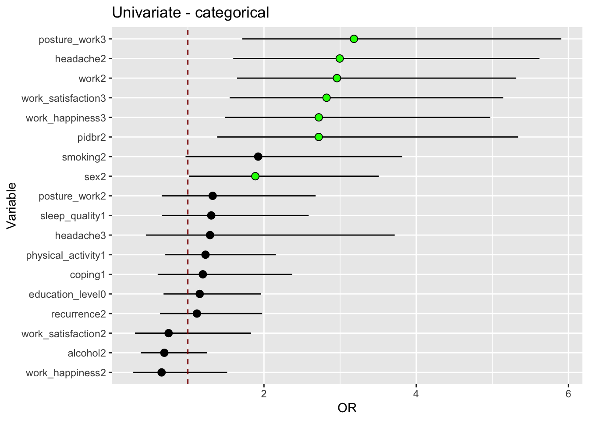
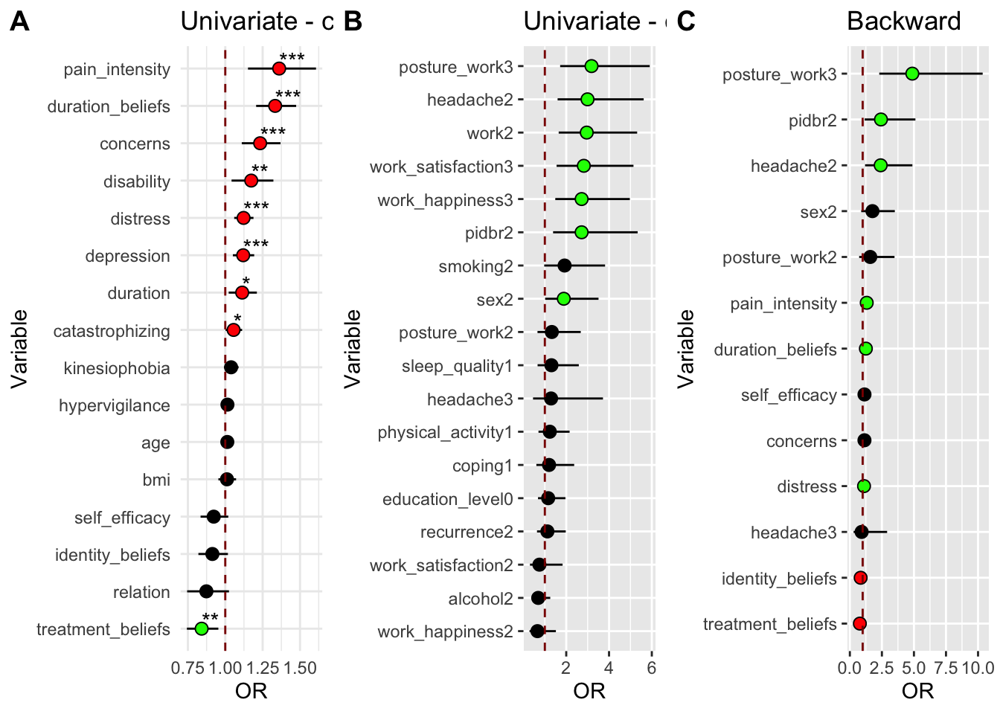
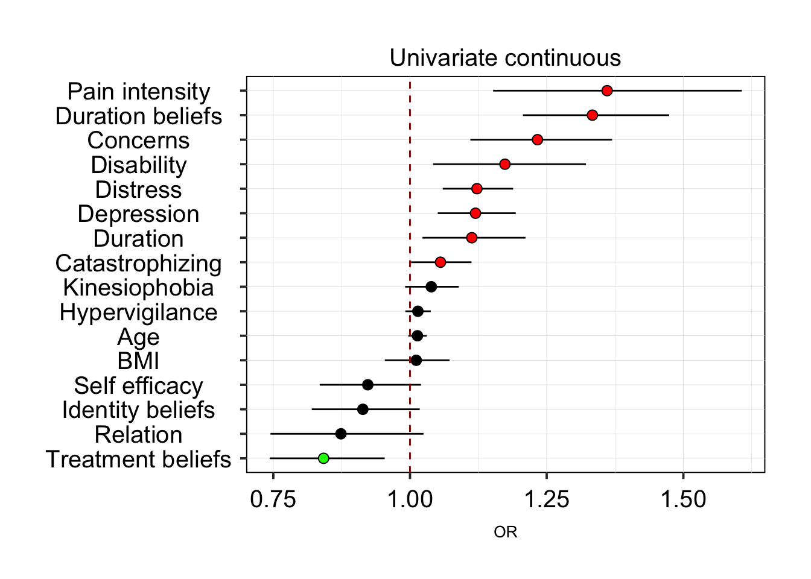
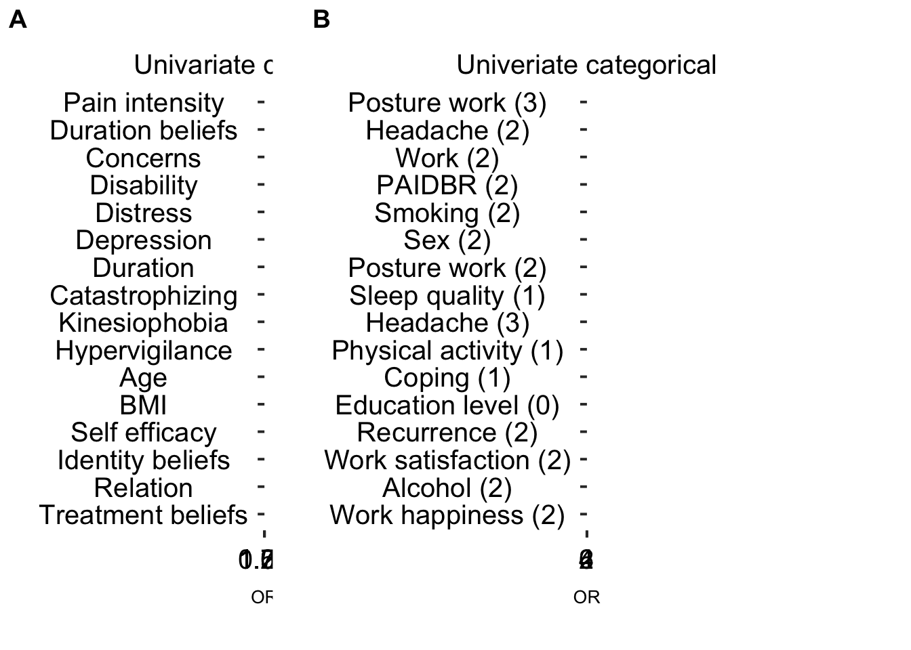
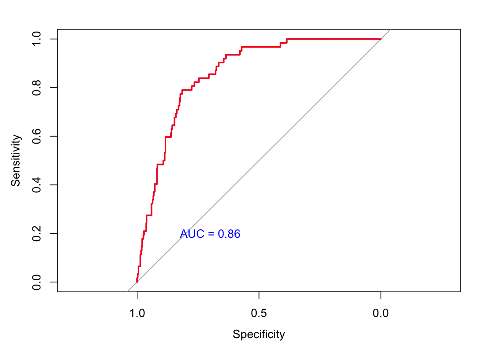
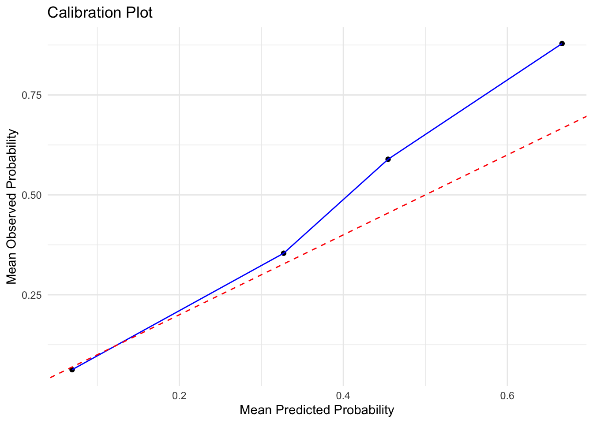

# Article figures


## Packages
First, we need to load all the required packages.

```r
library(rms)
```

```
## Loading required package: Hmisc
```

```
## 
## Attaching package: 'Hmisc'
```

```
## The following objects are masked from 'package:base':
## 
##     format.pval, units
```

```
## Warning in .recacheSubclasses(def@className, def, env): undefined subclass
## "ndiMatrix" of class "replValueSp"; definition not updated
```

```r
library(foreign)
library (dplyr)
```

```
## 
## Attaching package: 'dplyr'
```

```
## The following objects are masked from 'package:Hmisc':
## 
##     src, summarize
```

```
## The following objects are masked from 'package:stats':
## 
##     filter, lag
```

```
## The following objects are masked from 'package:base':
## 
##     intersect, setdiff, setequal, union
```

```r
library(haven)
library(car)
```

```
## Loading required package: carData
```

```
## 
## Attaching package: 'car'
```

```
## The following object is masked from 'package:dplyr':
## 
##     recode
```

```
## The following objects are masked from 'package:rms':
## 
##     Predict, vif
```

```r
library(fpc)
library(lmtest)
```

```
## Loading required package: zoo
```

```
## 
## Attaching package: 'zoo'
```

```
## The following objects are masked from 'package:base':
## 
##     as.Date, as.Date.numeric
```

```
## 
## Attaching package: 'lmtest'
```

```
## The following object is masked from 'package:rms':
## 
##     lrtest
```

```r
library(pROC)
```

```
## Type 'citation("pROC")' for a citation.
```

```
## 
## Attaching package: 'pROC'
```

```
## The following objects are masked from 'package:stats':
## 
##     cov, smooth, var
```

```r
library(tidyverse)
```

```
## ── Attaching core tidyverse packages ──────────────────────── tidyverse 2.0.0 ──
## ✔ forcats   1.0.0     ✔ readr     2.1.5
## ✔ ggplot2   3.4.4     ✔ stringr   1.5.1
## ✔ lubridate 1.9.3     ✔ tibble    3.2.1
## ✔ purrr     1.0.2     ✔ tidyr     1.3.1
```

```
## ── Conflicts ────────────────────────────────────────── tidyverse_conflicts() ──
## ✖ dplyr::filter()    masks stats::filter()
## ✖ dplyr::lag()       masks stats::lag()
## ✖ car::recode()      masks dplyr::recode()
## ✖ purrr::some()      masks car::some()
## ✖ dplyr::src()       masks Hmisc::src()
## ✖ dplyr::summarize() masks Hmisc::summarize()
## ℹ Use the conflicted package (<http://conflicted.r-lib.org/>) to force all conflicts to become errors
```

```r
library(haven)
library(corrr)
library(ggplot2)
library(car)
library(stats)
library(base)
library(dplyr)
library(broom)
library(MASS)
```

```
## 
## Attaching package: 'MASS'
## 
## The following object is masked from 'package:dplyr':
## 
##     select
```

```r
library(pROC)
library(ResourceSelection)
```

```
## ResourceSelection 0.3-6 	 2023-06-27
```

```r
library(xfun)
```

```
## 
## Attaching package: 'xfun'
## 
## The following objects are masked from 'package:base':
## 
##     attr, isFALSE
```

```r
library(rms)
library(skimr)
```

```
## 
## Attaching package: 'skimr'
## 
## The following object is masked from 'package:corrr':
## 
##     focus
```

```r
library(ggpubr)
```

## Data load
Here we load the build-in dataset

```r
imputed_with_attitude_and_chronic <- read_rds(
  here::here(
    "data",
    "imputed_with_attitude_and_chronic.rds"
  )
)
```

### Load labels for figures


## Clean data and rename variables

```r
imputed_with_attitude_and_chronic <- imputed_with_attitude_and_chronic |>
  rename(pidbr = wide_spread_pain)

## pidbr = pain in different body regions
```

## Exploratory Data Analysis

```r
summary(imputed_with_attitude_and_chronic)
```

```
##  sex          age          education   education_level pain_intensity  
##  1:206   Min.   :18.00   7      :208   0:321           Min.   : 1.000  
##  2:397   1st Qu.:31.00   6      :204   1:282           1st Qu.: 5.000  
##          Median :44.00   8      : 74                   Median : 6.000  
##          Mean   :44.51   2      : 42                   Mean   : 5.929  
##          3rd Qu.:56.00   4      : 30                   3rd Qu.: 7.000  
##          Max.   :85.00   3      : 20                   Max.   :10.000  
##                          (Other): 25                                   
##     duration      recurrence pidbr   headache   disability     work   
##  Min.   : 1.000   1:198      1:211   1:249    Min.   : 0.000   1:508  
##  1st Qu.: 2.000   2:405      2:392   2:284    1st Qu.: 1.000   2: 95  
##  Median : 4.000                      3: 70    Median : 2.300          
##  Mean   : 4.522                               Mean   : 2.726          
##  3rd Qu.: 6.000                               3rd Qu.: 4.100          
##  Max.   :11.000                               Max.   :11.000          
##                                                                       
##  work_happiness work_satisfaction posture_work physical_activity smoking
##  1:392          1:417             1:388        0:220             1:531  
##  2:116          2: 91             2:120        1:383             2: 72  
##  3: 95          3: 95             3: 95                                 
##                                                                         
##                                                                         
##                                                                         
##                                                                         
##  alcohol      bmi        sleep_quality catastrophizing  duration_beliefs
##  1:129   Min.   :10.73   0:130         Min.   : 0.000   Min.   : 0.000  
##  2:474   1st Qu.:22.51   1:473         1st Qu.: 1.000   1st Qu.: 2.000  
##          Median :24.66                 Median : 3.000   Median : 3.000  
##          Mean   :25.35                 Mean   : 4.587   Mean   : 4.121  
##          3rd Qu.:27.66                 3rd Qu.: 7.000   3rd Qu.: 6.000  
##          Max.   :51.06                 Max.   :24.000   Max.   :10.000  
##                                                                         
##     concerns      treatment_beliefs   depression     kinesiophobia  
##  Min.   : 0.000   Min.   : 0.000    Min.   : 0.000   Min.   : 0.00  
##  1st Qu.: 2.000   1st Qu.: 7.000    1st Qu.: 0.000   1st Qu.:12.00  
##  Median : 4.000   Median : 8.000    Median : 1.000   Median :15.00  
##  Mean   : 3.954   Mean   : 7.813    Mean   : 2.471   Mean   :16.55  
##  3rd Qu.: 6.000   3rd Qu.: 9.000    3rd Qu.: 4.000   3rd Qu.:20.00  
##  Max.   :10.000   Max.   :10.000    Max.   :20.000   Max.   :40.00  
##                                                                     
##     distress      coping  identity_beliefs hypervigilance self_efficacy  
##  Min.   : 0.000   0:122   Min.   : 0.000   Min.   : 0     Min.   : 0.00  
##  1st Qu.: 1.000   1:481   1st Qu.: 5.000   1st Qu.:23     1st Qu.:10.00  
##  Median : 3.000           Median : 6.000   Median :31     Median :11.00  
##  Mean   : 4.386           Mean   : 6.111   Mean   :31     Mean   :10.31  
##  3rd Qu.: 7.000           3rd Qu.: 8.000   3rd Qu.:38     3rd Qu.:12.00  
##  Max.   :21.000           Max.   :10.000   Max.   :76     Max.   :12.00  
##                                                                          
##     relation      painint_6weeks   painint_3months painint_6months 
##  Min.   : 0.000   Min.   : 0.000   Min.   :0.000   Min.   : 0.000  
##  1st Qu.: 8.000   1st Qu.: 0.000   1st Qu.:0.000   1st Qu.: 0.000  
##  Median : 9.000   Median : 2.000   Median :0.000   Median : 0.000  
##  Mean   : 8.799   Mean   : 2.541   Mean   :2.048   Mean   : 1.247  
##  3rd Qu.:10.000   3rd Qu.: 5.000   3rd Qu.:4.000   3rd Qu.: 1.000  
##  Max.   :10.000   Max.   :10.000   Max.   :9.000   Max.   :10.000  
##                                                                    
##     attitude      patient_code   painint_6weeks_high painint_3months_high
##  Min.   :1.000   Min.   :100.0   Mode :logical       Mode :logical       
##  1st Qu.:2.000   1st Qu.:330.5   FALSE:331           FALSE:391           
##  Median :2.000   Median :594.0   TRUE :272           TRUE :212           
##  Mean   :1.758   Mean   :570.2                                           
##  3rd Qu.:2.000   3rd Qu.:811.5                                           
##  Max.   :2.000   Max.   :999.0                                           
##  NA's   :49                                                              
##  painint_6months_high  painint_high   painint_total_score is_painint_chronic
##  Mode :logical        Min.   :0.000   Min.   : 0.000      Mode :logical     
##  FALSE:476            1st Qu.:0.000   1st Qu.: 0.000      FALSE:541         
##  TRUE :127            Median :1.000   Median : 5.000      TRUE :62          
##                       Mean   :1.013   Mean   : 5.836                        
##                       3rd Qu.:2.000   3rd Qu.: 9.000                        
##                       Max.   :3.000   Max.   :28.000                        
## 
```

## Variabel analysis
Identifying the independent predictive capacity of the candidate prognostic variables at baseline and the existence or non-existence of chronic pain by univariate logistic regression analysis. Univariate logistic regression for continous variables Univariate analyses, model per variable with 95 confidence interval and OR. Fitting the univariate logistic regression model. Retrieving the coefficient and standard error for "Variable". Calculating the 95% confidence interval for "Variable"


```r
# List of continuous variables
continuous_variables <- c("depression", "concerns", "age", "pain_intensity", "duration", "disability", "bmi", "catastrophizing", "duration_beliefs", "treatment_beliefs", "kinesiophobia", "distress", "identity_beliefs", "hypervigilance", "relation", "self_efficacy")

# Function univariate analyses of the continuous variables
## Roxygen comments for man page

#' @title Run an univariate model for all continuous variables in the data
#' @param variable Name of variable as a character string
#' @param data Dataset 'imputed_with_attitude_and_chronic'
#' @export

univariate_analysis <- function(variable, 
                                           data, 
                                           z_score = 1.96, 
                                           conf_int = 95) {
  
  formula <- as.formula(paste("is_painint_chronic ~", variable))
  model <- glm(formula, data = data, family = binomial)
 
  conf_int_upper_limit = paste0("conf_int_", conf_int)
  conf_int_lower_limit = paste0("conf_int_", (100-conf_int))
  
  # get model meterics with broom
  model |> 
    broom::tidy() |>
    mutate(
      conf_int_lower = exp(estimate - z_score * std.error),
      OR = exp(estimate),
      conf_int_upper = exp(
        estimate + z_score * std.error)) -> df
  
  names(df)[c(6,8)] <- c(conf_int_lower_limit, conf_int_upper_limit)
  df
  # remove Intercept term
  df <- df[-1,]
  return(df)
}

## test 1
univariate_analysis(
  data = imputed_with_attitude_and_chronic,
  variable = continuous_variables[1],
  z_score = 1.96,
  conf_int = 95)
```

```
## # A tibble: 1 × 8
##   term       estimate std.error statistic  p.value conf_int_5    OR conf_int_95
##   <chr>         <dbl>     <dbl>     <dbl>    <dbl>      <dbl> <dbl>       <dbl>
## 1 depression    0.113    0.0325      3.49 0.000490       1.05  1.12        1.19
```

```r
## test 2 - different conf int
univariate_analysis(
  data = imputed_with_attitude_and_chronic,
  variable = continuous_variables[1],
  z_score = 2.24,
  conf_int = 97.5)
```

```
## # A tibble: 1 × 8
##   term     estimate std.error statistic p.value conf_int_2.5    OR conf_int_97.5
##   <chr>       <dbl>     <dbl>     <dbl>   <dbl>        <dbl> <dbl>         <dbl>
## 1 depress…    0.113    0.0325      3.49 4.90e-4         1.04  1.12          1.20
```

```r
## Univariate analyses for all continuous variables
## Iterate over all variables, leave conf int to default = 95%
df_univariate_continuous <- map_df(
  .x = continuous_variables,
  .f = univariate_analysis,
  data = imputed_with_attitude_and_chronic
  )

df_univariate_continuous
```

```
## # A tibble: 16 × 8
##    term        estimate std.error statistic p.value conf_int_5    OR conf_int_95
##    <chr>          <dbl>     <dbl>     <dbl>   <dbl>      <dbl> <dbl>       <dbl>
##  1 depression    0.113    0.0325      3.49  4.90e-4      1.05  1.12        1.19 
##  2 concerns      0.210    0.0535      3.92  8.99e-5      1.11  1.23        1.37 
##  3 age           0.0135   0.00847     1.59  1.11e-1      0.997 1.01        1.03 
##  4 pain_inten…   0.308    0.0849      3.63  2.87e-4      1.15  1.36        1.61 
##  5 duration      0.107    0.0431      2.48  1.30e-2      1.02  1.11        1.21 
##  6 disability    0.160    0.0606      2.64  8.27e-3      1.04  1.17        1.32 
##  7 bmi           0.0113   0.0298      0.380 7.04e-1      0.954 1.01        1.07 
##  8 catastroph…   0.0543   0.0267      2.03  4.21e-2      1.00  1.06        1.11 
##  9 duration_b…   0.288    0.0511      5.63  1.77e-8      1.21  1.33        1.47 
## 10 treatment_…  -0.172    0.0635     -2.71  6.81e-3      0.743 0.842       0.954
## 11 kinesiopho…   0.0382   0.0241      1.59  1.12e-1      0.991 1.04        1.09 
## 12 distress      0.116    0.0293      3.95  7.86e-5      1.06  1.12        1.19 
## 13 identity_b…  -0.0902   0.0550     -1.64  1.01e-1      0.820 0.914       1.02 
## 14 hypervigil…   0.0143   0.0117      1.23  2.20e-1      0.991 1.01        1.04 
## 15 relation     -0.135    0.0814     -1.66  9.71e-2      0.745 0.874       1.02 
## 16 self_effic…  -0.0803   0.0511     -1.57  1.16e-1      0.835 0.923       1.02
```

## Graph of model metrics
Let's make a plot of the model results

```r
signi_continuous_pos <- df_univariate_continuous |>
  filter(conf_int_5 > 1)

signi_continuous_neg <- df_univariate_continuous |>
  filter(conf_int_95 < 1)

df_univariate_continuous |>
  ggplot(
    aes(x = reorder(as_factor(term), OR),
        y = OR)
  ) +
  geom_point() +
  geom_pointrange(
    aes(
      ymin = conf_int_5, 
      ymax = conf_int_95
      )
    )  +
  geom_point(data = signi_continuous_pos, aes(x = reorder(as_factor(term), OR),
                y = OR), colour = "red", size = 2
             ) +
  geom_point(data = signi_continuous_neg, aes(x = reorder(as_factor(term), OR),
                y = OR), colour = "green", size = 2
             ) +
  xlab("Variable") +
  ylab("OR") +
  geom_hline(yintercept = 1, colour  = 'darkred', linetype = "dashed") +
  coord_flip() +
  ggtitle("Univariate - continuous") +
  theme_minimal() -> plot1_univariate_continuous

plot1_univariate_continuous
```


```r
## annotate plot with metrics
library(ggplot2)
library(dplyr)

# Add a significance level column based on p-value
df_univariate_continuous <- df_univariate_continuous %>%
  mutate(significance = case_when(
    p.value < 0.001 ~ "***",
    p.value < 0.01 ~ "**",
    p.value < 0.05 ~ "*",
    TRUE ~ "" # No asterisk if p-value is not significant
  ))

signi_continuous_pos <- df_univariate_continuous |>
  filter(conf_int_5 > 1)

signi_continuous_neg <- df_univariate_continuous |>
  filter(conf_int_95 < 1)

df_univariate_continuous |>
  ggplot(
    aes(x = reorder(as_factor(term), OR),
        y = OR)
  ) +
  geom_point() +
  geom_pointrange(
    aes(
      ymin = conf_int_5, 
      ymax = conf_int_95
    )
  ) +
  geom_point(data = signi_continuous_pos, aes(x = reorder(as_factor(term), OR),
                y = OR), colour = "red", size = 2
             ) +
  geom_point(data = signi_continuous_neg, aes(x = reorder(as_factor(term), OR),
                y = OR), colour = "green", size = 2
             ) +
  geom_text(aes(label = paste(significance), y = OR * 1.0), hjust = 0, vjust = 0, check_overlap = TRUE, size = 4) +
  xlab("Variable") +
  ylab("OR") +
  geom_hline(yintercept = 1, colour = 'darkred', linetype = "dashed") +
  coord_flip() +
  ggtitle("Univariate - continuous") +
  theme_minimal() -> plot1_univariate_continuous -> plot1_univariate_continuous_annotated

plot1_univariate_continuous_annotated
```


## Relevel dichotomous variables
Univariate logistic regression for categorical and dichotomous variables.
Set the "1" or "0" of the variable as a reference category.
Fitting the univariate logistic regression.
Calculating the OR and CI of this model.


```r
# Variable "work"
imputed_with_attitude_and_chronic$work <- relevel(imputed_with_attitude_and_chronic$work, ref = "1")
model1 <- glm(is_painint_chronic ~ work, data = imputed_with_attitude_and_chronic, family = binomial)
OR_work <- exp(coef(model1))
CI_work <- exp(confint(model1))
```

```
## Waiting for profiling to be done...
```

```r
print(OR_work)
```

```
## (Intercept)       work2 
##  0.09012876  2.95873016
```

```r
print(CI_work)
```

```
##                  2.5 %    97.5 %
## (Intercept) 0.06476482 0.1219859
## work2       1.62175793 5.2614647
```

```r
# Variable "Education_level"
imputed_with_attitude_and_chronic$education_level <- relevel(imputed_with_attitude_and_chronic$education_level, ref = "1")
model2 <- glm(is_painint_chronic ~ education_level, data = imputed_with_attitude_and_chronic, family = binomial)
OR_education_level <- exp(coef(model2))
CI_education_level <- exp(confint(model2))
```

```
## Waiting for profiling to be done...
```

```r
print(OR_education_level)
```

```
##      (Intercept) education_level0 
##        0.1058824        1.1557886
```

```r
print(CI_education_level)
```

```
##                       2.5 %    97.5 %
## (Intercept)      0.06960165 0.1543606
## education_level0 0.68231415 1.9770643
```

```r
# Variable "recurrence"
imputed_with_attitude_and_chronic$recurrence <- relevel(imputed_with_attitude_and_chronic$recurrence, ref = "1")
model3 <- glm(is_painint_chronic ~ recurrence, data = imputed_with_attitude_and_chronic, family = binomial)
OR_recurrence <- exp(coef(model3))
CI_recurrence <- exp(confint(model3))
```

```
## Waiting for profiling to be done...
```

```r
print(OR_recurrence)
```

```
## (Intercept) recurrence2 
##   0.1061453   1.1190753
```

```r
print(CI_recurrence)
```

```
##                  2.5 %    97.5 %
## (Intercept) 0.06400102 0.1656877
## recurrence2 0.64242847 2.0165613
```

```r
# Variable - pain in different body regions
imputed_with_attitude_and_chronic$pidbr <- relevel(imputed_with_attitude_and_chronic$pidbr, ref = "1")
model4 <- glm(is_painint_chronic ~ pidbr, data = imputed_with_attitude_and_chronic, family = binomial)
OR_pidbr <- exp(coef(model4))
CI_pidbr <- exp(confint(model4))
```

```
## Waiting for profiling to be done...
```

```r
print(OR_pidbr)
```

```
## (Intercept)      pidbr2 
##    0.055000    2.719275
```

```r
print(CI_pidbr)
```

```
##                  2.5 %     97.5 %
## (Intercept) 0.02818785 0.09603279
## pidbr2      1.43692355 5.60887542
```

```r
# Variable "headache"
imputed_with_attitude_and_chronic$headache <- relevel(imputed_with_attitude_and_chronic$headache, ref = "1")
model5 <- glm(is_painint_chronic ~ headache, data = imputed_with_attitude_and_chronic, family = binomial)
OR_headache <- exp(coef(model5))
CI_headache <- exp(confint(model5))
```

```
## Waiting for profiling to be done...
```

```r
print(OR_headache)
```

```
## (Intercept)   headache2   headache3 
##  0.05957447  2.99496147  1.29120879
```

```r
print(CI_headache)
```

```
##                  2.5 %     97.5 %
## (Intercept) 0.03313328 0.09821967
## headache2   1.63503675 5.80948533
## headache3   0.40522908 3.51473465
```

```r
# Variable "sex"
imputed_with_attitude_and_chronic$sex <- relevel(imputed_with_attitude_and_chronic$sex, ref = "1")
model6 <- glm(is_painint_chronic ~ sex, data = imputed_with_attitude_and_chronic, family = binomial)
OR_sex <- exp(coef(model6))
CI_sex <- exp(confint(model6))
```

```
## Waiting for profiling to be done...
```

```r
print(OR_sex)
```

```
## (Intercept)        sex2 
##  0.07291667  1.88620549
```

```r
print(CI_sex)
```

```
##                  2.5 %    97.5 %
## (Intercept) 0.04044007 0.1207022
## sex2        1.03994691 3.6326504
```

```r
# Variable "Work_happiness"
imputed_with_attitude_and_chronic$work_happiness <- relevel(imputed_with_attitude_and_chronic$work_happiness, ref = "1")
model7 <- glm(is_painint_chronic ~ work_happiness, data = imputed_with_attitude_and_chronic, family = binomial)
OR_work_happiness <- exp(coef(model7))
CI_work_happiness <- exp(confint(model7))
```

```
## Waiting for profiling to be done...
```

```r
print(OR_work_happiness)
```

```
##     (Intercept) work_happiness2 work_happiness3 
##      0.09803922      0.65504587      2.72000000
```

```r
print(CI_work_happiness)
```

```
##                      2.5 %    97.5 %
## (Intercept)     0.06807407 0.1365982
## work_happiness2 0.26069153 1.4324050
## work_happiness3 1.46836240 4.9348410
```

```r
# Variable "posture_work"
imputed_with_attitude_and_chronic$posture_work <- relevel(imputed_with_attitude_and_chronic$posture_work, ref = "1")
model8 <- glm(is_painint_chronic ~ posture_work, data = imputed_with_attitude_and_chronic, family = binomial)
OR_posture_work <- exp(coef(model8))
CI_posture_work <- exp(confint(model8))
```

```
## Waiting for profiling to be done...
```

```r
print(OR_posture_work)
```

```
##   (Intercept) posture_work2 posture_work3 
##    0.08379888    1.32592593    3.18222222
```

```r
print(CI_posture_work)
```

```
##                    2.5 %    97.5 %
## (Intercept)   0.05653886 0.1194222
## posture_work2 0.63368447 2.6177321
## posture_work3 1.69613786 5.8757114
```

```r
# Variable "work_satisfaction"
imputed_with_attitude_and_chronic$work_satisfaction <- relevel(imputed_with_attitude_and_chronic$work_satisfaction, ref = "1")
model9 <- glm(is_painint_chronic ~ work_satisfaction, data = imputed_with_attitude_and_chronic, family = binomial)
OR_work_satisfaction <- exp(coef(model9))
CI_work_satisfaction <- exp(confint(model9))
```

```
## Waiting for profiling to be done...
```

```r
print(OR_work_satisfaction)
```

```
##        (Intercept) work_satisfaction2 work_satisfaction3 
##         0.09448819         0.74705882         2.82222222
```

```r
print(CI_work_satisfaction)
```

```
##                         2.5 %    97.5 %
## (Intercept)        0.06599362 0.1309863
## work_satisfaction2 0.27609334 1.7080924
## work_satisfaction3 1.52768147 5.1022741
```

```r
# Variable "physical Activity"
imputed_with_attitude_and_chronic$physical_activity <- relevel(imputed_with_attitude_and_chronic$physical_activity, ref = "0")
model10 <- glm(is_painint_chronic ~ physical_activity, data = imputed_with_attitude_and_chronic, family = binomial)
OR_physical_activity <- exp(coef(model10))
CI_physical_activity <- exp(confint(model10))
```

```
## Waiting for profiling to be done...
```

```r
print(OR_physical_activity)
```

```
##        (Intercept) physical_activity1 
##           0.100000           1.231672
```

```r
print(CI_physical_activity)
```

```
##                        2.5 %    97.5 %
## (Intercept)        0.0611943 0.1542119
## physical_activity1 0.7119442 2.1964490
```

```r
# Variable "smoking"
imputed_with_attitude_and_chronic$smoking <- relevel(imputed_with_attitude_and_chronic$smoking, ref = "1")
model11 <- glm(is_painint_chronic ~ smoking, data = imputed_with_attitude_and_chronic, family = binomial)
OR_smoking <- exp(coef(model11))
CI_smoking <- exp(confint(model11))
```

```
## Waiting for profiling to be done...
```

```r
print(OR_smoking)
```

```
## (Intercept)    smoking2 
##   0.1039501   1.9240000
```

```r
print(CI_smoking)
```

```
##                  2.5 %    97.5 %
## (Intercept) 0.07674972 0.1375884
## smoking2    0.93299869 3.7113889
```

```r
# Variable "alcohol"
imputed_with_attitude_and_chronic$alcohol <- relevel(imputed_with_attitude_and_chronic$alcohol, ref = "1")
model12 <- glm(is_painint_chronic ~ alcohol, data = imputed_with_attitude_and_chronic, family = binomial)
OR_alcohol <- exp(coef(model12))
CI_alcohol <- exp(confint(model12))
```

```
## Waiting for profiling to be done...
```

```r
print(OR_alcohol)
```

```
## (Intercept)    alcohol2 
##   0.1517857   0.6910736
```

```r
print(CI_alcohol)
```

```
##                  2.5 %    97.5 %
## (Intercept) 0.08795751 0.2456099
## alcohol2    0.38745282 1.2836914
```

```r
# Variable "sleep quality"
imputed_with_attitude_and_chronic$sleep_quality <- relevel(imputed_with_attitude_and_chronic$sleep_quality, ref = "0")
model13 <- glm(is_painint_chronic ~ sleep_quality, data = imputed_with_attitude_and_chronic, family = binomial)
OR_sleep_quality <- exp(coef(model13))
CI_sleep_quality <- exp(confint(model13))
```

```
## Waiting for profiling to be done...
```

```r
print(OR_sleep_quality)
```

```
##    (Intercept) sleep_quality1 
##     0.09243697     1.30741060
```

```r
print(CI_sleep_quality)
```

```
##                     2.5 %    97.5 %
## (Intercept)    0.04696702 0.1635109
## sleep_quality1 0.68450097 2.7150269
```

```r
# Variable "coping"
imputed_with_attitude_and_chronic$coping <- relevel(imputed_with_attitude_and_chronic$coping, ref = "0")
model14 <- glm(is_painint_chronic ~ coping, data = imputed_with_attitude_and_chronic, family = binomial)
OR_coping <- exp(coef(model14))
CI_coping <- exp(confint(model14))
```

```
## Waiting for profiling to be done...
```

```r
print(OR_coping)
```

```
## (Intercept)     coping1 
##  0.09909911  1.19682862
```

```r
print(CI_coping)
```

```
##                  2.5 %    97.5 %
## (Intercept) 0.05027562 0.1756983
## coping1     0.62546659 2.4886925
```

```r
# Variable "attitude"
model15 <- glm(is_painint_chronic ~ attitude, data = imputed_with_attitude_and_chronic, family = binomial)
OR_attitude <- exp(coef(model15))
CI_attitude <- exp(confint(model15))
```

```
## Waiting for profiling to be done...
```

```r
print(OR_attitude)
```

```
## (Intercept)    attitude 
##   0.1393033   0.9048630
```

```r
print(CI_attitude)
```

```
##                  2.5 %    97.5 %
## (Intercept) 0.04214516 0.4017094
## attitude    0.49543972 1.7361149
```

## Refactor code above to a more compact version

```r
# Your named vector of reference levels
reference_levels <- c(work = "1", 
                      education_level = "1",
                      recurrence = "1",
                      pidbr = "1",
                      headache = "1",
                      sex = "1",
                      work_happiness = "1",
                      posture_work = "1",
                      work_satisfaction = "1",
                      physical_activity = "0",  # Note that this is set to "0"
                      smoking = "1",
                      alcohol = "1",
                      sleep_quality = "0",  # Note that this is set to "0"
                      coping = "0")  # Note that this is set to "0"

# Ensure all relevant variables are factors
imputed_with_attitude_and_chronic[ names(reference_levels) ] <- lapply(imputed_with_attitude_and_chronic[ names(reference_levels) ], as.factor)

# subset data for categorical variables only
data_categorical <- imputed_with_attitude_and_chronic |>
  dplyr::select(names(reference_levels))

# Iterate over the variables using map() and relevel
data_categorical <- data_categorical %>%
  purrr::map2_df(., reference_levels, ~relevel(.x, ref = .y))

data_categorical$is_painint_chronic <- imputed_with_attitude_and_chronic$is_painint_chronic
```

## Univariate analysis on the categorical variables

```r
df_univariate_categorical <- map_df(
  .x = names(reference_levels),
  .f = univariate_analysis,
  data = data_categorical
  )

df_univariate_categorical
```

```
## # A tibble: 18 × 8
##    term        estimate std.error statistic p.value conf_int_5    OR conf_int_95
##    <chr>          <dbl>     <dbl>     <dbl>   <dbl>      <dbl> <dbl>       <dbl>
##  1 work2          1.08      0.299     3.63  2.83e-4      1.65  2.96         5.31
##  2 education_…    0.145     0.270     0.536 5.92e-1      0.681 1.16         1.96
##  3 recurrence2    0.113     0.290     0.388 6.98e-1      0.634 1.12         1.98
##  4 pidbr2         1.00      0.344     2.91  3.65e-3      1.39  2.72         5.34
##  5 headache2      1.10      0.321     3.42  6.34e-4      1.60  2.99         5.62
##  6 headache3      0.256     0.540     0.474 6.36e-1      0.448 1.29         3.72
##  7 sex2           0.635     0.317     2.00  4.51e-2      1.01  1.89         3.51
##  8 work_happi…   -0.423     0.428    -0.988 3.23e-1      0.283 0.655        1.52
##  9 work_happi…    1.00      0.308     3.25  1.15e-3      1.49  2.72         4.97
## 10 posture_wo…    0.282     0.359     0.786 4.32e-1      0.656 1.33         2.68
## 11 posture_wo…    1.16      0.315     3.67  2.42e-4      1.72  3.18         5.90
## 12 work_satis…   -0.292     0.457    -0.638 5.23e-1      0.305 0.747        1.83
## 13 work_satis…    1.04      0.306     3.39  7.02e-4      1.55  2.82         5.14
## 14 physical_a…    0.208     0.286     0.729 4.66e-1      0.703 1.23         2.16
## 15 smoking2       0.654     0.349     1.87  6.11e-2      0.970 1.92         3.82
## 16 alcohol2      -0.370     0.304    -1.22  2.24e-1      0.381 0.691        1.25
## 17 sleep_qual…    0.268     0.348     0.770 4.41e-1      0.661 1.31         2.59
## 18 coping1        0.180     0.349     0.515 6.07e-1      0.604 1.20         2.37
```

## Visualize model outcome

```r
signi_categorical_pos <- df_univariate_categorical |>
  filter(conf_int_5 > 1)

signi_categorical_neg <- df_univariate_categorical |>
  filter(conf_int_95 < 1)


df_univariate_categorical |>
  ggplot(
    aes(x = reorder(as_factor(term), OR),
        y = OR)
  ) +
  geom_point() +
  geom_pointrange(
    aes(
      ymin = conf_int_5, 
      ymax = conf_int_95
      )
    )  +
  geom_point(data = signi_categorical_pos, aes(x = reorder(as_factor(term), OR),
                y = OR), colour = "green", size = 2
             ) +
  geom_point(data = signi_categorical_neg, aes(x = reorder(as_factor(term), OR),
                y = OR), colour = "red", size = 2
             ) +
  xlab("Variable") +
  ylab("OR") +
  ggtitle("Univariate - categorical") +
  geom_hline(yintercept = 1, colour  = 'darkred', linetype = "dashed") + 
  coord_flip() -> plot2_univariate_categorical
plot2_univariate_categorical
```



```r
## annotate plot with * for significance
# Add a significance level column based on p-value
df_univariate_categorical <- df_univariate_categorical %>%
  mutate(significance = case_when(
    p.value < 0.001 ~ "***",
    p.value < 0.01 ~ "**",
    p.value < 0.05 ~ "*",
    TRUE ~ "" # No asterisk if p-value is not significant
  ))

signi_continuous_pos <- df_univariate_categorical |>
  filter(conf_int_5 > 1)

signi_continuous_neg <- df_univariate_categorical |>
  filter(conf_int_95 < 1)

df_univariate_categorical |>
  ggplot(
    aes(x = reorder(as_factor(term), OR),
        y = OR)
  ) +
  geom_point() +
  geom_pointrange(
    aes(
      ymin = conf_int_5, 
      ymax = conf_int_95
    )
  ) +
  geom_point(data = signi_categorical_pos, aes(x = reorder(as_factor(term), OR),
                y = OR), colour = "red", size = 2
             ) +
  geom_point(data = signi_categorical_neg, aes(x = reorder(as_factor(term), OR),
                y = OR), colour = "green", size = 2
             ) +
  geom_text(aes(label = paste(significance), y = OR * 1.0), hjust = 0, vjust = 0, check_overlap = TRUE, size = 4) +
  xlab("Variable") +
  ylab("OR") +
  geom_hline(yintercept = 1, colour = 'darkred', linetype = "dashed") +
  coord_flip() +
  ggtitle("Univariate - categorical") +
  theme_minimal() -> plot2_univariate_categorical_annotated

plot2_univariate_categorical_annotated
```


## Panel plot univariate

```r
cowplot::plot_grid(
  plotlist = list(
    plot1_univariate_continuous_annotated + painr::theme_individual(), 
    plot2_univariate_categorical_annotated + painr::theme_individual())
)
```


## Multivariable logistic regression analyses

Due to multicollinearity in the work-related factors (happiness, satisfaction, and posture -> leading to the outcome "3" = not working), a decision had to be made on which factor to include. We analysed different models with the individual work-related factors included. There was almost no difference in model performance. Because happiness and satisfaction align more with the other psychological factors, we have chosen to include the variable "posture_work", thereby incorporating add different domain into our model for the final backward model analyses and internal validation.

The candidate prognostic factor "attitude" does not have predictive value in het univariate analysis and does not emerge in the multivariate analysis in the formula with all the variables included. Additionally, there are many missing values, which cannot be imputed, as they pertain to the the therapist's attitude. We now excluding this variable from the complete model development because internal validation does not proceed with these variables included.


```r
naniar::vis_miss(imputed_with_attitude_and_chronic)
```


```r
new_data <- imputed_with_attitude_and_chronic |>
  dplyr::select(-attitude)

sum(is.na(new_data))
```

```
## [1] 0
```

```r
full_model <- glm(data = imputed_with_attitude_and_chronic, is_painint_chronic ~ sex + age + pain_intensity + duration + pidbr + headache + disability + posture_work + physical_activity + smoking + alcohol + bmi + sleep_quality + catastrophizing + duration_beliefs + concerns + treatment_beliefs + depression + kinesiophobia + distress + coping + identity_beliefs + hypervigilance + self_efficacy + relation, family = "binomial")

summary(full_model)
```

```
## 
## Call:
## glm(formula = is_painint_chronic ~ sex + age + pain_intensity + 
##     duration + pidbr + headache + disability + posture_work + 
##     physical_activity + smoking + alcohol + bmi + sleep_quality + 
##     catastrophizing + duration_beliefs + concerns + treatment_beliefs + 
##     depression + kinesiophobia + distress + coping + identity_beliefs + 
##     hypervigilance + self_efficacy + relation, family = "binomial", 
##     data = imputed_with_attitude_and_chronic)
## 
## Coefficients:
##                     Estimate Std. Error z value Pr(>|z|)    
## (Intercept)        -7.856997   2.014554  -3.900 9.61e-05 ***
## sex2                0.621459   0.381164   1.630 0.103012    
## age                 0.007465   0.011387   0.656 0.512097    
## pain_intensity      0.257560   0.115333   2.233 0.025537 *  
## duration            0.055364   0.053130   1.042 0.297391    
## pidbr2              0.809406   0.399367   2.027 0.042691 *  
## headache2           0.961491   0.380336   2.528 0.011471 *  
## headache3          -0.017406   0.611967  -0.028 0.977309    
## disability          0.037170   0.091565   0.406 0.684787    
## posture_work2       0.705919   0.421910   1.673 0.094297 .  
## posture_work3       1.523283   0.433345   3.515 0.000439 ***
## physical_activity1  0.164670   0.348018   0.473 0.636095    
## smoking2            0.563160   0.418249   1.346 0.178151    
## alcohol2           -0.302294   0.368041  -0.821 0.411441    
## bmi                 0.019959   0.036600   0.545 0.585528    
## sleep_quality1     -0.503916   0.421602  -1.195 0.231993    
## catastrophizing    -0.057224   0.048013  -1.192 0.233326    
## duration_beliefs    0.238992   0.065878   3.628 0.000286 ***
## concerns            0.183421   0.083870   2.187 0.028745 *  
## treatment_beliefs  -0.219190   0.098053  -2.235 0.025389 *  
## depression          0.017426   0.065927   0.264 0.791528    
## kinesiophobia      -0.007644   0.039061  -0.196 0.844841    
## distress            0.113553   0.056189   2.021 0.043290 *  
## coping1             0.459219   0.429294   1.070 0.284751    
## identity_beliefs   -0.163266   0.075735  -2.156 0.031102 *  
## hypervigilance      0.007581   0.016849   0.450 0.652743    
## self_efficacy       0.137327   0.085300   1.610 0.107416    
## relation           -0.060274   0.123675  -0.487 0.626003    
## ---
## Signif. codes:  0 '***' 0.001 '**' 0.01 '*' 0.05 '.' 0.1 ' ' 1
## 
## (Dispersion parameter for binomial family taken to be 1)
## 
##     Null deviance: 399.47  on 602  degrees of freedom
## Residual deviance: 292.30  on 575  degrees of freedom
## AIC: 348.3
## 
## Number of Fisher Scoring iterations: 6
```

```r
#full_model_mterics_df <- full_model |> broom::tidy()
#full_model_mterics_df <- full_model_mterics_df |>

  
## Run a tidy version of the full model  
#' @title Run an univariate model for all continuous variables in the data
#' @param variable Name of variable as a character string
#' @param data Dataset 'imputed_with_attitude_and_chronic'
#' @export

multivariate_analysis <- function(
    data, 
    z_score = 1.96, 
    conf_int = 95) {
  
  full_model <- glm(
    data = data, 
    is_painint_chronic ~ 
      sex + 
      age + 
      pain_intensity + 
      duration + 
      pidbr + 
      headache + 
      disability + 
      posture_work + 
      physical_activity + 
      smoking + 
      alcohol + 
      bmi + 
      sleep_quality + 
      catastrophizing + 
      duration_beliefs + 
      concerns + 
      treatment_beliefs + 
      depression + 
      kinesiophobia + 
      distress + 
      coping + 
      identity_beliefs + 
      hypervigilance + 
      self_efficacy + 
      relation, 
    family = "binomial")
 
  conf_int_upper_limit = paste0("conf_int_", conf_int)
  conf_int_lower_limit = paste0("conf_int_", (100-conf_int))
  
  # get model meterics with broom
  full_model |> 
    broom::tidy() |>
    mutate(
      conf_int_lower = exp(estimate - z_score * std.error),
      OR = exp(estimate),
      conf_int_upper = exp(
        estimate + z_score * std.error)) -> df
  
  names(df)[c(6,8)] <- c(conf_int_lower_limit, conf_int_upper_limit)
  df
  # remove Intercept term
  df <- df[-1,]
  return(df)
}

## full model
full_model_tidy <- multivariate_analysis(
  data = imputed_with_attitude_and_chronic
)


 full_model_tidy <- full_model_tidy %>%
  mutate(significance = case_when(
    p.value < 0.001 ~ "***",
    p.value < 0.01 ~ "**",
    p.value < 0.05 ~ "*",
    TRUE ~ "" # No asterisk if p-value is not significant
  ))


## Visualize
signi_full_pos <- full_model_tidy |>
  filter(conf_int_5 > 1)

signi_full_neg <- full_model_tidy |>
  filter(conf_int_95 < 1)


full_model_tidy |>
  ggplot(
    aes(x = reorder(as_factor(term), OR),
        y = OR)
  ) +
  geom_point() +
  geom_pointrange(
    aes(
      ymin = conf_int_5, 
      ymax = conf_int_95
      )
    )  +
  geom_point(data = signi_full_pos, aes(x = reorder(as_factor(term), OR),
                y = OR), colour = "green", size = 2
             ) +
  geom_point(data = signi_full_neg, aes(x = reorder(as_factor(term), OR),
                y = OR), colour = "red", size = 2
             ) +
  xlab("Variable") +
  ylab("OR") +
  ggtitle("Multivariate") +
  geom_hline(yintercept = 1, colour  = 'darkred', linetype = "dashed") + 
  coord_flip() -> plot3_multivariate

plot3_multivariate
```


## Backward model


```r
## Backward model

backward_model <- stepAIC(full_model, direction = "backward")
```

```
## Start:  AIC=348.3
## is_painint_chronic ~ sex + age + pain_intensity + duration + 
##     pidbr + headache + disability + posture_work + physical_activity + 
##     smoking + alcohol + bmi + sleep_quality + catastrophizing + 
##     duration_beliefs + concerns + treatment_beliefs + depression + 
##     kinesiophobia + distress + coping + identity_beliefs + hypervigilance + 
##     self_efficacy + relation
## 
##                     Df Deviance    AIC
## - kinesiophobia      1   292.34 346.34
## - depression         1   292.37 346.37
## - disability         1   292.47 346.47
## - hypervigilance     1   292.51 346.51
## - physical_activity  1   292.53 346.53
## - relation           1   292.54 346.54
## - bmi                1   292.60 346.60
## - age                1   292.74 346.73
## - alcohol            1   292.96 346.96
## - duration           1   293.38 347.38
## - coping             1   293.50 347.50
## - sleep_quality      1   293.68 347.68
## - catastrophizing    1   293.76 347.76
## - smoking            1   294.03 348.03
## <none>                   292.30 348.30
## - sex                1   295.09 349.09
## - self_efficacy      1   295.18 349.18
## - distress           1   296.31 350.31
## - pidbr              1   296.80 350.80
## - identity_beliefs   1   297.05 351.05
## - treatment_beliefs  1   297.10 351.10
## - concerns           1   297.26 351.26
## - pain_intensity     1   297.61 351.61
## - headache           2   301.00 353.00
## - posture_work       2   305.61 357.61
## - duration_beliefs   1   306.05 360.05
## 
## Step:  AIC=346.34
## is_painint_chronic ~ sex + age + pain_intensity + duration + 
##     pidbr + headache + disability + posture_work + physical_activity + 
##     smoking + alcohol + bmi + sleep_quality + catastrophizing + 
##     duration_beliefs + concerns + treatment_beliefs + depression + 
##     distress + coping + identity_beliefs + hypervigilance + self_efficacy + 
##     relation
## 
##                     Df Deviance    AIC
## - depression         1   292.40 344.40
## - disability         1   292.49 344.49
## - hypervigilance     1   292.52 344.52
## - physical_activity  1   292.56 344.56
## - relation           1   292.57 344.57
## - bmi                1   292.64 344.64
## - age                1   292.75 344.75
## - alcohol            1   293.00 345.00
## - duration           1   293.40 345.40
## - coping             1   293.51 345.51
## - sleep_quality      1   293.74 345.74
## - catastrophizing    1   293.99 345.99
## - smoking            1   294.15 346.15
## <none>                   292.34 346.34
## - sex                1   295.19 347.19
## - self_efficacy      1   295.42 347.42
## - distress           1   296.34 348.34
## - pidbr              1   296.98 348.98
## - identity_beliefs   1   297.06 349.06
## - treatment_beliefs  1   297.19 349.19
## - concerns           1   297.27 349.27
## - pain_intensity     1   297.81 349.81
## - headache           2   301.18 351.18
## - posture_work       2   305.65 355.65
## - duration_beliefs   1   306.05 358.05
## 
## Step:  AIC=344.4
## is_painint_chronic ~ sex + age + pain_intensity + duration + 
##     pidbr + headache + disability + posture_work + physical_activity + 
##     smoking + alcohol + bmi + sleep_quality + catastrophizing + 
##     duration_beliefs + concerns + treatment_beliefs + distress + 
##     coping + identity_beliefs + hypervigilance + self_efficacy + 
##     relation
## 
##                     Df Deviance    AIC
## - disability         1   292.54 342.54
## - hypervigilance     1   292.58 342.58
## - physical_activity  1   292.61 342.61
## - relation           1   292.66 342.66
## - bmi                1   292.71 342.71
## - age                1   292.81 342.81
## - alcohol            1   293.07 343.07
## - duration           1   293.50 343.50
## - coping             1   293.53 343.53
## - sleep_quality      1   293.79 343.78
## - catastrophizing    1   294.01 344.01
## - smoking            1   294.28 344.28
## <none>                   292.40 344.40
## - sex                1   295.19 345.19
## - self_efficacy      1   295.48 345.48
## - identity_beliefs   1   297.06 347.06
## - pidbr              1   297.10 347.09
## - treatment_beliefs  1   297.20 347.21
## - concerns           1   297.28 347.28
## - pain_intensity     1   297.81 347.81
## - headache           2   301.45 349.45
## - distress           1   300.69 350.69
## - posture_work       2   305.95 353.95
## - duration_beliefs   1   306.15 356.15
## 
## Step:  AIC=342.54
## is_painint_chronic ~ sex + age + pain_intensity + duration + 
##     pidbr + headache + posture_work + physical_activity + smoking + 
##     alcohol + bmi + sleep_quality + catastrophizing + duration_beliefs + 
##     concerns + treatment_beliefs + distress + coping + identity_beliefs + 
##     hypervigilance + self_efficacy + relation
## 
##                     Df Deviance    AIC
## - hypervigilance     1   292.73 340.73
## - physical_activity  1   292.75 340.75
## - relation           1   292.78 340.78
## - bmi                1   292.88 340.88
## - age                1   292.93 340.93
## - alcohol            1   293.24 341.24
## - coping             1   293.67 341.67
## - duration           1   293.67 341.67
## - sleep_quality      1   293.86 341.86
## - catastrophizing    1   294.06 342.06
## - smoking            1   294.35 342.35
## <none>                   292.54 342.54
## - sex                1   295.26 343.26
## - self_efficacy      1   295.51 343.51
## - identity_beliefs   1   297.15 345.15
## - pidbr              1   297.18 345.18
## - treatment_beliefs  1   297.43 345.43
## - concerns           1   297.56 345.56
## - pain_intensity     1   299.29 347.29
## - headache           2   301.68 347.68
## - distress           1   301.42 349.42
## - posture_work       2   305.95 351.95
## - duration_beliefs   1   306.38 354.38
## 
## Step:  AIC=340.73
## is_painint_chronic ~ sex + age + pain_intensity + duration + 
##     pidbr + headache + posture_work + physical_activity + smoking + 
##     alcohol + bmi + sleep_quality + catastrophizing + duration_beliefs + 
##     concerns + treatment_beliefs + distress + coping + identity_beliefs + 
##     self_efficacy + relation
## 
##                     Df Deviance    AIC
## - physical_activity  1   292.96 338.96
## - relation           1   292.96 338.97
## - bmi                1   293.10 339.09
## - age                1   293.17 339.17
## - alcohol            1   293.42 339.42
## - coping             1   293.80 339.80
## - duration           1   293.85 339.85
## - catastrophizing    1   294.06 340.06
## - sleep_quality      1   294.12 340.12
## - smoking            1   294.53 340.53
## <none>                   292.73 340.73
## - sex                1   295.31 341.31
## - self_efficacy      1   295.77 341.77
## - identity_beliefs   1   297.19 343.18
## - pidbr              1   297.21 343.21
## - treatment_beliefs  1   297.56 343.56
## - concerns           1   297.63 343.63
## - pain_intensity     1   299.41 345.41
## - headache           2   301.85 345.85
## - distress           1   303.14 349.14
## - posture_work       2   306.07 350.07
## - duration_beliefs   1   306.49 352.49
## 
## Step:  AIC=338.96
## is_painint_chronic ~ sex + age + pain_intensity + duration + 
##     pidbr + headache + posture_work + smoking + alcohol + bmi + 
##     sleep_quality + catastrophizing + duration_beliefs + concerns + 
##     treatment_beliefs + distress + coping + identity_beliefs + 
##     self_efficacy + relation
## 
##                     Df Deviance    AIC
## - relation           1   293.23 337.23
## - bmi                1   293.36 337.36
## - age                1   293.38 337.38
## - alcohol            1   293.75 337.76
## - coping             1   293.94 337.94
## - duration           1   294.06 338.06
## - catastrophizing    1   294.30 338.30
## - sleep_quality      1   294.33 338.33
## - smoking            1   294.80 338.80
## <none>                   292.96 338.96
## - sex                1   295.60 339.60
## - self_efficacy      1   296.15 340.15
## - identity_beliefs   1   297.51 341.51
## - treatment_beliefs  1   297.74 341.74
## - concerns           1   297.78 341.78
## - pidbr              1   297.88 341.88
## - pain_intensity     1   299.89 343.89
## - headache           2   302.03 344.03
## - distress           1   303.26 347.26
## - posture_work       2   306.13 348.13
## - duration_beliefs   1   306.68 350.68
## 
## Step:  AIC=337.23
## is_painint_chronic ~ sex + age + pain_intensity + duration + 
##     pidbr + headache + posture_work + smoking + alcohol + bmi + 
##     sleep_quality + catastrophizing + duration_beliefs + concerns + 
##     treatment_beliefs + distress + coping + identity_beliefs + 
##     self_efficacy
## 
##                     Df Deviance    AIC
## - bmi                1   293.60 335.60
## - age                1   293.65 335.65
## - alcohol            1   293.96 335.96
## - coping             1   294.21 336.21
## - duration           1   294.25 336.25
## - sleep_quality      1   294.52 336.52
## - catastrophizing    1   294.52 336.52
## - smoking            1   295.12 337.12
## <none>                   293.23 337.23
## - sex                1   295.83 337.83
## - self_efficacy      1   296.25 338.25
## - concerns           1   297.89 339.90
## - pidbr              1   298.00 340.00
## - identity_beliefs   1   298.43 340.43
## - pain_intensity     1   300.03 342.03
## - headache           2   302.17 342.17
## - treatment_beliefs  1   301.51 343.51
## - distress           1   303.46 345.46
## - posture_work       2   306.53 346.53
## - duration_beliefs   1   306.99 348.99
## 
## Step:  AIC=335.6
## is_painint_chronic ~ sex + age + pain_intensity + duration + 
##     pidbr + headache + posture_work + smoking + alcohol + sleep_quality + 
##     catastrophizing + duration_beliefs + concerns + treatment_beliefs + 
##     distress + coping + identity_beliefs + self_efficacy
## 
##                     Df Deviance    AIC
## - age                1   294.09 334.09
## - alcohol            1   294.33 334.34
## - coping             1   294.55 334.55
## - duration           1   294.66 334.66
## - catastrophizing    1   294.86 334.86
## - sleep_quality      1   294.97 334.97
## - smoking            1   295.54 335.54
## <none>                   293.60 335.60
## - sex                1   296.15 336.16
## - self_efficacy      1   296.63 336.63
## - concerns           1   298.31 338.31
## - pidbr              1   298.66 338.66
## - identity_beliefs   1   298.88 338.88
## - headache           2   302.37 340.37
## - pain_intensity     1   300.71 340.71
## - treatment_beliefs  1   301.99 341.99
## - distress           1   303.78 343.78
## - posture_work       2   306.88 344.88
## - duration_beliefs   1   307.00 347.01
## 
## Step:  AIC=334.09
## is_painint_chronic ~ sex + pain_intensity + duration + pidbr + 
##     headache + posture_work + smoking + alcohol + sleep_quality + 
##     catastrophizing + duration_beliefs + concerns + treatment_beliefs + 
##     distress + coping + identity_beliefs + self_efficacy
## 
##                     Df Deviance    AIC
## - alcohol            1   294.82 332.82
## - coping             1   295.12 333.12
## - duration           1   295.13 333.13
## - catastrophizing    1   295.51 333.51
## - sleep_quality      1   295.51 333.51
## <none>                   294.09 334.09
## - smoking            1   296.12 334.12
## - sex                1   296.42 334.42
## - self_efficacy      1   296.92 334.92
## - pidbr              1   299.05 337.05
## - concerns           1   299.46 337.46
## - identity_beliefs   1   299.54 337.54
## - headache           2   302.61 338.61
## - pain_intensity     1   301.78 339.78
## - treatment_beliefs  1   302.81 340.81
## - distress           1   303.85 341.85
## - duration_beliefs   1   307.11 345.11
## - posture_work       2   310.69 346.69
## 
## Step:  AIC=332.82
## is_painint_chronic ~ sex + pain_intensity + duration + pidbr + 
##     headache + posture_work + smoking + sleep_quality + catastrophizing + 
##     duration_beliefs + concerns + treatment_beliefs + distress + 
##     coping + identity_beliefs + self_efficacy
## 
##                     Df Deviance    AIC
## - coping             1   295.75 331.75
## - duration           1   295.99 331.99
## - catastrophizing    1   296.22 332.22
## - sleep_quality      1   296.36 332.36
## <none>                   294.82 332.82
## - smoking            1   296.85 332.85
## - self_efficacy      1   297.49 333.48
## - sex                1   297.93 333.93
## - identity_beliefs   1   299.81 335.81
## - concerns           1   300.02 336.02
## - pidbr              1   300.10 336.09
## - headache           2   303.53 337.53
## - pain_intensity     1   302.07 338.07
## - treatment_beliefs  1   303.57 339.57
## - distress           1   304.64 340.64
## - duration_beliefs   1   307.56 343.55
## - posture_work       2   311.81 345.81
## 
## Step:  AIC=331.75
## is_painint_chronic ~ sex + pain_intensity + duration + pidbr + 
##     headache + posture_work + smoking + sleep_quality + catastrophizing + 
##     duration_beliefs + concerns + treatment_beliefs + distress + 
##     identity_beliefs + self_efficacy
## 
##                     Df Deviance    AIC
## - duration           1   296.97 330.97
## - sleep_quality      1   297.34 331.34
## - catastrophizing    1   297.51 331.51
## - smoking            1   297.73 331.73
## <none>                   295.75 331.75
## - self_efficacy      1   298.75 332.76
## - sex                1   299.15 333.15
## - concerns           1   300.95 334.95
## - identity_beliefs   1   300.97 334.97
## - pidbr              1   300.98 334.98
## - headache           2   304.17 336.17
## - pain_intensity     1   303.17 337.17
## - treatment_beliefs  1   304.69 338.69
## - distress           1   305.05 339.05
## - duration_beliefs   1   308.49 342.48
## - posture_work       2   312.99 344.99
## 
## Step:  AIC=330.97
## is_painint_chronic ~ sex + pain_intensity + pidbr + headache + 
##     posture_work + smoking + sleep_quality + catastrophizing + 
##     duration_beliefs + concerns + treatment_beliefs + distress + 
##     identity_beliefs + self_efficacy
## 
##                     Df Deviance    AIC
## - sleep_quality      1   298.33 330.33
## - smoking            1   298.74 330.74
## <none>                   296.97 330.97
## - catastrophizing    1   299.09 331.09
## - self_efficacy      1   300.04 332.04
## - sex                1   300.20 332.20
## - pidbr              1   302.16 334.16
## - concerns           1   302.18 334.18
## - identity_beliefs   1   302.57 334.57
## - headache           2   306.05 336.05
## - pain_intensity     1   304.55 336.55
## - treatment_beliefs  1   305.75 337.75
## - distress           1   306.38 338.38
## - duration_beliefs   1   310.88 342.88
## - posture_work       2   314.79 344.79
## 
## Step:  AIC=330.33
## is_painint_chronic ~ sex + pain_intensity + pidbr + headache + 
##     posture_work + smoking + catastrophizing + duration_beliefs + 
##     concerns + treatment_beliefs + distress + identity_beliefs + 
##     self_efficacy
## 
##                     Df Deviance    AIC
## - smoking            1   300.31 330.31
## <none>                   298.33 330.33
## - catastrophizing    1   300.38 330.38
## - sex                1   300.92 330.92
## - self_efficacy      1   301.21 331.21
## - pidbr              1   303.45 333.45
## - concerns           1   303.46 333.46
## - identity_beliefs   1   303.75 333.75
## - headache           2   307.06 335.06
## - pain_intensity     1   306.00 336.00
## - distress           1   306.87 336.87
## - treatment_beliefs  1   307.03 337.03
## - duration_beliefs   1   311.49 341.49
## - posture_work       2   315.31 343.32
## 
## Step:  AIC=330.31
## is_painint_chronic ~ sex + pain_intensity + pidbr + headache + 
##     posture_work + catastrophizing + duration_beliefs + concerns + 
##     treatment_beliefs + distress + identity_beliefs + self_efficacy
## 
##                     Df Deviance    AIC
## - catastrophizing    1   302.15 330.15
## <none>                   300.31 330.31
## - self_efficacy      1   302.93 330.93
## - sex                1   303.19 331.19
## - concerns           1   305.14 333.14
## - pidbr              1   305.82 333.82
## - identity_beliefs   1   306.00 334.00
## - headache           2   308.56 334.56
## - pain_intensity     1   308.70 336.70
## - treatment_beliefs  1   308.71 336.71
## - distress           1   309.30 337.30
## - duration_beliefs   1   313.20 341.20
## - posture_work       2   317.19 343.19
## 
## Step:  AIC=330.15
## is_painint_chronic ~ sex + pain_intensity + pidbr + headache + 
##     posture_work + duration_beliefs + concerns + treatment_beliefs + 
##     distress + identity_beliefs + self_efficacy
## 
##                     Df Deviance    AIC
## <none>                   302.15 330.15
## - sex                1   304.88 330.88
## - concerns           1   305.40 331.40
## - self_efficacy      1   305.41 331.41
## - identity_beliefs   1   308.10 334.10
## - pidbr              1   308.22 334.22
## - headache           2   310.34 334.34
## - distress           1   309.57 335.57
## - pain_intensity     1   309.94 335.94
## - treatment_beliefs  1   310.91 336.91
## - duration_beliefs   1   315.02 341.02
## - posture_work       2   318.64 342.64
```

```r
summary(backward_model)
```

```
## 
## Call:
## glm(formula = is_painint_chronic ~ sex + pain_intensity + pidbr + 
##     headache + posture_work + duration_beliefs + concerns + treatment_beliefs + 
##     distress + identity_beliefs + self_efficacy, family = "binomial", 
##     data = imputed_with_attitude_and_chronic)
## 
## Coefficients:
##                   Estimate Std. Error z value Pr(>|z|)    
## (Intercept)       -6.65374    1.29837  -5.125 2.98e-07 ***
## sex2               0.56597    0.35162   1.610 0.107479    
## pain_intensity     0.27423    0.10267   2.671 0.007565 ** 
## pidbr2             0.88672    0.38035   2.331 0.019736 *  
## headache2          0.87757    0.36108   2.430 0.015083 *  
## headache3         -0.08510    0.58802  -0.145 0.884935    
## posture_work2      0.46378    0.40024   1.159 0.246551    
## posture_work3      1.58390    0.38480   4.116 3.85e-05 ***
## duration_beliefs   0.22295    0.06336   3.519 0.000434 ***
## concerns           0.13027    0.07322   1.779 0.075225 .  
## treatment_beliefs -0.24623    0.08153  -3.020 0.002528 ** 
## distress           0.10033    0.03668   2.735 0.006229 ** 
## identity_beliefs  -0.17109    0.07087  -2.414 0.015765 *  
## self_efficacy      0.13188    0.07682   1.717 0.086033 .  
## ---
## Signif. codes:  0 '***' 0.001 '**' 0.01 '*' 0.05 '.' 0.1 ' ' 1
## 
## (Dispersion parameter for binomial family taken to be 1)
## 
##     Null deviance: 399.47  on 602  degrees of freedom
## Residual deviance: 302.15  on 589  degrees of freedom
## AIC: 330.15
## 
## Number of Fisher Scoring iterations: 6
```

```r
odds_ratios_full <- exp(coef(full_model))
conf_int_full <- confint(full_model, )
```

```
## Waiting for profiling to be done...
```

```r
conf_int_exp_full <- exp(conf_int_full)

backward_model$coefficients
```

```
##       (Intercept)              sex2    pain_intensity            pidbr2 
##       -6.65374041        0.56597427        0.27422649        0.88672239 
##         headache2         headache3     posture_work2     posture_work3 
##        0.87757015       -0.08509645        0.46378204        1.58389588 
##  duration_beliefs          concerns treatment_beliefs          distress 
##        0.22295285        0.13027246       -0.24622667        0.10032867 
##  identity_beliefs     self_efficacy 
##       -0.17109476        0.13188227
```

```r
model_backward_tidy <- backward_model |> broom::tidy()

## look up calcualtion of OR from estimate and other model metrics
odds_ratios <- exp(coef(backward_model))
conf_int <- confint(backward_model, )
```

```
## Waiting for profiling to be done...
```

```r
conf_int_exp <- exp(conf_int)

results <- data.frame(OddsRatio = odds_ratios,
                      Lower97_5CI = conf_int_exp[, "2.5 %"],
                      Upper97_5CI = conf_int_exp[, "97.5 %"])
print(results)
```

```
##                     OddsRatio  Lower97_5CI Upper97_5CI
## (Intercept)       0.001289191 8.857723e-05  0.01462702
## sex2              1.761162794 9.028590e-01  3.61370233
## pain_intensity    1.315512715 1.082763e+00  1.62190191
## pidbr2            2.427161319 1.190556e+00  5.35031953
## headache2         2.405048685 1.210661e+00  5.02912669
## headache3         0.918423699 2.659645e-01  2.77353119
## posture_work2     1.590076355 7.059536e-01  3.42898788
## posture_work3     4.873907046 2.290224e+00 10.43194469
## duration_beliefs  1.249761645 1.105659e+00  1.41867676
## concerns          1.139138706 9.889557e-01  1.31893284
## treatment_beliefs 0.781745003 6.659186e-01  0.91872682
## distress          1.105534217 1.028728e+00  1.18846015
## identity_beliefs  0.842741709 7.316495e-01  0.96705986
## self_efficacy     1.140973980 9.893504e-01  1.33839592
```

```r
## tidy backward model
z_score = 1.96
model_backward_tidy <- model_backward_tidy |>
   mutate(
      conf_int_lower = exp(estimate - z_score * std.error),
      OR = exp(estimate),
      conf_int_upper = exp(
        estimate + z_score * std.error))

model_backward_tidy <- model_backward_tidy[-1,]

model_backward_tidy <- model_backward_tidy |>
  rename(
    conf_int_5 = conf_int_lower,
    conf_int_95 = conf_int_upper
  )

 model_backward_tidy <- model_backward_tidy %>%
  mutate(significance = case_when(
    p.value < 0.001 ~ "***",
    p.value < 0.01 ~ "**",
    p.value < 0.05 ~ "*",
    TRUE ~ "" # No asterisk if p-value is not significant
  ))
```

## Visualize backward model

```r
signi_backward_pos <- model_backward_tidy |>
  filter(conf_int_5 > 1)

signi_backward_neg <- model_backward_tidy |>
  filter(conf_int_95 < 1)

model_backward_tidy |>
  ggplot(
    aes(x = reorder(as_factor(term), OR),
        y = OR)
  ) +
  geom_point() +
  geom_pointrange(
    aes(
      ymin = conf_int_5, 
      ymax = conf_int_95
      )
    )  +
  geom_point(data = signi_backward_pos, aes(x = reorder(as_factor(term), OR),
                y = OR), colour = "green", size = 2
             ) +
  geom_point(data = signi_backward_neg, aes(x = reorder(as_factor(term), OR),
                y = OR), colour = "red", size = 2
             ) +
  xlab("Variable") +
  ylab("OR") +
  ggtitle("Backward") +
  geom_hline(yintercept = 1, colour  = 'darkred', linetype = "dashed") + 
  coord_flip() -> plot4_backward

plot4_backward
```


## Panel plot with all models

```r
panel_all_high_res <- cowplot::plot_grid(
  plot1_univariate_continuous + citrulliner::theme_individual(),
  plot2_univariate_categorical + citrulliner::theme_individual(),
  plot4_backward + citrulliner::theme_individual(),
  labels = c("A", "B", "C", "D"), label_size = 30,
  ncol = 1
)

panel_all <- cowplot::plot_grid(
  plot1_univariate_continuous,
  plot2_univariate_categorical,
  plot4_backward,
  labels = c("A", "B", "C", "D"),
  nrow = 1
)
panel_all
```



```r
#remotes::install_github(
#  "uashogeschoolutrecht/citrulliner"
#)
library(citrulliner)

ggsave(
  filename = here::here(
    "img",
    "all_models.svg"),
  panel_all_high_res,
  width = 30,
  height = 70,
  units = "cm",
  dpi = 300)
```

## Rework figure labels

```r
df_univariate_continuous <- df_univariate_continuous |>
  mutate(
    fig = "A"
  )
df_univariate_categorical <- df_univariate_categorical |>
  mutate(
    fig = "B"
  )
model_backward_tidy <- model_backward_tidy |>
  mutate(
    fig = "C"
  )

results <- dplyr::bind_rows(
  df_univariate_continuous,
  df_univariate_categorical,
  model_backward_tidy
)

## write to disk and edit by hand to relabel
#readr::write_csv(
#  enframe(labels_raw$term),
#  file = here::here(
#    "data-raw",
#    "labels-relevel.csv"
#  )
#)

## Read from disk
labels_relevel <- read_csv(
  here::here(
    "data-raw",
    "labels-relevel.csv"
  )
)
```

```
## Warning: One or more parsing issues, call `problems()` on your data frame for details,
## e.g.:
##   dat <- vroom(...)
##   problems(dat)
```

```
## Rows: 47 Columns: 4
## ── Column specification ────────────────────────────────────────────────────────
## Delimiter: ","
## chr (3): value, new_name, level
## dbl (1): name
## 
## ℹ Use `spec()` to retrieve the full column specification for this data.
## ℹ Specify the column types or set `show_col_types = FALSE` to quiet this message.
```

```r
## join with results
results$new_labels <- labels_relevel$new_name
```

## Figures for paper

```r
## plotting function

plot_model_results <- function(df_model_tidy, title, ...) {
  
  ## significant OR
  signi_pos <- df_model_tidy |>
    dplyr::filter(conf_int_5 > 1)
  
  signi_neg <- df_model_tidy |>
    dplyr::filter(conf_int_95 < 1)
  
  ## significance (stars for p-value)
  df_model_tidy <- df_model_tidy %>%
  mutate(significance = case_when(
    p.value < 0.001 ~ "***",
    p.value < 0.01 ~ "**",
    p.value < 0.05 ~ "*",
    TRUE ~ "" # No asterisk if p-value is not significant
  ))
  
  ## plot
  df_model_tidy |>
    ggplot(aes(x = reorder(as_factor(new_labels), OR),
               y = OR)) +
    geom_point() +
    geom_pointrange(aes(ymin = conf_int_5,
                        ymax = conf_int_95))  +
    geom_point(
      data = signi_pos,
      aes(x = reorder(as_factor(new_labels), OR),
          y = OR),
      colour = "red",
      size = 2,
     # shape = 25,
      fill = "red"
    ) +
    geom_point(
      data = signi_neg,
      aes(x = reorder(as_factor(new_labels), OR),
          y = OR),
      colour = "green",
      size = 2,
    #  shape = 24,
      fill = "green"
    ) +
    xlab(NULL) +
    ylab("OR") +
    ggtitle(title) +
    geom_hline(
      yintercept = 1,
      colour  = 'darkred',
      linetype = "dashed"
    ) +
 #   geom_text(aes(label = paste(significance), y = OR * 1), ..., check_overlap = TRUE, size = 4) +
    coord_flip() +
    painr::theme_individual() -> plot
  
  return(plot)
  
}

## nest data to figure
results_nested <- results |>
  group_by(fig) |>
  nest()

plot_model_results(
  results_nested$data[[3]],
  title = "test"
)
```


```r
results_nested$titles <- c(
  "Univariate continuous",
  "Univeriate categorical",
  "Multivariate backward")

## add figures
plot_A <- plot_model_results(
  df_model_tidy = results_nested$data[[1]],
  title = results_nested$titles[[1]],
  hjust = 0,
  vjust = 0.05
)
plot_A <- plot_A + painr::theme_individual()
plot_A
```



```r
## add figures
data_B <- results_nested$data[[2]] |> dplyr::filter(term != "work_satisfaction3", term != "work_happiness3")

plot_B <- plot_model_results(
  df_model_tidy = data_B,
  title = results_nested$titles[[2]],
  hjust = 0,
  vjust = 0.05
)
plot_B <- plot_B + painr::theme_individual() 

## add figures
plot_C <- plot_model_results(
  df_model_tidy = results_nested$data[[3]],
  title = results_nested$titles[[3]],
  hjust = -1.6,
  vjust = 0.06
)
plot_C <- plot_C + painr::theme_individual()
```


```r
## panel
panel_1_paper <- cowplot::plot_grid(
  plotlist = list(plot_A, plot_B),
  labels = c("A", "B"),
  ncol = 3
)
panel_1_paper
```



```r
ggsave(
  filename = here::here(
    "img",
    "paper",
    "panel_1.svg"),
  panel_1_paper,
  width = 60,
  height = 18,
  units = "cm",
  dpi = 300)


ggsave(
  filename = here::here(
    "img",
    "paper",
    "figure_2.svg"),
  plot_C,
  width = 18,
  height = 12,
  units = "cm",
  dpi = 300)
```

## Adding level info to figure

```r
#pak::pkg_install("ggpubr")

cat_info <- labels_relevel |>
  na.omit() |>
  dplyr::select(new_name, level)

cat_info_no_dups <- cat_info[!duplicated(cat_info),] |>
  dplyr::select(new_name, level) |>
  rename(Variable = new_name,
         Choice = level) |>
  arrange(Variable)

info_table <- ggtexttable(cat_info_no_dups, rows = NULL, 
                        theme = ttheme())
```

## GGpubr panel

```r
panel_arrange <- ggarrange(
  plot_A,
  plot_B,
  plot_C,
  info_table,
          ncol = 4,
          heights = c(1, 1, 1, 1)) |>
  ggexport(filename = here::here(
    "img",
    "paper",
    "panel_with_table.svg"),
  width = 17,
  height = 6,
  units = "cm",
  dpi = 300)
```

```
## [1] "/Users/marcteunis/Documents/workspaces/painr-new/img/paper/panel_with_table%03d.svg"
```

```
## file saved to /Users/marcteunis/Documents/workspaces/painr-new/img/paper/panel_with_table%03d.svg
```

## Area Under the receiver operating characteristic Curve (AUC)
The discriminative ability of the prognostic model will be determined based on the Area Under the receiver operating characteristic Curve (AUC), calibration will be assessed using a calibration plot"


```r
## Prediction of the probabilities based on our model
predicted_probs <- predict(backward_model, newdata = imputed_with_attitude_and_chronic, type="response")

# Calculation and plotting the Area Under the receiver operating
# characteristic Curve (AUC).
roc_obj <- roc(imputed_with_attitude_and_chronic$is_painint_chronic, predicted_probs)
```

```
## Setting levels: control = FALSE, case = TRUE
```

```
## Setting direction: controls < cases
```

```r
auc(roc_obj)
```

```
## Area under the curve: 0.8589
```

```r
plot(roc_obj, col = "blue", lwd = 2)
lines(roc_obj, ci = TRUE, col = "red")

ci <- ci.auc(roc_obj)
print(ci)
```

```
## 95% CI: 0.8195-0.8982 (DeLong)
```

```r
# Add the AUC
text(0.7, 0.2, paste("AUC =", round(auc(roc_obj), 2)), col = "blue")
```



```r
# Plotting the calibration curve

# Measuring the predicted probability and the observed responses and creating
# a dataframe.
# Grouping predicted probabilities in deciles and calculation of the
# average predicted probabiloty and actual percentage per group and plot the
# calibration curve.
  
  predicted_probs <- predict(backward_model, newdata = imputed_with_attitude_and_chronic, type = "response")
  observed_outcome <- as.numeric(imputed_with_attitude_and_chronic$is_painint_chronic)
  
  calibration_data <-
    data.frame(Predicted = predicted_probs, Observed = observed_outcome)
  
  calibration_data <- data.frame(Predicted = predicted_probs, Observed = observed_outcome)
  calibration_data$PredictedGroup <- cut(calibration_data$Predicted, breaks = seq(0, 1, by = 0.25), include.lowest = TRUE)
  
  grouped_data <- aggregate(cbind(Observed, Predicted) ~ PredictedGroup, data = calibration_data, FUN = function(x) c(Mean = mean(x)))
  names(grouped_data)[2:3] <- c("Mean_Predicted", "Mean_Observed")
  
  ## TODO: cleanup calibrarion plot, vierkant maken, schaal x en y as gelijk maken
  
  calibration_plot <- ggplot(grouped_data, aes(x = Mean_Predicted, y = Mean_Observed)) +
      geom_point() +
      geom_line(data = data.frame(lowess(grouped_data$Mean_Predicted, grouped_data$Mean_Observed)), aes(x = x, y = y), color = "blue") +
      geom_abline(intercept = 0, slope = 1, color = "red", linetype = "dashed") +
      labs(x = "Mean Predicted Probability", y = "Mean Observed Probability", title = "Calibration Plot") +
      theme_minimal()
  
  print(calibration_plot)
```



## Calibration curve

Results: 
The calibration plot (figure X) revealed acceptable alignment for patients not developing chronic pain. However, for patients developing chronic pain, the model tended to overestimate the risk. Despite this, the calibration remained within acceptable limits.

## Formally testing the goodness-of-fit using the Hosmer and Lemeshow.

```r
predicted_probs <- predict(backward_model, newdata = imputed_with_attitude_and_chronic, type = "response")

gof <- hoslem.test(imputed_with_attitude_and_chronic$is_painint_chronic, predicted_probs, g = 10)

gof |> broom::tidy()
```

```
## # A tibble: 1 × 4
##   statistic p.value parameter method                                        
##       <dbl>   <dbl>     <dbl> <chr>                                         
## 1      8.07   0.427         8 Hosmer and Lemeshow goodness of fit (GOF) test
```

```r
x_sqrd <- gof$statistic[1] 
p_value_gof <- gof$p.value[1]
```

Results: 
X-squared = 8.0693394, DF = 8, p-value = 0.4267263 
We found a high p-value suggests there's no statistically significant difference between observed and expected frequencies, indicating
that the model fits the data well.


The model fit will be quantified as Nagelkerke’s R2

```r
nagelkerkeR2 <- function(model) {
  LL_0 <- as.numeric(logLik(update(model, .~1)))
  LL_f <- as.numeric(logLik(model))
  R2 <- (1 - exp((2/nrow(model$data))*(LL_0 - LL_f))) /
    (1 - exp(2*LL_0/nrow(model$data)))
  return(R2)
}

nagelkerkeR2(backward_model)
```

```
## [1] 0.3076664
```

Result: R2 0.3076664 
Internal validation will be performed using bootstrap resampling to estimate the optimism-corrected AUC and to yield a measure of overfitting (i.e., the shrinkage factor). The shrinkage factor (a constant between 0 and 1) will be used to multiply the regression coefficient by. Generally, regression coefficients (and resulting predictions) are too extreme in case of overfitting, which is counteracted by the shrinking of regression coefficients.


```r
set.seed(12345)

formula(backward_model)
```

```
## is_painint_chronic ~ sex + pain_intensity + pidbr + headache + 
##     posture_work + duration_beliefs + concerns + treatment_beliefs + 
##     distress + identity_beliefs + self_efficacy
```

```r
# Respecifying the model with the LRM function and internal validate our model.
new_model <- lrm(formula(backward_model), data=imputed_with_attitude_and_chronic, x=TRUE, y=TRUE)

validation_result <- validate(new_model, method="boot", B=1000)

print(validation_result)
```

```
##           index.orig training    test optimism index.corrected    n
## Dxy           0.7177   0.7424  0.6776   0.0648          0.6529 1000
## R2            0.3077   0.3431  0.2745   0.0686          0.2391 1000
## Intercept     0.0000   0.0000 -0.2660   0.2660         -0.2660 1000
## Slope         1.0000   1.0000  0.8274   0.1726          0.8274 1000
## Emax          0.0000   0.0000  0.0946   0.0946          0.0946 1000
## D             0.1597   0.1804  0.1411   0.0393          0.1204 1000
## U            -0.0033  -0.0033  0.0049  -0.0082          0.0049 1000
## Q             0.1630   0.1837  0.1362   0.0475          0.1155 1000
## B             0.0770   0.0734  0.0802  -0.0069          0.0838 1000
## g             1.9372   2.1388  1.7481   0.3907          1.5465 1000
## gp            0.1264   0.1324  0.1200   0.0124          0.1140 1000
```

Calculating of the corrected AUC.
Extracting the original and optimism values from the validation result
Calculating of the corrected Dxy
Converting Dxy to AUC
Calculating the corrected AUC


```r
original_dxy <- validation_result["Dxy", "index.orig"]
optimism_dxy <- validation_result["Dxy", "optimism"]

corrected_dxy <- original_dxy - optimism_dxy
print(corrected_dxy)
```

```
## [1] 0.6529234
```

```r
original_auc <- original_dxy / 2 + 0.5
optimism_auc <- optimism_dxy / 2

corrected_auc <- original_auc - optimism_auc
print(corrected_auc)
```

```
## [1] 0.8264617
```

Result: the corrected AUC = 0.8264617 The difference from the original AUC was 0.86 on the entire dataset. The corrected is not much lower and the overfitting is therefore relatively low. The model appears to have a robust discriminatory ability.


Show the corrected AUC in the figure made earlier.
roc_obj <- roc(observed_outcome, predicted_probs)
plot(roc_obj, main="ROC Curve", col="blue", lwd=2)
Voeg de originele AUC toe als tekst
text(0.3, 0.3, labels=sprintf("Original AUC: %0.2f", auc(roc_obj)), adj=c(0,1))
Voeg de gecorrigeerde AUC toe als tekst
text(0.3, 0.2, labels=sprintf("Corrected AUC: %0.2f", 0.8296583), adj=c(0,1), col="red")


Multiplying all the coefficients of our model by the shrinkage factor 'sf',
and estimate the intercept, so that the average estimated probability is equal
to the frequency of the outcome.

predictiemodel <- round(new_model$coef*0.8274, 3)
predictiemodel.lp <- cbind(new_model$x) %*% predictiemodel[-1]

predictiemodel["Intercept"] <- round(lrm.fit(y=imputed_with_attitude_and_chronic$is_painint_chronic, offset=predictiemodel.lp)$coef, 3)

print (predictiemodel)


Checking whether the internally validated model gives the same average
estimated probability as the average outcome (calibration in the large)

predictiemodel.linearpredictor <- predictiemodel[1] + new_model$x %*% predictiemodel[-1]

Calculating the linear predictor for everyone in the database.
Creating a function to calculate the risk: 1/(1+exp(-(LP)))
Calculating the probability for everyone in the database and average probability.

risk <- function(lp)

{risk <- 1/(1 + exp(-lp))}

risk.predicted <- risk(predictiemodel.linearpredictor)

mean(risk.predicted)

mean(imputed_with_attitude_and_chronic$is_painint_chronic)

Result = 0.1028 and 0.1028.
The model is well calibrated in the large.

## Intermezzo - Linear Predictors
The patient is a female who reports a pain intensity of 9 on the Numeric Pain Rating Scale (NPRS). She does experience pain in other body regions. Since the onset of neck pain, she has also developed headaches, which were not present before the neck pain. She is currently not working. Her anticipated duration of symptoms is rated as 8 on a 0-10 scale, and she expresses significant concern about her condition, also scoring an 8 on a 0-10 scale. Her confidence in the therapy is high, rated at 9 on a 0-10 scale. She experiences a relatively high level of stress, scoring 18 on a 0-21 scale. She feels that she understands her pain well, rating this understanding as 9 on a 0-10 scale, and a high score in self-efficacy, with a score of 12 on a 0-12 scale.

Linear predictor (LP) = -5.782 + (0.468*sex[female = 1]) + (0.227*pain intensity) + (0.734*pain in different body regions) + (0.726*headache(s) since the neck pain) + (-0.070*headache(s) before the neck pain) + (0.384*potential to self-modify posture work) +  (1.311*work status) + (0.184*duration beliefs) + (0.108*concerns) + (-0.204*treatment beliefs) + (0.083*distress) + (-0.142*identity beliefs) + (0.109*self-efficacy).

Probability of chronicity = 1/(1 + exp(-LP)) 

Patient X
Linear predictor (LP) = -5.782 + (0.468*1) + (0.227*7) + (0.734*1) + (0.726*1) + (-0.070*0) + (0.384*0) + (1.311*1) + (0.184*8) + (0.108*8) + (-0.204*9) + (0.083*18) + (-0.142*9) + (0.109*12) = 1.07

Probability of chronicity = 1/(1 + exp(1.07)) = 74.5%
